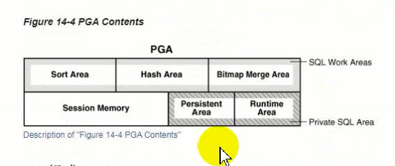
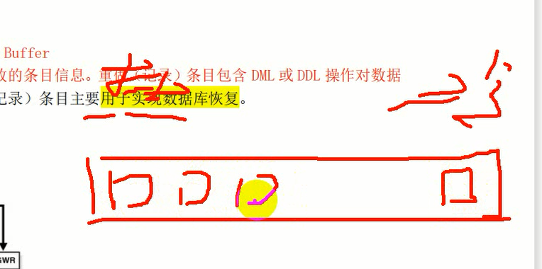
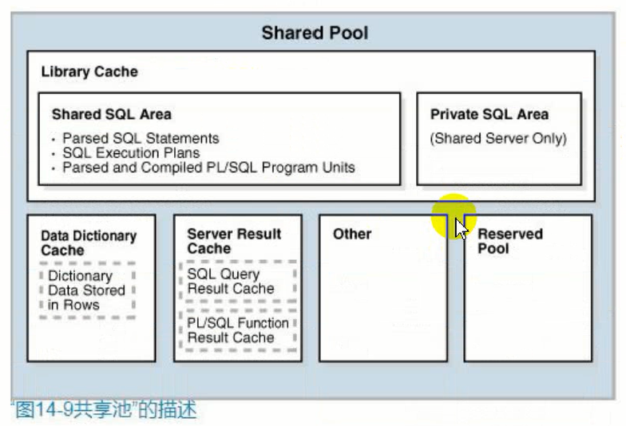

# 内存结构

内存存储：
1. 程序代码
2. 关于每个已连接会话的信息，即使该会话当前未出于活动状态
3. 程序执行过程中所需的信息
4. 进程之间共享和通信的信息，例如锁定数据
5. 缓存数据，例如数据块和重做记录

## 内存结构

Oracle数据库内存结构包括：
1. 系统全局区域SGA<br />
&ensp;&ensp;&ensp;&ensp;SGA是一组内存结构，称为SGA组件，其中包含一个Oracle数据库实例的数据和控制信息。这个数据包括缓存的数据块和共享的SQL、重做记录的数据。SGA是共享的，可以给不同的客户端使用。
2. 程序全局区域PGA<br />
&ensp;&ensp;&ensp;&ensp;PGA是非共享内存区域，专门供Oracle进程使用的数据和控制信息。当Oracle进程启动时，PGA有Oracle数据库创建。
3. 用户全局区域UGA<br />
&ensp;&ensp;&ensp;&ensp;存储的是与用户会话关联的数据信息。专用服务器的UGA位于PGA，共享服务器的UGA位于large pool。
4. 软件代码区<br />
&ensp;&ensp;&ensp;&ensp;软件代码区是内存的一部分，用于存储正在运行或可以运行的代码。

## 内存管理

1. 自动内存管理 Automatic Memory Management<br />
&ensp;&ensp;&ensp;&ensp;指定实例内存的目标大小。数据库实例自动优化到这个目标内存大小，根据需要在SGA和PGA实例之间重新分配内存。
2. 自动共享内存管理 Automatic Shared Memory Management<br />
&ensp;&ensp;&ensp;&ensp;设置一个SGA的目标大小，然后设置PGA总目标大小，或单独管理PGA的各个工作区。
3. 手工内存管理 Manual Memory Management<br />
&ensp;&ensp;&ensp;&ensp;不设置总的内存大小，但需要设置许多初始化参数，以单独管理SGA和PGA实例中的各个组件。

```sh
# 查看各个区的目标值
show parameter memory_target
show parameter sga_target
show parameter pga
```

通过修改各个目标值就可以修改内存管理方式。

```sh
# 查询内存分配情况
select COMPONENT,sum(CURRENT_SIZE/1024/1024) mb from v$memory_dynamic_components group by COMPONECT;
```

```sh
# 修改内存管理方式
alter system set sga_target = [分配内存值]
alter system set pga_aggregate_target = [分配内存值]
alter system set memory_target = [分配内存值]
```


内存目标值MEMORY_TARGET是SGA_TARGET和PGA_AGGREGATE_TARGET加在一起的大小。

```sh
# sga_target不能超过这个参数大小
show parameter sga_max
```

SGA_TARGET的大小是其下组件内存大小的总和。

## 数据字典

后面再总结吧

## PGA

专有服务器模式下，一个服务器进程分配一个PGA。后台进程也会分配内存。这些内存共同组成PGA。




1. sql工作区
2. 会话内存区
3. 私有SQL区

## SGA

### 数据库高速缓冲区 Database Buffer Cache

存储的是从数据文件读取的数据块的副本，即数据缓存，数据文件存储在物理磁盘中，oracle数据库的数据保存在数据文件中，由服务器进程将数据文件中的数据读入到数据库高速缓冲区。

使用lru算法。有冷端与热端。服务器进程在内存中无法得到更多内存的时候会把内存中不经常用的数据块移出内存。根据lru算法判断。访问给数据块一次，数据块的**触摸计数(Buffer touch count)**加一，根据数据块的触摸计数判定是否要保留或移除。经常被使用的数据块会被移动到热端，其余数据块向冷端移动。触摸计数很低，会被移出内存。服务器进程将数据读入内存时，会将数据块插入到中间。



#### Buffer state

1. Unused

没有被使用。

2. Clean

buffer内容与数据文件保持一致。

4. Dirty

buffer内容已被修改但是还没被写入磁盘。

#### Buffer mode

1. Current Mode

读取数据时读取当前内存buffer cache中的数据。例如，若一个未提交的事务更新了一个块中的两行数据，在current mode下获取返回的数据是未提交的这两行。

2. Consistent Mode

该模式读取的是数据块的可信版本。这种模式返回的数据可能会使用undo data。例如，当一个未提交的事务更新了一个数据块中的两行，如果另一个独立的会话请求了这个数据块，数据库会用undo daya创建该数据块的可信版本，该版本不包含未提交的数据。

#### Buffer I/O

是一种逻辑I/O，指的是buffer cache中buffer的读写。


#### Buffer write

由dbwn进程将dirty buffer写入磁盘。

服务器进程发现没有空闲的buffer时。

数据库执行检查点，进行实例恢复时。

表空间被变为只读状态或者脱机时会写入。

#### Buffer read

读取。

#### Buffer Pool


默认缓冲池中的一个buffer数据块是8K，数据库默认块大小为8k，由db_block_size决定。

```sh
show parameter blok
```


keep pool保留池，要长期驻留在内存中的数据。通过db_keep_cache_size设置保留池大小。


Recycle，由recycle_cache_size设置。


2k、4k、16k的数据块不可以缓存到默认缓冲池中，需要单独在内存中划分块大小为16k(对应表空间数据块大小)的缓冲区域。

#### Buffers and Full Table Scans

数据库使用复杂的算法来管理表空间扫描。默认情况下，必须从磁盘中读取数据到缓冲区时，数据库会将缓冲数据插入到lru列表中间。通过这种方式，热数据块会继续保存在缓存中不必重新从磁盘读取。

别的还是得看官方文档。。。

### 重做日志缓冲区 Redo Log Buffer

存储的是数据库所做的**更改的条目信息**。重做（记录）条目包含DML或DDL操作对数据库所作的更改的信息。重做（记录）条目主要用于实现数据库恢复。


redo log buffer中存储数据库更改条目信息，服务器进程写入到redo log buffer中后，通过lgwr进程再写入到online redo log file中。online redo log file通过arch进程产生**归档文件**。

第一个主要作用是实现数据库恢复，第二个主要作用是实现数据挖掘。挖掘历史数据信息。

### 共享池

共享池缓存的是各种类型的程序数据。例如已解析的SQL，PL/SQL代码，系统参数和数据字典信息。



## In-Memory

Oracle数据库传统上以行格式存储数据。在行格式数据库中，数据库中存储的每个新事务或新记录都表示为表中的一个新行，而在查询数据时是利用传统Buffer Cache。

在In-Memory中所存储的数据不是使用传统行格式而是列式。每个列作为单独的结构存储到内存中，并且数据被优化用于快速扫描。In-Memory不会替代buffer cache，是对buffer cache的一种补充，因此，数据在内存中可以以行与列的形式进行存储。列格式适用于报表类，分析，选择少量列但是查询要访问大部分的数据的场景。

它是内存中的一个区域。


1. 是行格式的补充
2. 提高查询速度
3. 适用于报表分析

启用In-Memory必须将INMEMORY_SIZE设置为非0值。INMEMORY_SIZE是个实例级参数，默认为0，设置一个非0值时，最小值为100M。

通常情况下，sys用户下的对象及SYSTEM、SYSAUX表空间上的对象无法使用IMO特性，但通过设置“_inmemory_enable_sys”隐含参数也可以使用。

### 开启In-Memory

1. 修改INMEMORY_SIZE参数
```sh
alter system set inmemory_size=500m scope=spfile;
```
2. 检查SGA参数的设置，确保在设置完inmemory_size参数之后数据库实例可以正常启动。如果数据库使用了ASM，则需要检查sga_target参数。如果使用了ASM，则需要检查MEMORY_TARGET参数，同时也需要检查SGA_MAX_TARGET。从12.2开始，可以动态调整In-Memory区域大小，因此，只需增加INMEMORY_SIZE数值即可。

3. 重启数据库实例
可以看到在实例启动过程中分配了In-Memory Area


4. 查看In-Memory特性是否开启
```sh
show parameter inmemory_size
```

### 关闭In-Memory

将该参数修改为0，并重启数据库。

### 使用

#### TABLE级使用

```sh
# 创建表时加入 inmemory 关键字；
create table test (id number) inmemory;
# 表创建完毕后修改；
alter table test inmemory;
```

#### COLUMN级使用

```sh
create table imo_tl(id number, name varchar(12), type varchar(12));
create table imo_t2(id number, name varchar(12), type varchar(12));
alter table imo_t1 inmemory (id) no inmemory (name, type);
alter table imo_t2 inmemory (name) no inmemory (id, type);
col table_name format a20
col column_name format a20
```

#### 表空间级启用

创建表空间或修改表空间，启用inmemory，在属性为inmemory的表空间中创建的对象自动加载inmemory属性，除非显示设置对象为no inmemory。

```sh
create tablespace imotest datafile '/u01/app/oracle/oradata/ORCL/imotest01.dbf' size 100M default inmemory;
alter tablespace_name, def_inmemory from dba_tablespaces where tablespace_name in ('IMOTEST');
```

#### 查询哪些列开启了inmemory

```sh
select table_name. column_name, inmemory_compression from v$im_column_level where table_name = "IMO_T1";
```

### inmemory优先级

pirority none

pirority low

pirority medium

pirority high

pirority critical