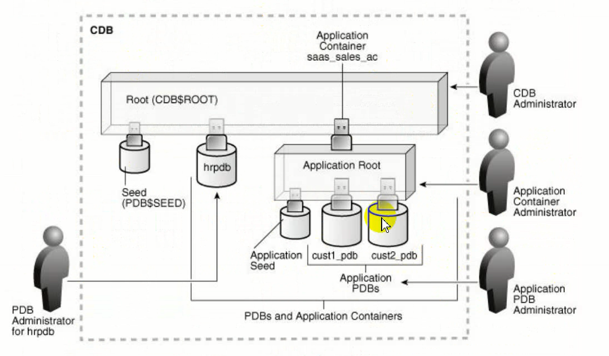

# 多租户架构

## 多租户架构
容器是多租户容器数据库（CDB）中模式、对象和相关结构的集合，在逻辑上应用程序将其显示为单独的数据库。在CDB中，每个容器都有一个唯一的ID和名称。根和每个可插拔数据库（pdb）都被视为一个容器。PDB隔离数据库可操作，因此从用户或应用程序的角度来看，每个pdb看起来都像是传统的非cdb。

多租户体系结构允许Oracle数据库充当多租户容器数据库(CDB)。CDB包括零个、一个或多个客户创建的可插拔数据库(PDB)和应用程序容器。PDB是**模式(schema)**、**模式对象**和**非模式对象**的可移植集合，在Oracle Net client中作为单独的数据库出现。

在数据库中创建用户时会创建同名的模式。连接到用户就会连接到模式。19C中可以单独创建模式，不需要创建用户；11G中不能单独创建模式，只能通过创建用户自动创建。连接到用户可以使用该模式下的对象（模式对象），例如表、视图、存储过程等，这些对象都是在该模式中创建的。非模式对象如角色等都不是在模式中创建的。

CDB中的容器是多租户体系结构中数据或元数据的逻辑集合。CDB包含一个或多个用户创建的pdb和应用程序容器。

CDB称为根容器。根容器是所有PDB所属的模式、模式对象和非模式对象的集合。每个cdb都有且只有一个根容器，根容器被命名CDB$ROOT。用于存储管理pdb所需的系统元数据。所有pdb都属于根目录。根目录不存储用户数据。因此不能将用户数据添加到根目录或修改根目录中系统提供的架构。但是，可以为数据库管理创建公共用户和角色。

PDB是用户创建的一组模式、模式对象和相关结构。在逻辑上对应应用程序显示为单独的数据库。每个pdb都贵sys所有，sys是cdb中的一个公共用户，在所有容器中都存在。使用PDB可以：
1. 存储特定应用程序的数据。例如销售应用程序可以有自己的专用PDB，人力资源应用程序可以有自己的专用PDB。
2. 将数据移动到其他CDB。数据库是“可插入的”，可以将其打包为一个独立的单元，移动到另一个CDB中。
3. 在PDB中隔离授权。具有适当权限的本地或公共用户可以授予单个PDB中的public。

PDB必须在CDB中唯一命名，并遵循与服务名称相同的命名规则。此外，由于pdb有一个具有自己名称的服务，pdb名称必须在其服务通过特定侦听器公开的所有cdb中是唯一的。

PDB中名称和权限的作用域：

pdb有单独的名称和空间，对以下结构有影响：

模式

一个PDB中包含的架构可能与另一个pdb中的架构同名，例如pdb1和pdb2中均创建了一个user用户，但是这两个user是不同的。这两个模式可以表示不同的本地用户，区别在于连接时解析用户名的pdb，或者是一个普通用户。

对象

对象必须在pdb中唯一命名，不同pdb和不同cdb中可以相同。模式对象和非模式对象都是一样。不同pdb中包含的同名数据库pdb中包含的同名数据库对象和其他字典对象彼此不同。

oracle数据库目录是非模式对象的一个示例。在CDB中，公共用户sys拥有目录。因为每个pdb都有自己的sys模式，所以目录通过在pdb的sys模式中创建而属于pdb。

PDB之间的数据库连接

在CDB中，所有数据库对象都位于架构中，而架构又位于容器中。因为pdb在用户看来是非cdb，所以模式必须在容器中唯一命名，而不能跨容器命名。例如，rep模式既可以存在于SalePDB中，也可以存在于HrPDB中。这两个模式是独立的。

pdb和pdb之间要访问数据，需要创建**database link**。

连接到一个pdb的用户必须使用database links来访问另一个pdb中的对象。这种行为直接类似于非cdb中的用户访问不同非cdb中的对象。

在物理层面，CDB是一组文件，控制文件、联机重做日志文件和数据文件。

在物理层面，每个PDB都有自己的一组数据文件，用于存储PDB数据。

在根容器中查看控制文件，整个CDB只有一组控制文件，一组日志文件。

每个pdb都有自己的数据文件，但是控制文件和日志文件是cdb中共用的。

应用程序容器是CDB中一个可选的、用户创建的容器，用于存储一个或多个应用程序的数据和元数据。应用程序是存储在应用程序根中的一组公共数据和元数据。一个应用程序容器可以包含多个应用程序pdb，并允许这些pdb共享元数据和数据。在物理级别上，应用程序容器有自己的一组数据文件，就像PDB一样。

假设数据库管理全国的数据，每个省份有自己的销售记录。可以将产品的信息(公用的数据)存放在应用根容器中。应用根容器下的不同应用程序pdb存放不同省份的销售数据。将应用根中的公共数据同步到应用pdb中共享使用。

物理结构由数据库构成，数据文件，控制文件，日志文件。其中，11G的数据文件、控制文件、日志文件均只有一组。19C每个pdb有一组数据文件，每个cdb有一组控制文件和日志文件。

有一个DBA管理所有容器（CDB），其他各个DBA分别管理不同的容器。

传统架构

传统架构(例如11G架构)。比如人事、生产、销售等不同的应用，为一个应用系统建立一个数据库，一个管理员管理一个数据库。可能有数百、数千台数据库，造成硬件、人力资源浪费，管理也麻烦。

19c的容器数据库可以解决以上问题。有一台服务器装一个容器数据库CDB，在CDB中创建多个PDB。不同PDB存放不同应用的数据。

多租户体系结构好处：
1. 降低成本。减少服务器数量，共享进程，共享系统资源。
2. 更容易和更快速的数据和代码的移动。PDB迁移方便。
3. 更轻松地管理和监控物理数据库。数据库服务器数量少。
4. 分离数据和代码。
5. 安全分离管理权限。各个PDB间权限相对独立。
6. 轻松性能调优。

多租户体系结构对管理性的好处：
1. 更容易升级数据和代码
2. 更容易在服务器之间迁移
3. 防止PDB中的数据损坏
4. 能够在一个地方安装、管理和升级特定于应用程序的数据和元数据

CDB中的表空间和数据库文件，实例，根容器，PDB等。

cdb的结构和非cdb相同，只是每个pdb和应用程序根目录都有自己的表空间，包括自己的SYSTEM，SYSAUX和undo表空间。

一个CDB包括：
1. 一个控制文件
2. 一个在线联机重做日志
3. 一个或多个undo表空间。本地undo

用户通过sqlplus连接到不同的pdb的监听器。连接后会分配服务器进程，服务器进程管理和使用内存中的数据。不同的容器有自己的数据文件，读取时会读取对应的容器的数据文件。后台进程负责数据的一致性等。根容器管理所有的pdb。

可以理解为中间是实例，左边是数据库。

## 多租户架构的一般使用

### CDB和PDB管理

