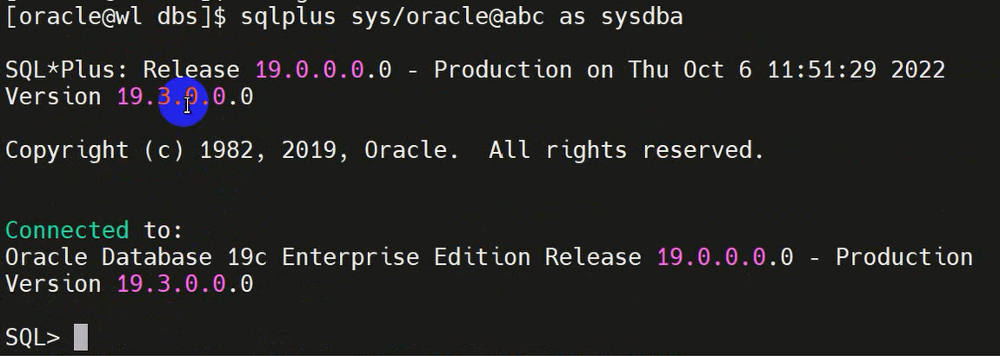
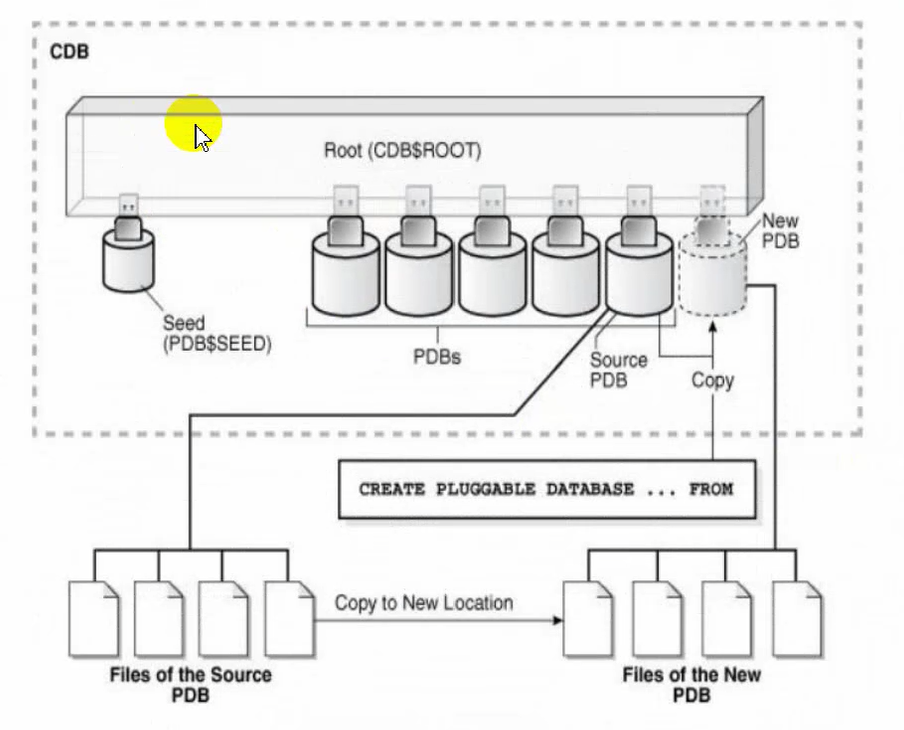
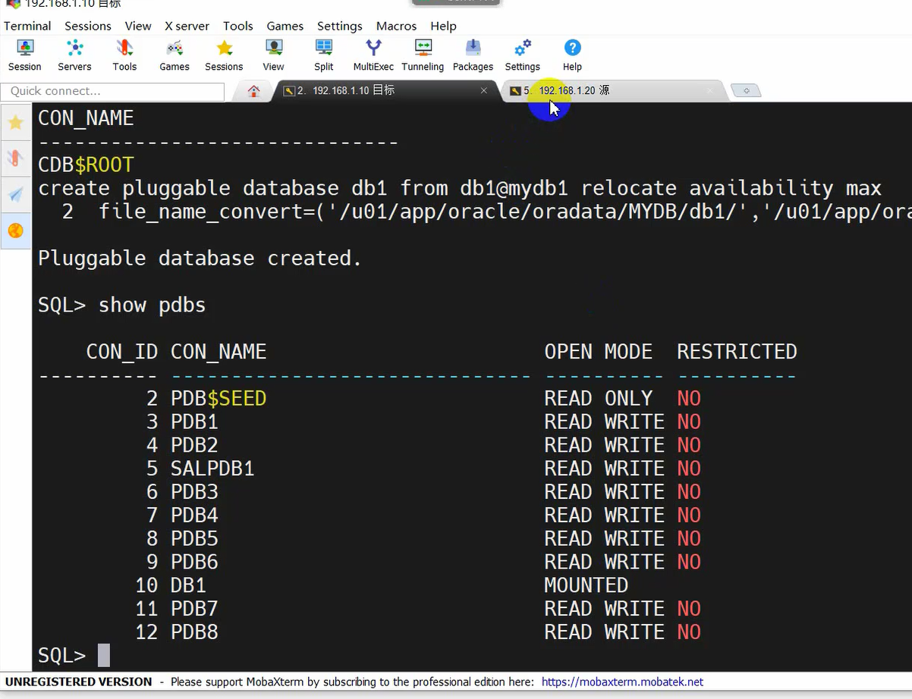
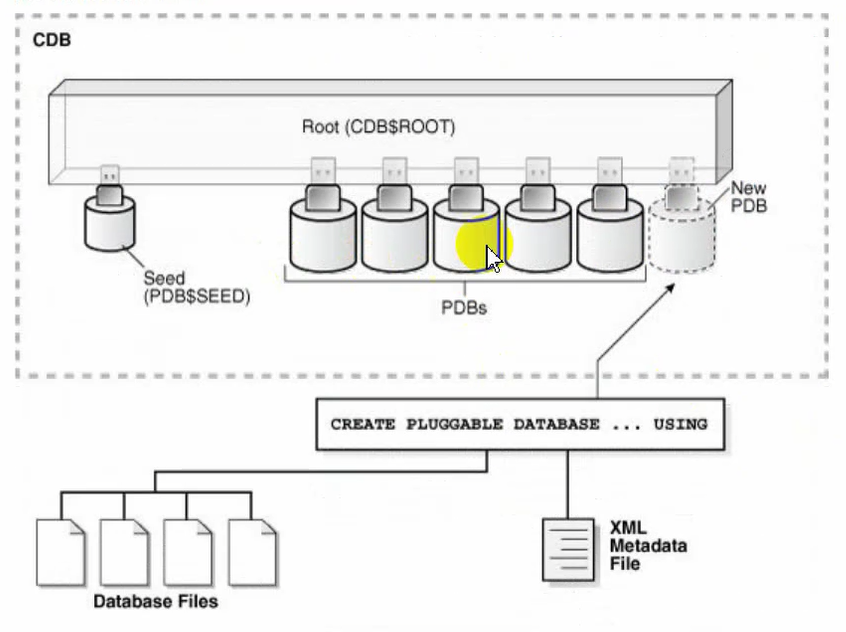
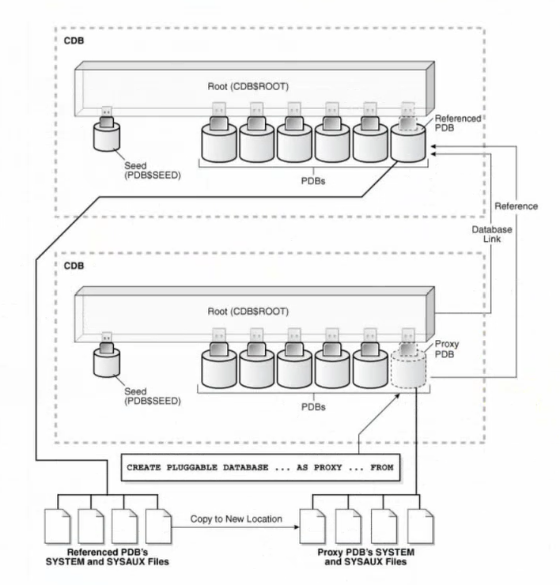

# 多租户架构

## 多租户架构
容器是多租户容器数据库（CDB）中模式、对象和相关结构的集合，在逻辑上应用程序将其显示为单独的数据库。在CDB中，每个容器都有一个唯一的ID和名称。根和每个可插拔数据库（pdb）都被视为一个容器。PDB隔离数据库可操作，因此从用户或应用程序的角度来看，每个pdb看起来都像是传统的非cdb。

多租户体系结构允许Oracle数据库充当多租户容器数据库(CDB)。CDB包括零个、一个或多个客户创建的可插拔数据库(PDB)和应用程序容器。PDB是**模式(schema)**、**模式对象**和**非模式对象**的可移植集合，在Oracle Net client中作为单独的数据库出现。

在数据库中创建用户时会创建同名的模式。连接到用户就会连接到模式。19C中可以单独创建模式，不需要创建用户；11G中不能单独创建模式，只能通过创建用户自动创建。连接到用户可以使用该模式下的对象（模式对象），例如表、视图、存储过程等，这些对象都是在该模式中创建的。非模式对象如角色等都不是在模式中创建的。

CDB中的容器是多租户体系结构中数据或元数据的逻辑集合。CDB包含一个或多个用户创建的pdb和应用程序容器。

CDB称为根容器。根容器是所有PDB所属的模式、模式对象和非模式对象的集合。每个cdb都有且只有一个根容器，根容器被命名CDB$ROOT。用于存储管理pdb所需的系统元数据。所有pdb都属于根目录。根目录不存储用户数据。因此不能将用户数据添加到根目录或修改根目录中系统提供的架构。但是，可以为数据库管理创建公共用户和角色。

PDB是用户创建的一组模式、模式对象和相关结构。在逻辑上对应应用程序显示为单独的数据库。每个pdb都贵sys所有，sys是cdb中的一个公共用户，在所有容器中都存在。使用PDB可以：
1. 存储特定应用程序的数据。例如销售应用程序可以有自己的专用PDB，人力资源应用程序可以有自己的专用PDB。
2. 将数据移动到其他CDB。数据库是“可插入的”，可以将其打包为一个独立的单元，移动到另一个CDB中。
3. 在PDB中隔离授权。具有适当权限的本地或公共用户可以授予单个PDB中的public。

PDB必须在CDB中唯一命名，并遵循与服务名称相同的命名规则。此外，由于pdb有一个具有自己名称的服务，pdb名称必须在其服务通过特定侦听器公开的所有cdb中是唯一的。

PDB中名称和权限的作用域：

pdb有单独的名称和空间，对以下结构有影响：

模式

一个PDB中包含的架构可能与另一个pdb中的架构同名，例如pdb1和pdb2中均创建了一个user用户，但是这两个user是不同的。这两个模式可以表示不同的本地用户，区别在于连接时解析用户名的pdb，或者是一个普通用户。

对象

对象必须在pdb中唯一命名，不同pdb和不同cdb中可以相同。模式对象和非模式对象都是一样。不同pdb中包含的同名数据库pdb中包含的同名数据库对象和其他字典对象彼此不同。

oracle数据库目录是非模式对象的一个示例。在CDB中，公共用户sys拥有目录。因为每个pdb都有自己的sys模式，所以目录通过在pdb的sys模式中创建而属于pdb。

PDB之间的数据库连接

在CDB中，所有数据库对象都位于架构中，而架构又位于容器中。因为pdb在用户看来是非cdb，所以模式必须在容器中唯一命名，而不能跨容器命名。例如，rep模式既可以存在于SalePDB中，也可以存在于HrPDB中。这两个模式是独立的。

pdb和pdb之间要访问数据，需要创建**database link**。

连接到一个pdb的用户必须使用database links来访问另一个pdb中的对象。这种行为直接类似于非cdb中的用户访问不同非cdb中的对象。

在物理层面，CDB是一组文件，控制文件、联机重做日志文件和数据文件。

在物理层面，每个PDB都有自己的一组数据文件，用于存储PDB数据。


在根容器中查看控制文件，整个CDB只有一组控制文件，一组日志文件。


每个pdb都有自己的数据文件，但是控制文件和日志文件是cdb中共用的。

应用程序容器是CDB中一个可选的、用户创建的容器，用于存储一个或多个应用程序的数据和元数据。应用程序是存储在应用程序根中的一组公共数据和元数据。一个应用程序容器可以包含多个应用程序pdb，并允许这些pdb共享元数据和数据。在物理级别上，应用程序容器有自己的一组数据文件，就像PDB一样。

假设数据库管理全国的数据，每个省份有自己的销售记录。可以将产品的信息(公用的数据)存放在应用根容器中。应用根容器下的不同应用程序pdb存放不同省份的销售数据。将应用根中的公共数据同步到应用pdb中共享使用。

物理结构由数据库构成，数据文件，控制文件，日志文件。其中，11G的数据文件、控制文件、日志文件均只有一组。19C每个pdb有一组数据文件，每个cdb有一组控制文件和日志文件。

有一个DBA管理所有容器（CDB），其他各个DBA分别管理不同的容器。


传统架构

传统架构(例如11G架构)。比如人事、生产、销售等不同的应用，为一个应用系统建立一个数据库，一个管理员管理一个数据库。可能有数百、数千台数据库，造成硬件、人力资源浪费，管理也麻烦。


19c的容器数据库可以解决以上问题。有一台服务器装一个容器数据库CDB，在CDB中创建多个PDB。不同PDB存放不同应用的数据。


多租户体系结构好处：
1. 降低成本。减少服务器数量，共享进程，共享系统资源。
2. 更容易和更快速的数据和代码的移动。PDB迁移方便。
3. 更轻松地管理和监控物理数据库。数据库服务器数量少。
4. 分离数据和代码。
5. 安全分离管理权限。各个PDB间权限相对独立。
6. 轻松性能调优。

多租户体系结构对管理性的好处：
1. 更容易升级数据和代码
2. 更容易在服务器之间迁移
3. 防止PDB中的数据损坏
4. 能够在一个地方安装、管理和升级特定于应用程序的数据和元数据

CDB中的表空间和数据库文件，实例，根容器，PDB等。


cdb的结构和非cdb相同，只是每个pdb和应用程序根目录都有自己的表空间，包括自己的SYSTEM，SYSAUX和undo表空间。

一个CDB包括：
1. 一个控制文件
2. 一个在线联机重做日志
3. 一个或多个undo表空间。本地undo


用户通过sqlplus连接到不同的pdb的监听器。连接后会分配服务器进程，服务器进程管理和使用内存中的数据。不同的容器有自己的数据文件，读取时会读取对应的容器的数据文件。后台进程负责数据的一致性等。根容器管理所有的pdb。

可以理解为中间是实例，左边是数据库。


## 多租户架构的一般使用

### CDB和PDB管理

#### 查看数据库是否为CDB

```sh
SQL> select name, decode(cdb, 'YES', 'Multitenant Option enabled', 'Regular 12c Database:')"Multitenant Option", open_mode, con_id from v$database;
```

#### 连接到CDB

##### 简易方式连接

sqlplus命令，/分割用户名和口令，as sysdba

使用操作系统验证省略用户名密码。当前连接到系统的oracle用户，说明有权限连接到数据库。此时不进行口令验证，随便怎么填进去都是sys用户。

```sh
# 操作系统验证方式
sqlplus / as sysdba
show con_name
```

当使用网络连接时，必须指定用户名跟口令。此时使用的是数据库口令文件验证。口令文件为 $ORACLE_HOME/dbs/orapw[sid]

```sh
# 简易方式
sqlplus sys/oracle@192.168.1.10:1521/orcl as sysdba
```

##### 使用net service方式连接

需要使用netmgr配置网络服务名。


在Service Naming中新建。新建的名称自己定义，TCP/IP本机1521，**Service Name不能随便写，需要查询**。

```sh
show parameter service_name
```

配置完成后可以用tnsping验证。


此时可以用以下方式连接

```sh
sqlplus sys/oracle@abc as sysdba
```



通过命令lsnrcl可以看到配置的服务名

```sh
lsnrcl status
```


#### 连接到PDBs

##### 使用简单方式连接到pdb:(prod1)

通过查询监听服务，使用sqlplus连接

```sh
sqlplus sys/oracle@192.168.10.1:1521/pdb1 as sysdba
```

##### 使用net service方式连接

使用netmgr，跟之前记录的方法一样。

```sh
sqlplus sys/oracle@abc_pdb1 as sysdba
```

#### 创建一个新的PDB

从sedd PDB创建一个PDB，每个CDB有一个PDB template，名为PDB$Seed。

创建一个操作系统目录用于存放新创建的PDB数据库的数据文件和临时文件：
```sh
mkdir /u01/app/oracle/oradata/cdb1/prod3
```

##### 创建PDB

创建一个可插拔数据库prod3，管理员用户为wl，密码口令为123。并将'/u01/app/oracle/oradata/ORCL/pdbseed'数据文件转化为新创建的容器数据文件'/u01/app/oracle/oradata/cdb1/prod3'，将种子容器数据问件复制到新的目录。

```sh
# 需要进入根容器创建
create pluggable database prod3 admin user wl identified by 123 file_name_convert=('/u01/app/oracle/oradata/ORCL/pdbseed', '/u01/app/oracle/oradata/cdb1/prod3');
```

#### PDB删除

在根容器中drop。

一般删除容器的时候会保留数据文件，而pdb删除前若没有拔出，则不保留数据文件。

```sh
SQL> conn / as sysdbq
SQL> alter pluggable database all close immediate;
SQL> select name, open_mode from v$pdbs;
SQL> drop pluggable database prod3_his includeing datafiles;
SQL> select name, open_mode from v$pdbs;
```
### CDB数据字典

多租户容器数据库（CDB）中，数据字典表和视图定义的元素数据仅存储在根目录中。每个可插拔数据库（PDB）都有自己的一组数据字典表和视图，用于包含在PDB中的数据库对象。

在根容器下查询


cdb_objects存放所有容器的对象，dba_objects只存放根容器下sys用户的对象，user_objects只存放当前用户的对象。

|View|Description|
|---|---|
|{cdb/dba}_pdbs|CDB或PDB的信息|
|cdb_properties|数据库参数|
|{cdb/dba}_pdb_history|每个pdb的历史信息|
|{cdb/dba}_container_data|显示用户级别和一些属性信息|
|{cdb/dba}_pdb_saved_status|保存的状态|
|{cdb/dba}_cdb_app_errors|错误消息|
|{cdb/dba}_cdb_rsrc_plans|pdb资源计划指令|
|{user/all/dba/cdb}_objects|查看所有对象|
|{all/dba/cdb}_services|网络服务名|

### 创建和移除PDB及应用程序容器

创建PDB的方法：


可以克隆、重定位、插入、刷新代理等方式。

#### 利用种子容器创建PDB


其实就是把种子容器的数据文件拷贝生成新的PDB的数据文件。

```sh
# 没有指定pdb_file_name_convert参数直接运行下面的命令会出错
# 这个是数据库的参数，跟之前示例中指定的不一样。之前的是命令的参数。
alter session set pdb_file_name_convert='pdbseed', 'salpdb1';
create pluggable database salpdb1 admin user salam identified by 123;
```


```sh
# 创建PDB并将预定义的Oracle角色授予PDB管理员
alter session set pdb_file_name_convert = 'pdbseed', 'salpdb2';
create pluggable database salpdb2 admin user saladm identified by 123 roles=(dba);
```

```sh
# 创建容器时指定参数
create pluggable database pdb3 admin user wl identified by oracle 
storage(maxsiaze 3g)
default tablespace wl
datafile '/u01/app/oracle/oradata/cdb1/pdb3/w1l1.dbf' size 200m autoextend on path_prefix='/u01/app/oracle/oradata/cdb1/pdb3/'
fil_name_convert = ('/u01/app/oracle/oradata/ORCL/pdbseed', '/u01/app/oracle/oradata/cdb1/pdb3');
```

#### 克隆方式创建PDB

##### 克隆本地PDB



把源PDB的数据文件拷贝成为新的PDB的数据文件。没有使用种子容器。

```sh
# 方法1
alter pluggable database pdb2 open read only;
alter session set pdb_file_name-converter='pdb2','pdb3';
create pluggable database pdb3 from pdb2;

# 或者

alter session set pdb_file_name_converter='pdb01','pdb02,pdb03';
create pluggable database pdb03 from pdb01;
```

```sh
# 方法2
create pluggable database pdb4 from pdb2;
path_prefix = '/u01/app/oracle/oradata/cdb1/pdb4/'
file_name_convert = ('/u01/app/oracle/oradata/ORCL/pdb2/', '/u01/app/oracle/oradata/cdb1/pdb4/')
service_name_convert = ('pdb2', 'pdb4') nologging;
# 不克隆数据，no data 不复制普通用户下的数据
create pluggable database pdb3 FROM pdb1 no data
PATH_PREFIX = '/u01/app/oracle/oradata/cdb1/pdb3'
FILE_NAME_CONVERT = ('/u01/app/oracle/oradata/ORCL//pdb1', '/u01/app/oracle/oradata/cdb1/pdb3')
```

方法2不需要设置参数pdb_file_name，因为命令中指定了file_name_convert参数，已经将文件复制了。

##### 克隆远程PDB


::: TIP
克隆虚拟机后修改
1. IP地址
2. 主机名/etc/hostname
3. 修改/etc/hosts
:::

两台主机字符集、字节序需要相同。

源端监听打开。目的端配置网络服务名，地址指向源端，服务名指向源端的库。

```sh
# 源端授权。
grant CREATE PLUGGABLE DATABASE, cdb_dba, sysoper to system container = all;

# 建立数据库link
create database link oral2 connect to system identified by oracle using 'mydb20';

create database link [link的名字] connect to [用户] identified by [口令] using '[网络服务名]';
```

##### 克隆非容器数据库


需要两端字符集、字节序相同。

```sh
# 源端授权
grant CREATE PLUGGABLE DATABASE, cdb_dba, sysoper to system container = all;

# 目标端创建link
create database link orcl2 connect to system identified by oracle using 'prod20';

create pluggable database pdb8 from prod_1@orc112
file_name_convert = ('/u01/app/oacle/oradata/PROD/', '/u01/app/oracle/oradata/ORCL/pdb8/');
```

非容器数据库克隆之后不能直接打开，需要运行一个脚本进行转换。需要使用拥有SYSDBA权限的用户在PDB中执行。将非容器数据库转换为pdb。

```sh
alter session set container = pdb8;
# @是执行的意思
@$ORACLE_HOME/rdbms/admin/noncdb_to_pdb.sql
```

##### 重定位PDB

将源PDB移动到新的CDB。


将PDB移动到其他CDB，当目标PDB由于ALTER PLUGGABLE DATABASE OPEN语句而联机时，Oracle数据库将终止活动会话并关闭源PDB。此技术是在**最少停机时间或没有停机时间的情况下移动PDB的最快方法**。而拔出源PDB会导致PDB中断，在relocation期间，源PDB可以以read/write模式打开并且功能齐全，源CDB和目的CDB的平台必须满足以下要求：
1. 必须具有相同的字节序。
2. 源平台上安装的数据库选项必须与目标平台上安装的数据库选项相同。
3. 如果目标CDB的字符集不是AL32UTF8，则源CDB和目标CDB必须具有兼容的字符集。
4. 源PDB必须处于本地undo模式

```sh
select property_name,property_value from database_properties where property_name = 'LOCAL_UNDO_ENABLED';
```

兼容性检查
```sh
# 源端生成pdb的xml文件
begin
dbms_pdb_describe(
    # 指定文件路径
    pdb_descr_file=>'/home/oracle/db1.xml',
    # 指定pdb
    pdb_name=>'db1');
end;

# 将xml文件复制到目标主机，目标端主机检查兼容性
set serveroutput on
declare
    compatible constant varchar2(3):=
    case dems_pdb.check_plug_compatibility(
        pdb_descr_file=>"/home/oracle/de1.xml",
        pdb_name=>'db1')
    WHEN TRUE THEN 'YES'
    ELSE 'NO'
end;
begin dbms_optput.put_line(compatible);
end;
/
```

源端打开容器
```sh
alter Pluggable database DB1 open;
```

目标端
```sh
Mydb20 =
    (DESCRIPTION =
        (ADDRESS_LIST =
            (ADDRESS = (PROTOCOL = TCP)(HOST = 192.168.1.20)(PORT=1521))
        )
        (CONNECT_DATA =
            (SERVIVE_NAME = mydb)
        )
    )

create database link mydb1 connect to system identified by oracle using 'mydb20';

create pluggable database pdb9 from db1@mydb1 relocate avaliablity max file_name_convert=('/u01/app/oracle/oradata/MYDB/db1','/u01/app/oracle/oradata/ORCL/pdb9/');
```

运行完创建命令后，目标端DB1状态为MOUNTED，而源端仍为READ WRITE




打开目标数据库容器后，源端DB1状态为MOUNTED，目标端状态为READ WRITE
```sh
alter pluggable database db1 open
```


在源端也无法开启db1。


这个容器已经没用了

```sh
drop pluggable database db1;
```

做重定位之前PDB可以正常使用。<br />
重定位期间源PDB也可以正常使用。<br />
做完重定位之后新的PDB没打开前，源PDB也能正常使用。<br />
**目标端PDB打开后，源PDB才不能正常使用。**

##### 插入一个拔出的PDB

将拔出的PDB插入CDB来创建PDB，使用描述PDB的**XML元数据文件**与**PDB相关联的文件**将其插入CDB。



需要有数据文件和xml文件。

```sh
# 使用nocopy语句插入
alter plugging database pdb2 close immediate;
alter pluggable database pdb2 unplug into '/home/oracle/pdb2.xml';
drop pluggable database pdb2 keep datafiles;
create pluggable database pdb2 using '/home/oracle/pdb2.xml' no copy tempfile reuse;
```

##### 代理PDB

在远程CDB中提供对不同PDB referenced PDB的访问。代理PDB提供对远程CDB中的PDB的访问，代理PDBs能够聚合来自多个源的数据。提交给代理PDB执行的SQL语句在引用的PDB中执行。引用的PDB中返回的数据是源PDB中的数据。

APDB和BPDB。A为源库，B代理。连接至B时查询的数据查询的是A库中的数据。修改A时可以在B中看到修改的数据。

典型的用例是引用应用程序根副本的代理PDB。如果多个CDB具有相同的应用程序定义，例如相同的表和PL/SQL包，则可以在主应用程序根的应用程序容器中创建代理PDB。代理PDB引用的PDB是另一个CDB中的应用程序根。通过在主根中运行安装脚本，其他CDBs中的应用程序根将成为主应用程序根的副本。

创建代理PDB使用 create pluggable database 语句和 from 子句，后者必须指定到远程CDB中引用的PDB数据库链接，以及as proxy子句。

如果直接将代理PDB插入到CDB$ROOT，必须在CDB$ROOT中创建代理。application PDB的代理必须同时插入到application root。



必须满足以下先决条件：
1. 完成“创建PDB的一般先决条件”中所述的先决条件。
2. 当前用户必须在创建代理PDB的CDB的根目录中具有系统特权。create pluggable database
3. 包含引用的PDB的CDB必须处于本地UNDO模式
4. 包含引用的PDB的CDB必须处于ARCHVELOG模式
5. 创建代理PDB时，引用的PDB必须处于打开读/写模式。创建代理PDB后，可以更改引用的PDB的打开模式。
6. database link必须启用从创建代理PDB的CDB到引用PDB的连接。数据库链路可以连接到远程CDB的根目录，也可以连接到远程PDB。
7. 如果database link连接到远程CDB，则连接的用户必须是公用用户，如果database link连接到引用的PDB，则database link在引用的PDB中连接的用户必须具有CREATE PLUGGABLE DATABASE的系统权限。