# PDB

## 连接到PDBs

### 使用简单方式连接到pdb:(prod1)

通过查询监听服务，使用sqlplus连接

```sh
sqlplus sys/oracle@192.168.10.1:1521/pdb1 as sysdba
```

### 使用net service方式连接

使用netmgr，跟之前记录的方法一样。

```sh
sqlplus sys/oracle@abc_pdb1 as sysdba
```

### 创建一个新的PDB

从sedd PDB创建一个PDB，每个CDB有一个PDB template，名为PDB$Seed。

创建一个操作系统目录用于存放新创建的PDB数据库的数据文件和临时文件：
```sh
mkdir /u01/app/oracle/oradata/cdb1/prod3
```

## 创建PDB

创建一个可插拔数据库prod3，管理员用户为wl，密码口令为123。并将'/u01/app/oracle/oradata/ORCL/pdbseed'数据文件转化为新创建的容器数据文件'/u01/app/oracle/oradata/cdb1/prod3'，将种子容器数据问件复制到新的目录。

```sh
# 需要进入根容器创建
create pluggable database prod3 admin user wl identified by 123 file_name_convert=('/u01/app/oracle/oradata/ORCL/pdbseed', '/u01/app/oracle/oradata/cdb1/prod3');
```

## PDB删除

在根容器中drop。

一般删除容器的时候会保留数据文件，而pdb删除前若没有拔出，则不保留数据文件。

```sh
SQL> conn / as sysdbq
SQL> alter pluggable database all close immediate;
SQL> select name, open_mode from v$pdbs;
SQL> drop pluggable database prod3_his includeing datafiles;
SQL> select name, open_mode from v$pdbs;
```

## 创建和移除PDB及应用程序容器

创建PDB的方法：

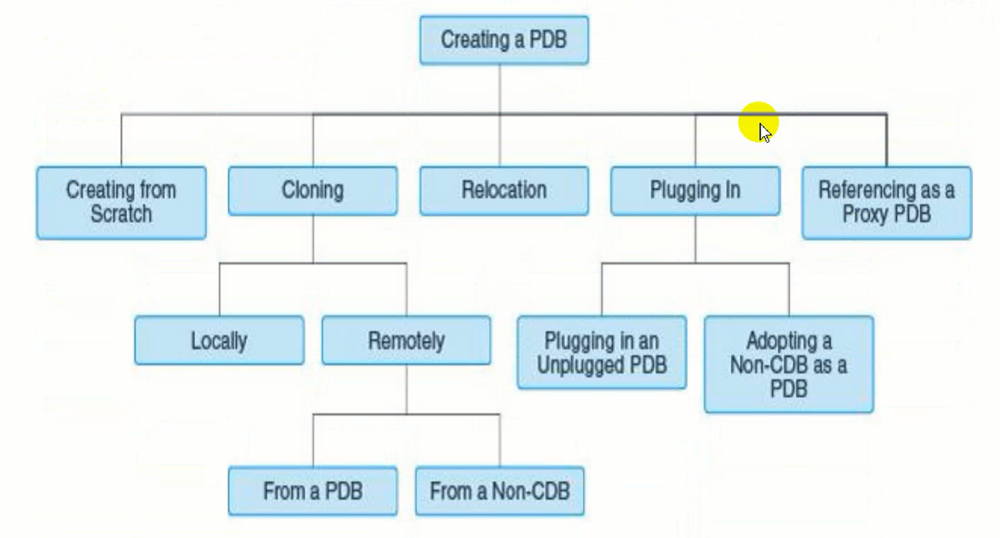

可以克隆、重定位、插入、刷新代理等方式。

### 利用种子容器创建PDB

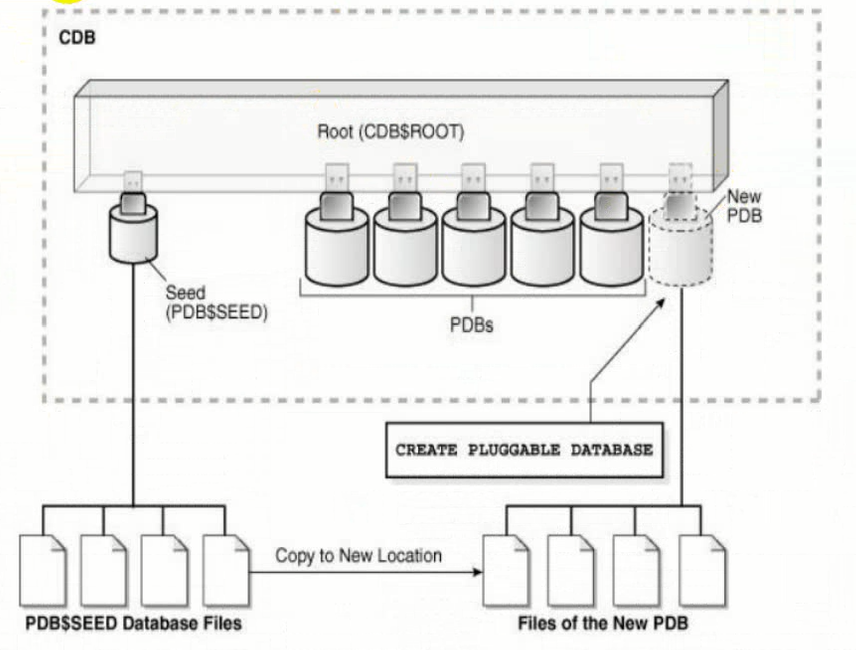

其实就是把种子容器的数据文件拷贝生成新的PDB的数据文件。

```sh
# 没有指定pdb_file_name_convert参数直接运行下面的命令会出错
# 这个是数据库的参数，跟之前示例中指定的不一样。之前的是命令的参数。
alter session set pdb_file_name_convert='pdbseed', 'salpdb1';
create pluggable database salpdb1 admin user salam identified by 123;
```
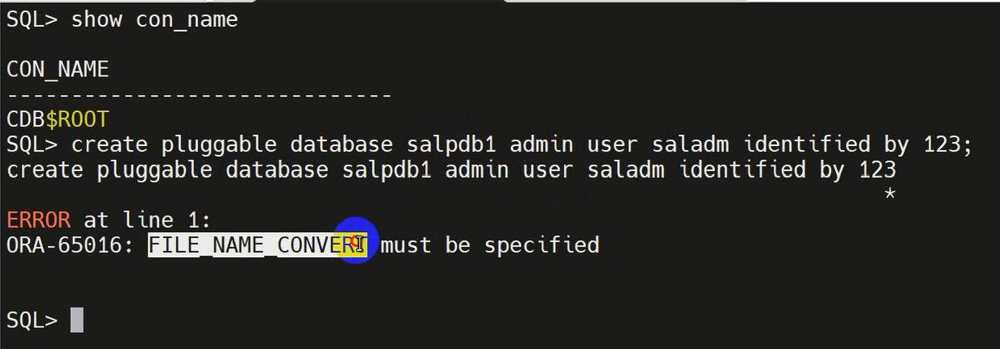

```sh
# 创建PDB并将预定义的Oracle角色授予PDB管理员
alter session set pdb_file_name_convert = 'pdbseed', 'salpdb2';
create pluggable database salpdb2 admin user saladm identified by 123 roles=(dba);
```

```sh
# 创建容器时指定参数
create pluggable database pdb3 admin user wl identified by oracle 
storage(maxsiaze 3g)
default tablespace wl
datafile '/u01/app/oracle/oradata/cdb1/pdb3/w1l1.dbf' size 200m autoextend on path_prefix='/u01/app/oracle/oradata/cdb1/pdb3/'
fil_name_convert = ('/u01/app/oracle/oradata/ORCL/pdbseed', '/u01/app/oracle/oradata/cdb1/pdb3');
```

### 克隆方式创建PDB

#### 克隆本地PDB

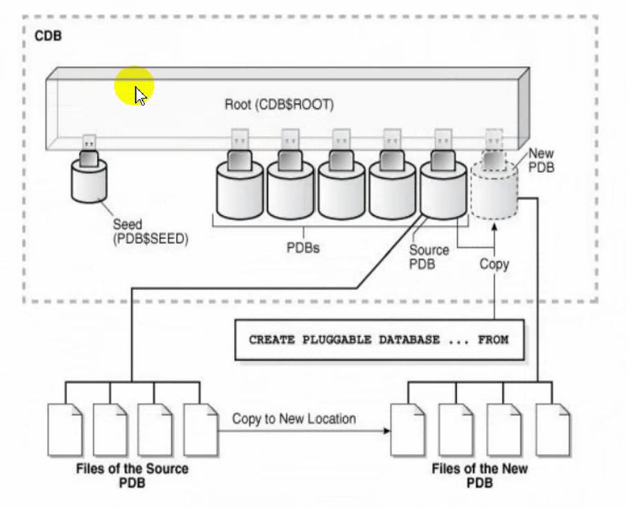

把源PDB的数据文件拷贝成为新的PDB的数据文件。没有使用种子容器。

```sh
# 方法1
alter pluggable database pdb2 open read only;
alter session set pdb_file_name-converter='pdb2','pdb3';
create pluggable database pdb3 from pdb2;

# 或者

alter session set pdb_file_name_converter='pdb01','pdb02,pdb03';
create pluggable database pdb03 from pdb01;
```

```sh
# 方法2
create pluggable database pdb4 from pdb2;
path_prefix = '/u01/app/oracle/oradata/cdb1/pdb4/'
file_name_convert = ('/u01/app/oracle/oradata/ORCL/pdb2/', '/u01/app/oracle/oradata/cdb1/pdb4/')
service_name_convert = ('pdb2', 'pdb4') nologging;
# 不克隆数据，no data 不复制普通用户下的数据
create pluggable database pdb3 FROM pdb1 no data
PATH_PREFIX = '/u01/app/oracle/oradata/cdb1/pdb3'
FILE_NAME_CONVERT = ('/u01/app/oracle/oradata/ORCL//pdb1', '/u01/app/oracle/oradata/cdb1/pdb3')
```

方法2不需要设置参数pdb_file_name，因为命令中指定了file_name_convert参数，已经将文件复制了。

#### 克隆远程PDB

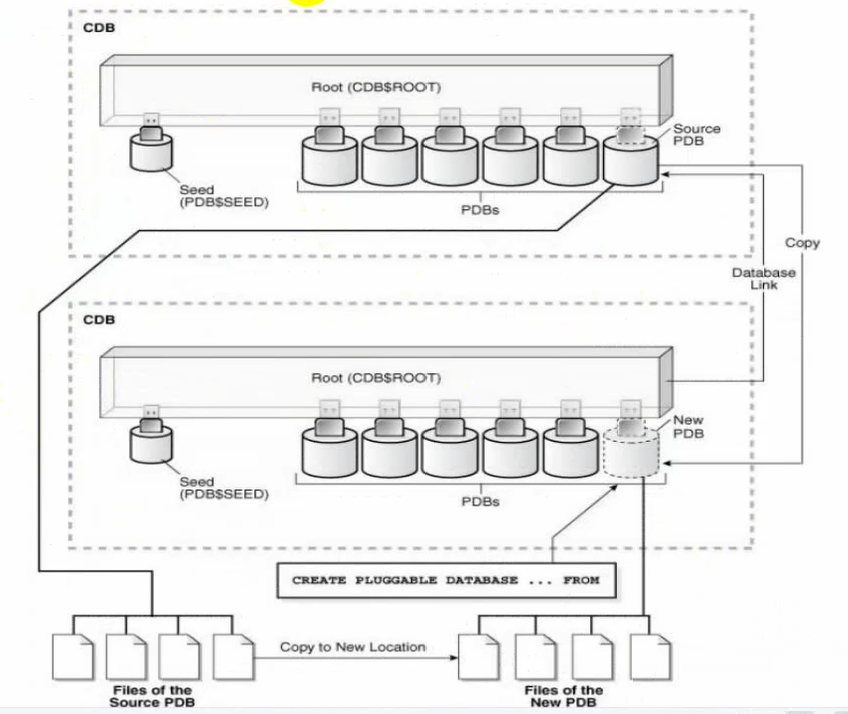

::: TIP
克隆虚拟机后修改
1. IP地址
2. 主机名/etc/hostname
3. 修改/etc/hosts
:::

两台主机字符集、字节序需要相同。

源端监听打开。目的端配置网络服务名，地址指向源端，服务名指向源端的库。

```sh
# 源端授权。
grant CREATE PLUGGABLE DATABASE, cdb_dba, sysoper to system container = all;

# 建立数据库link
create database link oral2 connect to system identified by oracle using 'mydb20';

create database link [link的名字] connect to [用户] identified by [口令] using '[网络服务名]';
```

#### 克隆非容器数据库

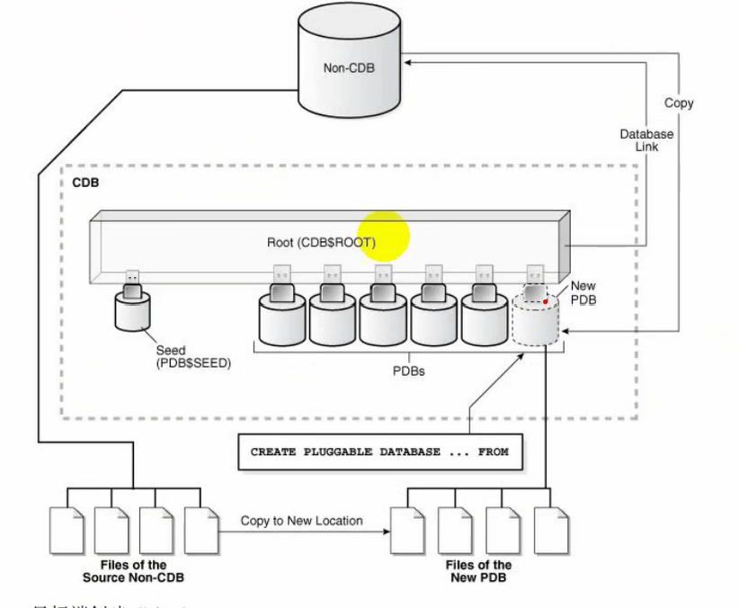

需要两端字符集、字节序相同。

```sh
# 源端授权
grant CREATE PLUGGABLE DATABASE, cdb_dba, sysoper to system container = all;

# 目标端创建link
create database link orcl2 connect to system identified by oracle using 'prod20';

create pluggable database pdb8 from prod_1@orc112
file_name_convert = ('/u01/app/oacle/oradata/PROD/', '/u01/app/oracle/oradata/ORCL/pdb8/');
```

非容器数据库克隆之后不能直接打开，需要运行一个脚本进行转换。需要使用拥有SYSDBA权限的用户在PDB中执行。将非容器数据库转换为pdb。

```sh
alter session set container = pdb8;
# @是执行的意思
@$ORACLE_HOME/rdbms/admin/noncdb_to_pdb.sql
```

### 重定位PDB

将源PDB移动到新的CDB。

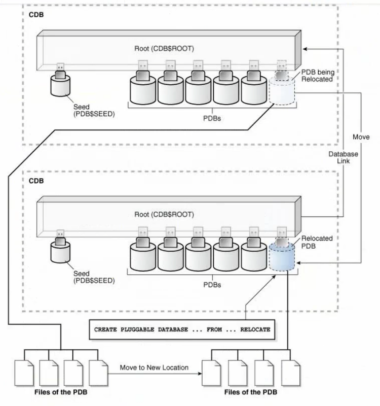

将PDB移动到其他CDB，当目标PDB由于ALTER PLUGGABLE DATABASE OPEN语句而联机时，Oracle数据库将终止活动会话并关闭源PDB。此技术是在**最少停机时间或没有停机时间的情况下移动PDB的最快方法**。而拔出源PDB会导致PDB中断，在relocation期间，源PDB可以以read/write模式打开并且功能齐全，源CDB和目的CDB的平台必须满足以下要求：
1. 必须具有相同的字节序。
2. 源平台上安装的数据库选项必须与目标平台上安装的数据库选项相同。
3. 如果目标CDB的字符集不是AL32UTF8，则源CDB和目标CDB必须具有兼容的字符集。
4. 源PDB必须处于本地undo模式

```sh
select property_name,property_value from database_properties where property_name = 'LOCAL_UNDO_ENABLED';
```

兼容性检查
```sh
# 源端生成pdb的xml文件
begin
dbms_pdb_describe(
    # 指定文件路径
    pdb_descr_file=>'/home/oracle/db1.xml',
    # 指定pdb
    pdb_name=>'db1');
end;

# 将xml文件复制到目标主机，目标端主机检查兼容性
set serveroutput on
declare
    compatible constant varchar2(3):=
    case dems_pdb.check_plug_compatibility(
        pdb_descr_file=>"/home/oracle/de1.xml",
        pdb_name=>'db1')
    WHEN TRUE THEN 'YES'
    ELSE 'NO'
end;
begin dbms_optput.put_line(compatible);
end;
/
```

源端打开容器
```sh
alter Pluggable database DB1 open;
```

目标端
```sh
Mydb20 =
    (DESCRIPTION =
        (ADDRESS_LIST =
            (ADDRESS = (PROTOCOL = TCP)(HOST = 192.168.1.20)(PORT=1521))
        )
        (CONNECT_DATA =
            (SERVIVE_NAME = mydb)
        )
    )

create database link mydb1 connect to system identified by oracle using 'mydb20';

create pluggable database pdb9 from db1@mydb1 relocate avaliablity max file_name_convert=('/u01/app/oracle/oradata/MYDB/db1','/u01/app/oracle/oradata/ORCL/pdb9/');
```

运行完创建命令后，目标端DB1状态为MOUNTED，而源端仍为READ WRITE

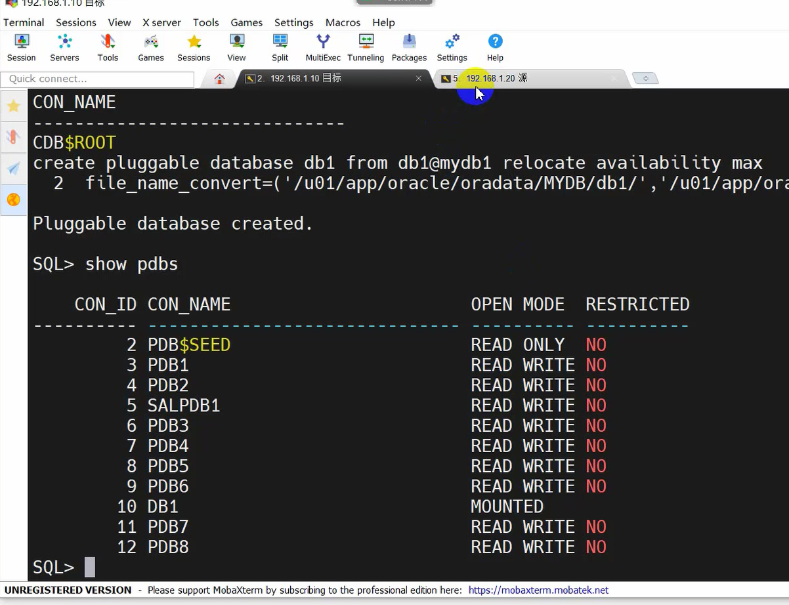

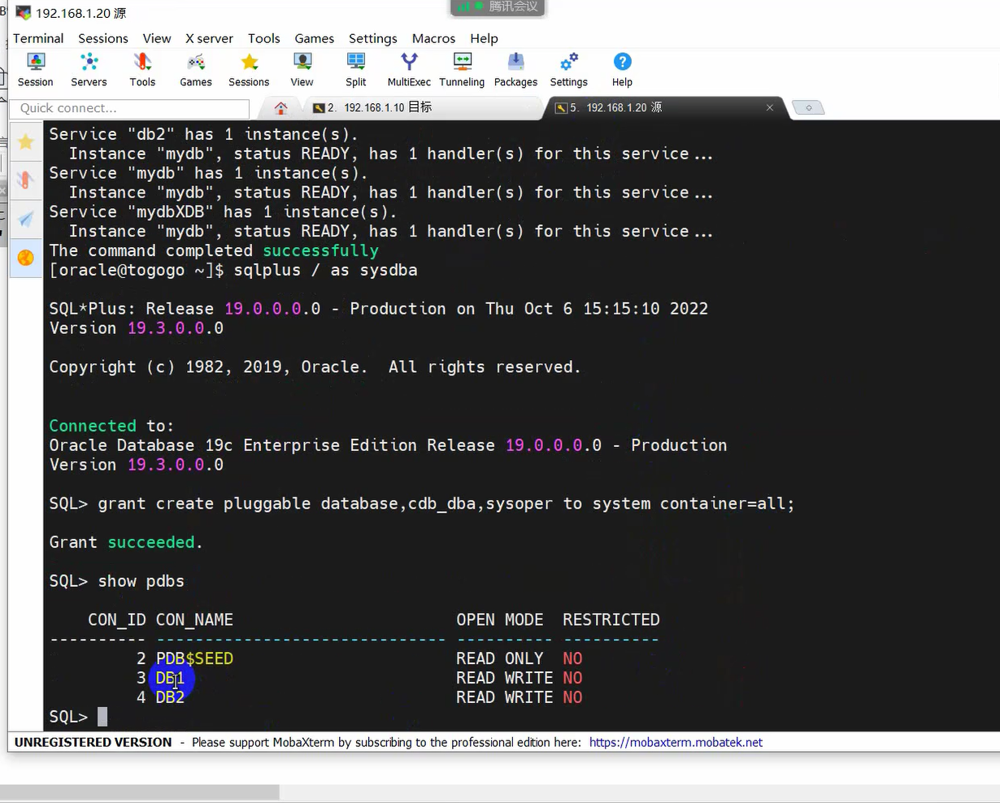

打开目标数据库容器后，源端DB1状态为MOUNTED，目标端状态为READ WRITE
```sh
alter pluggable database db1 open
```
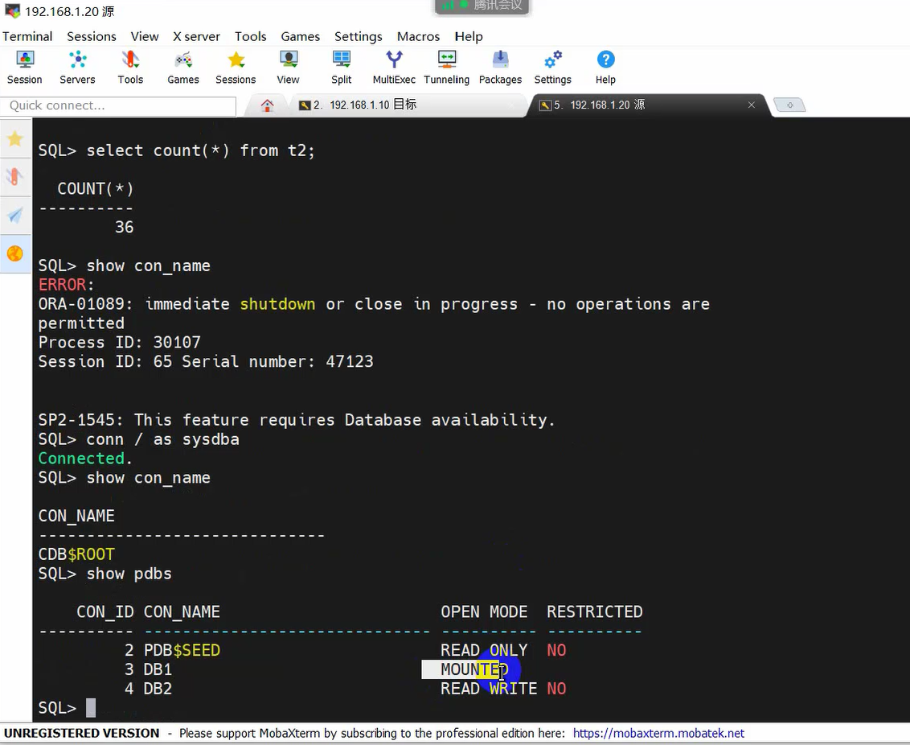
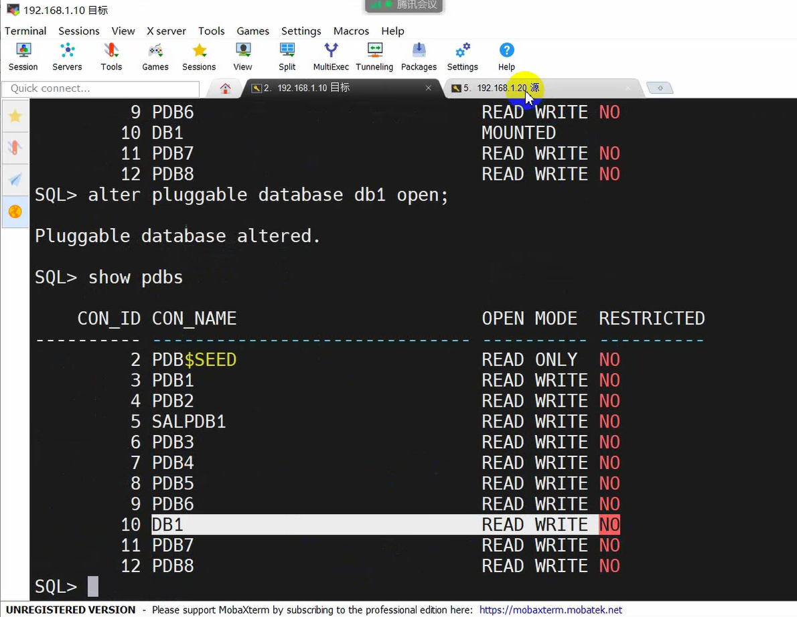

在源端也无法开启db1。

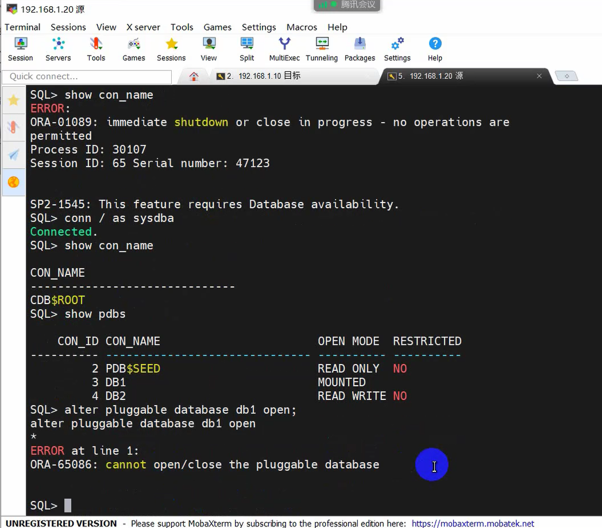

这个容器已经没用了

```sh
drop pluggable database db1;
```

做重定位之前PDB可以正常使用。<br />
重定位期间源PDB也可以正常使用。<br />
做完重定位之后新的PDB没打开前，源PDB也能正常使用。<br />
**目标端PDB打开后，源PDB才不能正常使用。**

### 插入一个拔出的PDB

将拔出的PDB插入CDB来创建PDB，使用描述PDB的**XML元数据文件**与**PDB相关联的文件**将其插入CDB。

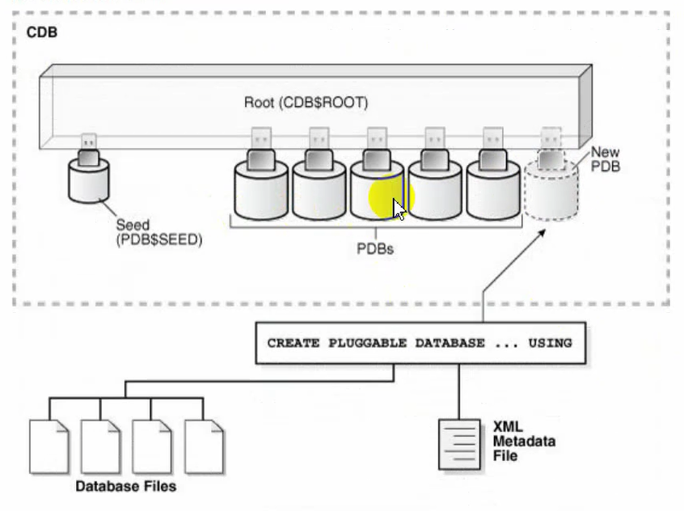

需要有数据文件和xml文件。

```sh
# 使用nocopy语句插入
alter plugging database pdb2 close immediate;
alter pluggable database pdb2 unplug into '/home/oracle/pdb2.xml';
drop pluggable database pdb2 keep datafiles;
create pluggable database pdb2 using '/home/oracle/pdb2.xml' no copy tempfile reuse;
```

### 代理PDB

在远程CDB中提供对不同PDB referenced PDB的访问。代理PDB提供对远程CDB中的PDB的访问，代理PDBs能够聚合来自多个源的数据。提交给代理PDB执行的SQL语句在引用的PDB中执行。引用的PDB中返回的数据是源PDB中的数据。

APDB和BPDB。A为源库，B代理。连接至B时查询的数据查询的是A库中的数据。修改A时可以在B中看到修改的数据。

典型的用例是引用应用程序根副本的代理PDB。如果多个CDB具有相同的应用程序定义，例如相同的表和PL/SQL包，则可以在主应用程序根的应用程序容器中创建代理PDB。代理PDB引用的PDB是另一个CDB中的应用程序根。通过在主根中运行安装脚本，其他CDBs中的应用程序根将成为主应用程序根的副本。

创建代理PDB使用 create pluggable database 语句和 from 子句，后者必须指定到远程CDB中引用的PDB数据库链接，以及as proxy子句。

如果直接将代理PDB插入到CDB$ROOT，必须在CDB$ROOT中创建代理。application PDB的代理必须同时插入到application root。

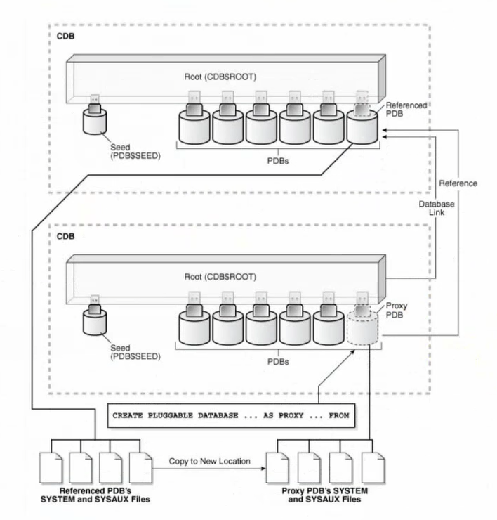

必须满足以下先决条件：
1. 完成“创建PDB的一般先决条件”中所述的先决条件。
2. 当前用户必须在创建代理PDB的CDB的根目录中具有系统特权。create pluggable database
3. 包含引用的PDB的CDB必须处于本地UNDO模式
4. 包含引用的PDB的CDB必须处于ARCHVELOG模式
5. 创建代理PDB时，引用的PDB必须处于打开读/写模式。创建代理PDB后，可以更改引用的PDB的打开模式。
6. database link必须启用从创建代理PDB的CDB到引用PDB的连接。数据库链路可以连接到远程CDB的根目录，也可以连接到远程PDB。
7. 如果database link连接到远程CDB，则连接的用户必须是公用用户，如果database link连接到引用的PDB，则database link在引用的PDB中连接的用户必须具有CREATE PLUGGABLE DATABASE的系统权限。

### PDB快照轮播

PDB snapshot Carousel 提供了在pdb手工或者自动生成快照，为开发测试用例提供了便捷。CDB为local undo和归档模式下，指定max_pdb_snapshots控制pdb最多生成快照的数量，当快照超过最大数量时，会覆盖最旧的快照，如图：

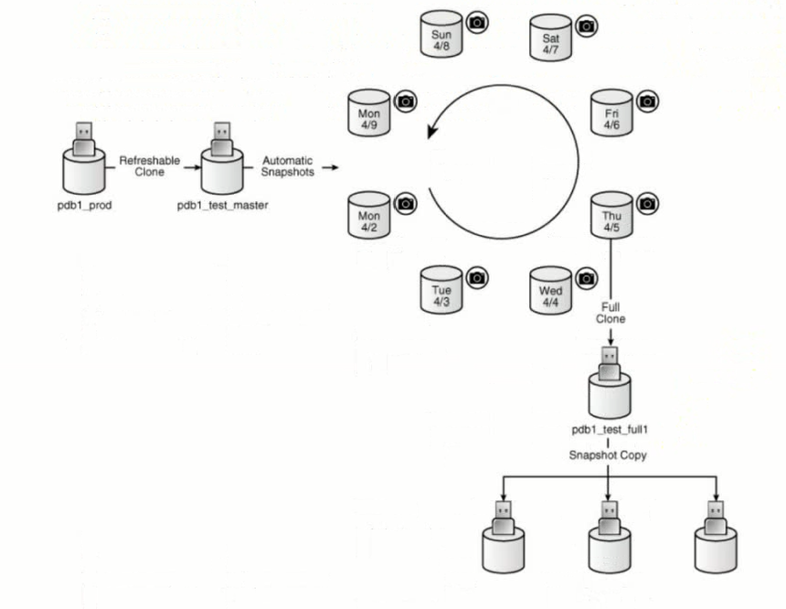

pdb1_prod生成一个master快照之后，生成若干个快照。master快照可有可无。最多可以生成8个快照，由参数设置。数量满了之后，会自动覆盖旧的快照。可以利用其中的快照分别生成PDB。可以根据测试数据需要，选择不同快照创建PDB。

快照会占用硬盘空间，文件默认存放在PDB的数据文件相同的目录中。系统自动生成的snapshot以snap_开头，唯一标示结尾的命名规则，包含当前SCN，.PDB结尾。

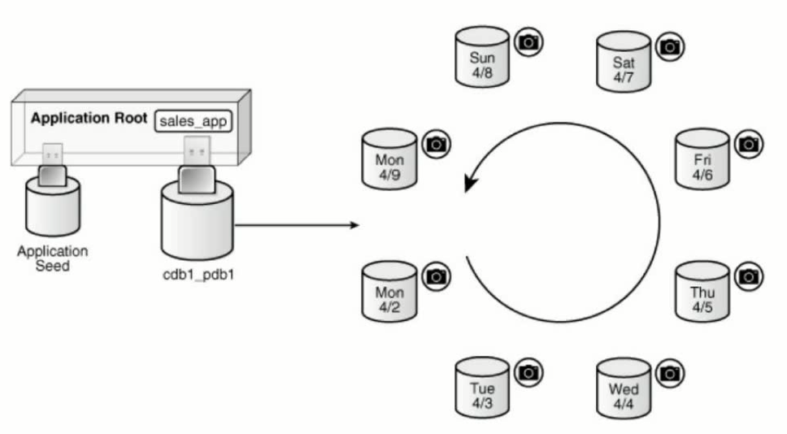

相关视图dba_pdb_snapshots、dba_pdbs查看快照相关信息。

#### 设置PDB snapshot最大数量

登录到PDB，查看cdb_properties，修改参数MAX_PDB_SNAPSHOTS。

#### 配置自动生成快照

默认情况下快照都是手动生成，使用snapshot mode every子句自动产生PDB快照。

```sh
select snapshot_mode "s_mode" , snapshot_interval/60 "snap_int_hrs" from dba_pdbs; 
```

进入PDB，更改自动创建模式为每24小时自动生成PDB快照
```sh
alter session set container=pdb1;
alter pluggable database snapshot mode every 24 hours;
ERROR at line 1:
ORA-12754: Feature PDB SNAPSHOT CAROUSEL is disabled due to missing capability.
# 解决方法
alter session set container = cdb$root;
alter system set "_exadata_feature_on"=true scope=spfile;
shutdown immediate;
startup
```

#### 查看创建的快照
```sh
select p.con_id,p.pdb_name,p.snapshot_mode,p.snapshot_interval from cdb_pdbs p order by 1;
```

#### 更改快照设置

更改快照设置需要连接到PDB。

### 可刷新的PDB

PDB Refresh具有对源端PDB进行增量同步的功能，每次刷新会将资源端PDB中的任何更改同步到目标PDB中（在此环境中目标PDB被称作Refreshable PDB）。目前增量同步方式有两种：手动同步方式与自动同步方式。

Refresh MODE语句：
1. 在使用Create Pluggable Database创建PDB时指定Refresh MODE句子用来控制是否开启刷新机制。
2. 该子句目前只在“Create Pluggable Database ... From ”中支持，可以使用此语句指定以下选项：<br>
&ensp;&ensp;&ensp;&ensp;Refresh MODE NONE，是默认方式，在创建PDB时不开启刷机机制。
&ensp;&ensp;&ensp;&ensp;Refresh MODE MANUAL，创建手动刷新的PDB。
&ensp;&ensp;&ensp;&ensp;Refresh MODE EVERY number_of_minutes MINUTES，创建以周期性刷新的PDB。

注意事项：
1. 如果PDB被Clone到的CDB的字符集不是AL32UTF8，那么源与目标字符集必须兼容。
2. 源端与目标端的字节顺序必须相同。
3. 连接的用户在CDB中必须拥有Create Pluggable Database权限
4. 源PDB不可以关闭
5. 源端PDB必须为归档模式
6. 源端PDB必须是local undo模式。
7. 在Refreshable PDB创建后，如果源端需要创建相应表空间，那么目标端需要配置PDB_FILE_NAME_CONVERT参数或使用OMF目录管理方式(OMF级别高于PDB_FILE_NAME_CONVERT)，否则会导致目标端PDB刷新失败。
8. 目标端采用OMF目录管理方式后，Create Pluggable Database子句中不能指定file_name_convert做显示目录转换，否则报ORA-01276错误。
9. 刷新与切换命令均需在目标PDB中执行。

