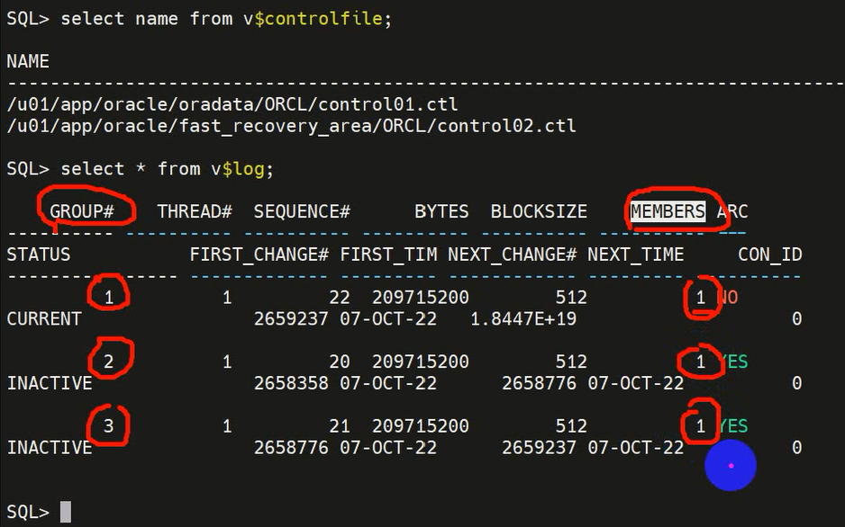

# 物理存储结构

Oracle数据库的数据文件：

1. 数据文件和临时文件 Data files and temp files 
数据文件时一个由Oracle数据库创建，并包含数据结构，包含数据库中的**用户数据和应用程序数据**。
2. 控制文件 Control files 
存储数据库**物理结构位置**的信息(数据文件、联机重做日志文件和归档的重做日志文件)。是数据库用来查找定位数据库文件，并管理数据库状态的根文件。在数据库装载(mount)和打开(open)后使用控制文件。
3. 联机重做日志文件 Online redo log files 
存储的是数据进行**更改的记录信息**。数据库维护在线重做日志文件，以防止数据丢失。用于数据库恢复。

数据库文件可以存储在：
1. ASM
2. 文件系统
3. 原始设备
4. 集群文件系统

永久和临时数据文件 
一个永久表空间包含模式（用户）对象数据。永久表空间中的对象（数据）存储在永久数据文件中。 
一个临时表空间包含一个会话的临时数据，这些临时数据存储在临时数据文件中。 

表空间和数据文件密切相关，但是有重要区别:
1. 每个表空间由一个或多个数据文件组成。表空间是逻辑概念，数据文件是物理概念。
2. 数据库的数据存储在表空间的数据文件中。
3. 段可以跨越一个或多个数据文件，但不能跨越多个表空间。
4. 数据库必须有SYSTEM系统表空间和SYSAUX辅助表空间。

控制文件是Oracle数据库用来查找数据库文件并通常管理数据库状态的根文件。控制文件包含以下信息：
1. 数据库名称和数据库唯一标识符(DBID)
2. 数据库创建的时间戳
3. 有关数据文件、联机重做日志文件和归档的重做日志文件的信息
4. 表空间信息
5. RMAN备份信息

控制文件用于以下目的：
1. 包含有关打开数据库所需的数据文件，联机重做日志文件等信息
2. 控制文件跟踪对数据库的结构更改。例如，当管理员（DBA）添加，重命名或删除数据文件或联机重做日志文件时，数据库将更新控制文件以反映此更改。
3. 包含在数据库未打开时必须可访问的元数据。
4. 在数据库使用期间(open)，Oracle数据库连续读取和写入控制文件，并且只要打开数据库就必须可以写入控制文件。

一个数据库至少有一个控制文件，建议有多个控制文件，多个控制文件的目的： 
Oracle数据库使多个相同的控制文件可以同时打开并为统一数据库写入。通过在不同磁盘上多路复用控制文件，数据库可以实现冗余，从而**避免单点故障**，即保证控制文件安全可用。

联机在线日志文件作用： 
数据库维护在线重做日志文件，以防止数据丢失。实现数据库的恢复。在一个数据库中至少有连个日志组，默认三个日志组，多个日志组实现日志切换。

log buffer中的数据通过lgwr写入online redo log file。online redo log file有固定大小，当这个日志组写满后写第二个，顺序切换。最后一个日志组写满后会重新写入第一个日志组。为了防止第一个日志组被覆盖，arcn进程会产生归档文件。

一个日志组至少由一个日志文件组成，也可以多个连接重做日志文件组成，即联机重做日志文件的多个副本。 
Oracle数据库可以在单独的位置自动维护两个或更多个相同的联机重做日志副本。一个联机重做日志组由一个联机重做日志文件和它的冗余副本组成。维护在线重做日志组的多个成员可以防止重做日志文件的丢失。

redo log buffer 内容通过LGWR写入Group1，相同的信息同时写入redo01a.log和redo01b.log，两个文件互为镜像，放在不同的磁盘中，避免单点故障。

联机在线重做日志存放的信息：
1. SCN和时间戳
2. 事务信息，如事务ID
3. 当事务提交时的SCN和时间戳
4. 操作类型
5. 数据段的名称和类型
