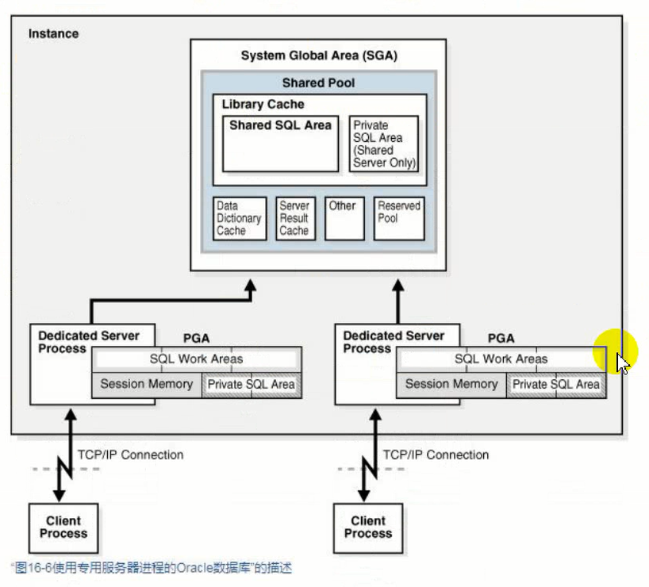
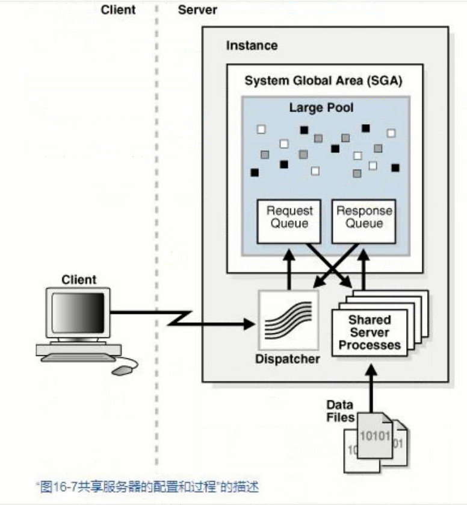
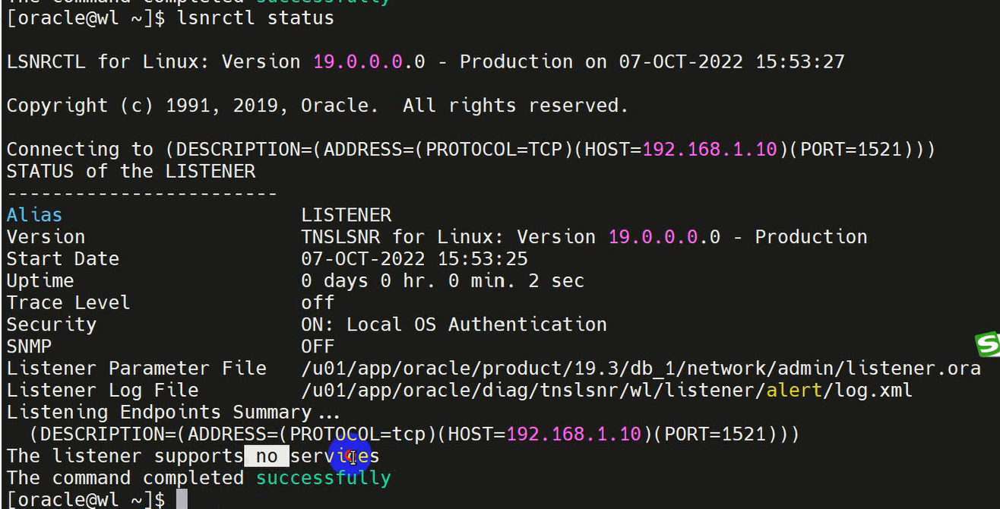
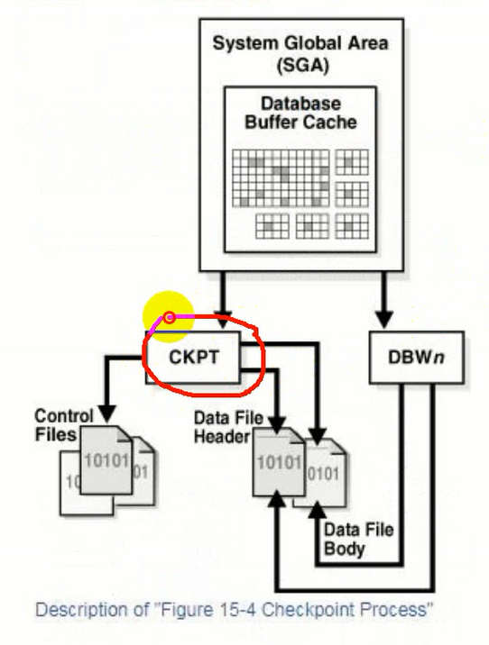

# 进程结构

进程类型有**客户端进程**和**Oracle进程**。客户端进程是运行应用程序或Oracle工具。

Oracle进程运行Oracle数据库代码。包括以下子类型：

1. **后台进程**： 
从数据库实例启动开始，并执行维护任务，例如执行实例恢复，清理进程，将重做缓冲区写入磁盘等。
2. **服务器进程**： 
执行客户端的请求 
3. **从属进程**： 
为后台或服务器进程执行其他任务。

## 服务器进程

处理连接到该实例的客户端进程的请求。客户端进程始终通过单独的服务器进程与数据库通信。

服务器进程的主要作用：
1. 解析并运行通过应用程序发布的SQL语句，包括创建和执行查询计划
2. 执行PL/SQL代码
3. 将数据文件中的数据块读入数据库缓冲区高速缓存
4. 返回结果

服务器进程分为**专有服务器进程**和

### 专有服务器进程

客户端连接仅与一个服务器进程关联。每个客户端进程都直接与其服务器进程通信。

一个客户端分配一个服务器进程，一个服务器进程分配一个PGA内存。

### 共享服务器进程

客户端应用程序通过网络连接到调度程序进程，而不是服务器进程。调度程序接收来自已连接客户端的请求，并将其放入大型池的请求队列中

客户端连接到调度器，调度器将客户端的请求放在大池的请求队列中，共享服务器进程从请求队列中得到客户端请求，生成执行计划和查询结果等，将返回数据放到大池的响应队列中，调度器从响应队列得到结果返回给客户端。

## 后台进程

后台进程执行操作数据库所需的维护任务，并最大化多个用户的性能。

### 强制后台进程

#### 程序监控进程 PMON

监视其他后台进程和执行进程恢复。PMON负责清理数据库缓冲区高速缓存并释放客户端进程正在使用的资源。例如，PMON重置活动事务表的状态，释放不再需要的锁，并从活动进程列表中删除进程ID。

#### 监听器注册器进程 LREG

LREG向监听器注册有关实例和调度程序进程的信息。实例启动时，LREG**轮询侦听器**以确定它是否正在运行。如果侦听器正在运行，则LREG会向其传递相关参数。如果它没有运行，则LREG会定期尝试与它联系。

监听器关闭再打开后，看不到相关服务。但是过一会儿相关信息就注册进来了。因为LREG是轮询工作的，将实例和相关信息写入。

#### 系统监控进程 SMON

负责各种系统级清理职责。分配给SMON的职责包括：
1. 必要时在实例启动时执行实例恢复。
2. 恢复由于文件读取或表空间脱机错误而在实例恢复期间跳过的终止事务。当表空间或文件重新联机时，SMON将恢复事务。
3. 清理未使用的临时段。例如，Oracle数据库在创建索引时分配范围。如果操作失败，则SMON清理临时空间。
4. 在字典管理的表空间内合并连续的自由空间。

#### 数据库写进程 DWN n

将数据库缓冲区的内容写入数据文件。DBW n进程将数据库缓冲区高速缓存中的已修改缓冲区数据写入磁盘。

在以下情况下，DBW n进程将脏缓冲区写入磁盘：

当服务器进程在扫描缓冲区后无法找到干净的可重用的缓冲区时，服务器进程将向DBW n发送信号，让DBW n进行写入。

DBW n定期写入缓冲区以推进检查点，检查点时重做线程中进行实例恢复的开始位置。

检查点执行时也会触发DBW n写入。

DBW n是被动的，只有在通知时才会写入。

#### 日志写进程 LGWR

负责管理重做日志缓冲区。LGWR将重做日志缓冲区的一个连续部分内容写入到联机在线重做日志文件中。

在以下情况下，LGWR将自上次写入以来已复制到缓冲区的所有重做条目写入：

1. 用户提交事务
2. 发生联机重做日志切换
3. 自LGWR上次写以来已经过去了三秒钟
4. 重做日志缓冲区已满三分之一，或包含1MB的缓冲数据
5. DBW n必须将修改后的缓冲区写入磁盘。
6. 在DBW n可以写入脏缓冲区之前，必须将与更改缓冲区相关联的重做记录写入磁盘

#### 检查点进程 CKPT

更新控制文件和数据文件的相关信息，通知DBWn后台进程写磁盘。

#### 可管理性监视进程 MMON和MMNL

管理监控进程MMON执行相关的许多任务自动工作负载AWR，MML写入从活动会话历史ASH在SGA磁盘缓冲区的统计数据。

#### 恢复进程 RECO

在分布式数据库中，RECO自动解决分布式事务中的故障。

### 可选后台进程

#### 存档进程 ARC n

将联机重做日志文件复制到脱机的归档文件中，即归档。

#### 作业队列进程 CJQO和Jnnn

Oracle数据库动态地管理作业队列过程，从而时作业队列客户端可以在需要时使用更多地作业队列过程。

#### 闪回数据归档进程 FBDA

跟踪表到闪回数据归档地历史行。当在跟踪表上包含DML的事务提交时，此过程将行的前映像存储到闪回数据存档中。它还将元数据保留在当前行上。

#### 空间管理协调员进程 SMCO

SMCO流程协调各种与空间管理相关的任务的执行，例如主动空间分配和空间回收。

### 从属进程

I/O从属进程Innn为不支持它的系统和设备模拟异步I/O

