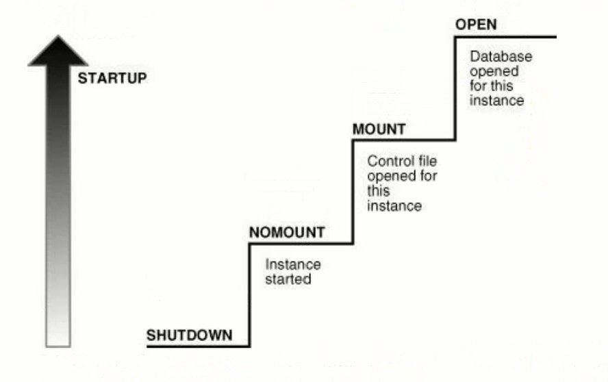
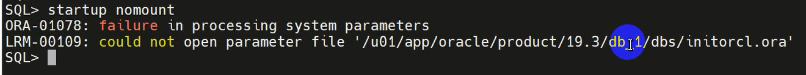
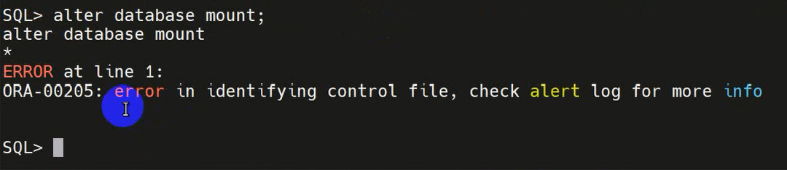
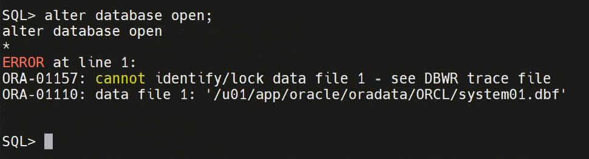
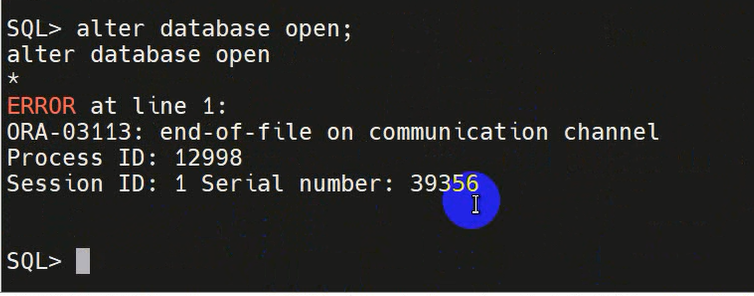
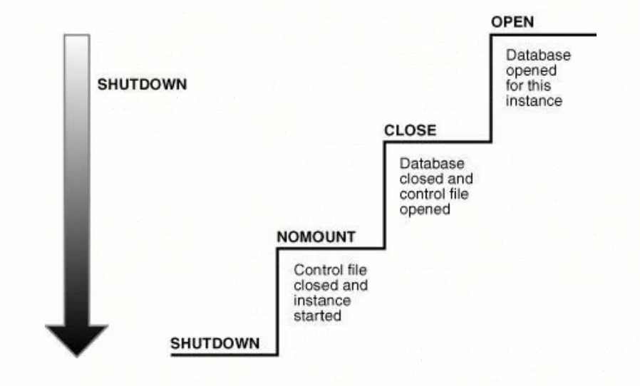
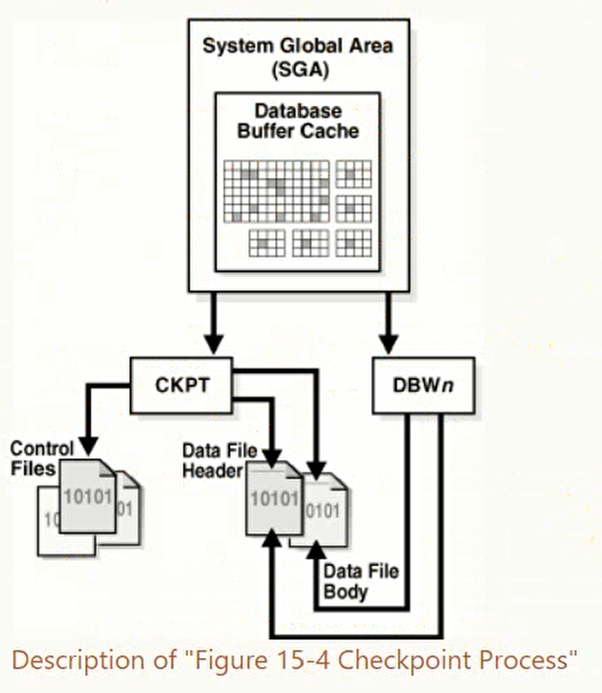
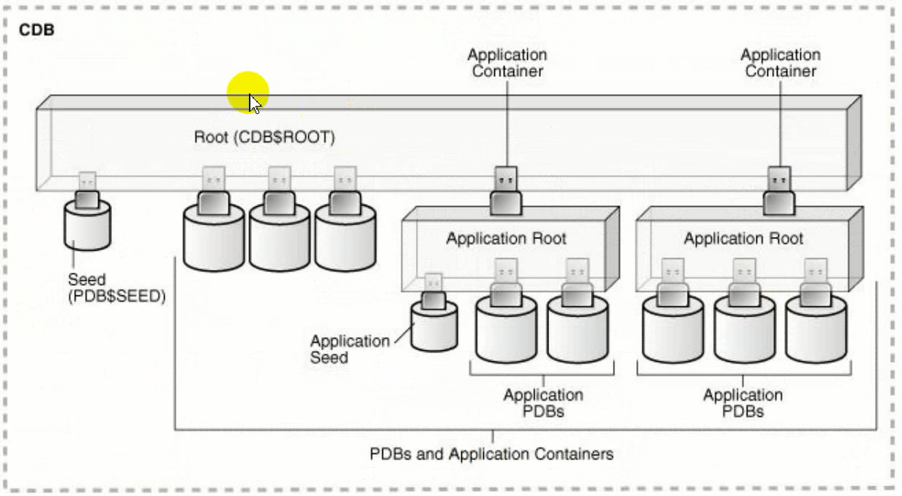

# Oracle启动和关闭

## 启动

### 启动过程
Oracle数据库从关闭到打开主要有三个阶段
* **NOMOUNT** 实例启动
* **MOUNT** 装载数据库
* **OPEN** 打开数据库



实例启动：通过SID找到**参数文件**(参数文件)，读取参数文件中的参数分配内存，启动后台进程，实例启动，进入NOMOUNT状态。

装载数据库：读取参数文件中记录的control_files参数，记录了**控制文件**的位置，定位到数据库的控制文件，和数据库建立关联，装载数据库，进入MOUNT状态。

打开数据库：控制文件中记录着数据库的物理结构信息，**数据文件和联机在线日志文件**的位置。定位并打开文件后，数据库打开，进入OPEN状态。

参数文件丢失，无法进入NOMOUNT状态；控制文件丢失，无法进入MOUNT状态；数据和日志文件丢失，无法进入OPEN状态。

分步骤完成数据库启动：
```shell
# 数据库启动实例，分配内存，启动后台进程
startup nomount

# 进入mount状态
alter database mount;

# 进入open状态
alter database open;

# 查询数据库状态
select status from v$instance;
```

### 错误

#### 丢失参数文件
丢失参数文件或者SID故障，无法启动实例。


#### 丢失控制文件
丢失控制文件，无法进入MOUNT状态。


#### 丢失数据文件



#### 丢失联机日志文件
报错与丢失数据文件不同。


## 关闭

数据库关闭也有四个个阶段
* **OPEN** 数据文件和联机在线日志文件打开。
* **CLOSE** 数据文件和联机在线日志文件关闭。
* **NOMOUNT** 关闭控制文件，实例打开。
* **SHUTDOWN** 实例关闭。


关闭数据库的命令
* 强制关闭 shutdown -abort
* 立即关闭 shutdown -immediate
* 事物关闭 shutdown -transactional
* 常规关闭 shutdown -normal
执行时需要具有SYSDSBA的权限或者SYSOPER特权。

```shell
# 创建用户并授权
sqlplus / as sysdba
create user [username] identified by [password];
grant sysdba to [username] container=all;
```

四条命令的区别：
|Database Behavior|ABORT|IMMEDIATE|TRANSACTIONAL|NORMAL|
|-|-|-|-|-|
|Permits new user connections|NO|NO|NO|NO|
|Waits until current sessions end|NO|NO|NO|YES|
|Waits until current transactions end|NO|NO|YES|YES|
|Performs a checkpoint and closes open files|NO|YES|YES|YES|

允许新用户连接：均不允许。<br />
等待当前会话结束：仅NORMAL等待结束。<br />
等待当前事物结束：TRANSACTIONAL和NORMAL会等待。事物：DML操作(insert/update/delete)，创建表修改表，授权回收权限会产生事物。事物的结束：正常结束会话，执行rollback或者commit。<br />
执行检查点：仅ABORT不执行。ABORT是**非一致性关闭数据库**，其余三种是**一致性关闭**。一致性关闭数据库，后续启动不用做实例恢复。

NORMAL关闭最安全，但是使用的时间最多。<br />
使用最多的是**IMMEDIATE**。<br />
shutdown immediate 后未提交的事物会被回滚。<br />
shutdown abort后需要做实例恢复。

分步关闭数据库：
```shell
alter database close;
alter database dismount;
shutdown
```

检查点进程，做检查点时就是在执行检查点进程。<br />
检查点进程会更新控制文件头部和数据文件头部的信息，通知DBWn将脏数据写回数据文件。从内存写入磁盘，保持数据的一致。


## Oracle多租户环境

多租户环境(Multienant Environment)中，允许一个数据库容器CDB承载多个可插拔数据库(PDB)。CDB全称为Container Database，即，数据库容器，PDB全称为Pluggable Database，即可插拔数据库。



ROOT 又叫CDB$ROOT，根容器，也称为CDB容器。CDB存储着ORACLE提供的元数据(表的属性)和Common User。CDB容器中承载着多个PDB。这些PDB在该CDB下管理。

SEED 种子容器。PDB$SEED，是创建PDB数据库的模板，是只读的，不能在Seed中添加或修改对象。一个CDB中有且只能有一个SEED。

PDB CDB中可以有一个或多个PDBS，最多可以有4096个。每个PDB跟11G的数据库一样，PDBS向后兼容，可以像以前在数据库中那样操作PDBS。

每个组件都能被称为一个容器，根容器，种子容器，PDB容器。每个容器在CDB中都有一个独一无二的ID和名称，是不能重复的。

```sh
select PDB_ID,DBID,PDB_NAME,CON_UID from cdb_pdbs;
```

之前的启动和关闭过程都是CDB的启动和关闭。（startup shutdown）

在调试数据库时以受限的模式打开数据库，不希望其他用户连接。

```sh
startup open restrict
```

首先执行shutdown abort，再执行startup。

```sh
startup force
```

默认情况下使用sqlplus / as sysdba 登录的是CDB。在CDB启动后，PDB是自动启动到mount状态，而不是OPEN。(种子容器是READ ONLY)
```sh
sqlplus / as sysdba
show pdbs
```

启动和关闭CDB：
```sh
# 启动
startup [nomount | mount | restrict | force | read only]
# 关闭
shutdown [immediate | abort]

alter database close;
alter database dismount;
shutdown
```

启动和关闭PDB
```sh
alter pluggable databse [pdbname] open;
alter pluggable databse [pdbname] close;
alter pluggable databse [pdbname] open read only force;
alter pluggable databse [pdbname],[pdbname] close immediate;
select name,open_mode from v$pdbs;
alter pluggable databse all open;
alter pluggable databse all close immediate;
alter pluggable databse all except [pdbname] open;
alter pluggable databse all except [pdbname] close immediate;

# 切换容器
alter session set container = pdb1;

```

在CDB中运行startup是开启数据库，closed->nomount->mounted->open

在PDB中运行startup是开启PDB容器。

## PDB自动启动

默认情况下，PDB不会随CDB额启动而启动。CDB启动后，PDB处于mount状态。

PDB自动启动设置：

### 创建触发器

```sh
# 方法1，创建一个触发器
create trigger open_all_pdbs
    after startup on database
begin
    execute immediate 'alter pluggable databse all open';
end open_all_pdbs;
```
### 保存PDB状态

在 pdb open状态时保存状态
```sh
SQL> alter pluggable database all save state;
# 取消自动启动
SQL> alter pluggable database all discard state;
```