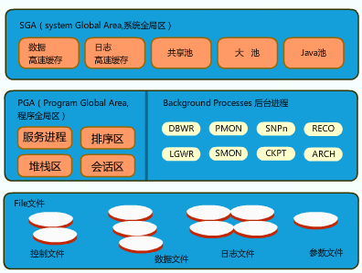
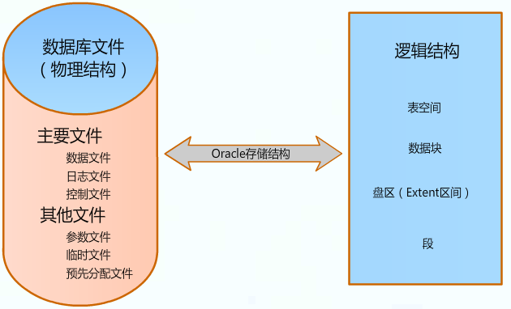
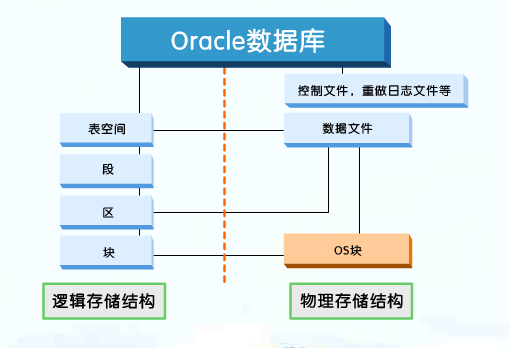
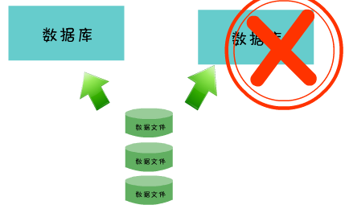
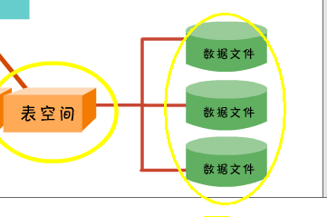
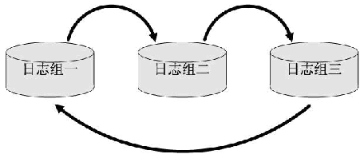

# Oracle体系结构

## Oracle核心竞争力
**可扩充性**： 
Oracle系统有能力承担增长的工作符合，并且相应的扩充系统资源利用情况。

**可靠性**： 
无论出现系统资源崩溃，电源断电还是系统故障的时候，我们都可以对Oracle进行配置。 
以保证检索用户数据事物处理的时候不受影响。

**可管理性**： 
数据库管理员可以微调Oracle使用内存的方式，以及Oracle向磁盘写入数据的频率。并且管理可以调整，数据库为连接到数据库的用户分配操作系统进程的方式。 

Oracle总体结构分为三个部分： 
第一部分：系统全局区(SGA) 
第二部分：程序全局区和后台进程 
第三部分：Oracle的文件

从功能上划分： 
存储结构：包括控制文件、数据文件、日志文件等文件。这些文件构成了Oracle的物理存储结构。 
内存结构：包括系统全局区(SGA)和程序全局区(PGA)。使用内存最多的是**SGA**，也是**影响数据库性能**最大的一个参数。 
进程结构：包括前台进程、后台进程。前台进程是指服务进程和用户进程，是根据实际需要而运行的，并在需要结束后立刻结束。后台进程是指数Oracle数据库启动后自动启动的几个操作系统进程。 

## 存储结构
包括物理结构和逻辑结构，既独立又相互联系的。 

物理结构：物理存储结构主要描述Oracle数据库的外部存储结构，即在操作系统中如何组织、管理数据。是和操作系统平台有关的。 

逻辑解构：逻辑存储结构主要描述Oracle数据库的内部存储结构，即从技术该念上描述在Oracle数据库中如何组织、管理数据。逻辑存储结构是和操作系统平台无关的。

该图是两种存储结构中的对应关系。 
表空间包括系统表空间和用户表空间。表空间也是最大的逻辑单位。 
块是最小的一个逻辑单位。 
逻辑结构的表空间对应物理结构的数据文件，**也就是创建表空间的时候要给它指定数据文件**,但是一个表空间可以对应多个数据文件。表空间的大小也就是他包含的数据文件大小的总和。 
数据文件同时对应着操作系统中的数据块，数据文件也是以数据块的形式，存在于操作系统中。 
逻辑结构中的块也对应着操作系统的数据块。

### 物理存储结构
Oracle的物理存储结构，也就是Oracle的数据库文件。 
数据库文件又分为主要文件和其他文件。 

**主要文件** 
数据文件、日志文件、控制文件

**数据文件** 
是物理存储数据库数据的文件，有以下特点： 
每一个数据文件只与一个数据库相关联。不能同时对应两个数据库。

一个表空间可以包含一个或多个或多个数据文件，也就是说表空间的大小就是他包含的数据文件大小的总和，

一个数据文件只能属于一个表空间

表空间有用户默认的表空间和临时表空间 
用户默认的表空间可以是由一个或者多个数据文件组成。 
临时表空间就我们用tmpfile选项指定的一个临时文件。用于存放排序操作产生的临时数据。 
当执行排序操作时如果临时数据超过排序去的尺寸，那么服务器进程会将临时数据放到临时表空间中。但是不管是用户默认的表空间还是临时表空间，数据最终存储在数据文件中。 

**日志文件** 
重做日志文件(Redo Log)、归档日志文件(Archive Log) 

**重做日志文件** 
用于记录数据库变化，是用户的事务处理日志。
当进行历程恢复和介质恢复的时候，我们需要使用重做日志，如果没有重做日志，用户能够执行的唯一恢复手段就是从最后的完整备份中复原。 
数据库至少要包含两个重做日志组，并且这些重做日志组是循环使用的。 
假定数据库中有三个日志组：

在初始阶段，日志文件写入进程，会将事务变化写入日志组一，当日志组一写满后，Oracle会自动进行日志切换，并且循环使用这三个日志组。当所有日志写满后，如果需要归档就会生成归档日志(是非活动重做日志的备份)。 
