# 表空间

Oracle数据库由若干个表空间构成。任何数据库对象在存储时都必须存储在某个表空间中，以逻辑存储结构使用数据库，表空间、段、区、块。表空间对应于若干个数据文件，即表空间是由一个或多个数据文件构成的。表空间的大小就是表空间下数据库文件大小之和，数据库大小是系统各个表空间大小之和。

## 常用表空间

### 系统表空间

系统表空间中存放注入表空间名称、表空间所含数据文件等数据库管理所需的信息。系统表空间的名称hi不可更改的。系统表空间必须在任何时候都可以使用，也是数据库运行的必要条件。因此，系统表空间是不能脱机的。

系统表空间包括数据字典、存储过程等信息。为避免系统表空间产生存储碎片以及争用系统资源的问题，应创建一个独立的表空间来单独存储用户数据。

SYSTEM表空间建议不存放用户数据，应当为系统设定缺省的默认表空间来避免用户创建时使用系统表空间。

```sh
select property_name, property_value from database_properties where property_name like 'DEFAULT%';
```

用户创建对象时若没有指定具体表空间，就会使用USERS。

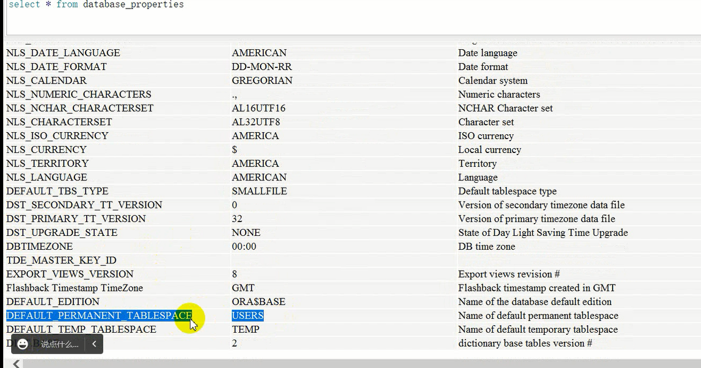

系统表空间**不能脱机、不能置为已读、不能重命名、不能删除**。

### SYSAUX表空间

SYSAUX系统辅助表空间随着数据库的创建而创建，它充当SYSTEM的辅助表空间，主要存储**除数据字典以外的其他对象**。SYSAUX是数据库的默认表空间，使用SYSAUX表空间降低了SYSTEM表空间的负荷。

SYSAUX表空间不能删除、不能重命名、不能置为只读。**可以脱机**。

```sh
# 脱机
alter tablespace sysaux offline;
# 联机
alter tablespace sysaux online;
```

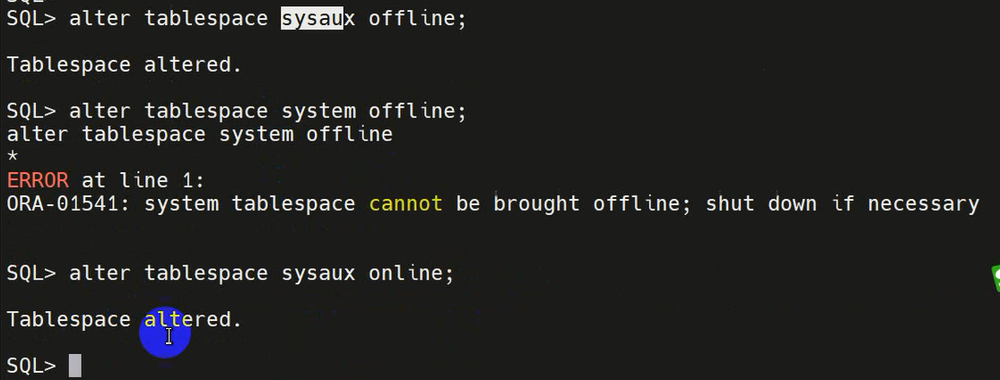

### 临时表空间

临时表空间(temp tablespace)主要用于存储Oracle数据库运行期间所产生的临时数据。主要用来做查询和存放一些缓冲区数据。临时表空间消耗的主要原因是需要对查询的中间结果进行排序。当数据库关闭后，临时表空间中所有数据将全部被清除。出临时表空间外，其他表空间都属于永久性表空间。

临时表空间作用：
1. 索引create或rebuild
2. Order by或group by
3. Distinct操作
4. Union或intersect或minus
5. Sort-merge joins
6. analyze

### 撤销表空间

Undo tablespace 撤销表空间用于保存Oracle数据库撤销信息，即保存用户回滚段的表空间，称之为回滚表空间（或简称为撤销表空间）。UNDO表空间用于存入数据修改后的旧值。

更新后新的数据放在缓存中，旧数据放在还原段中。

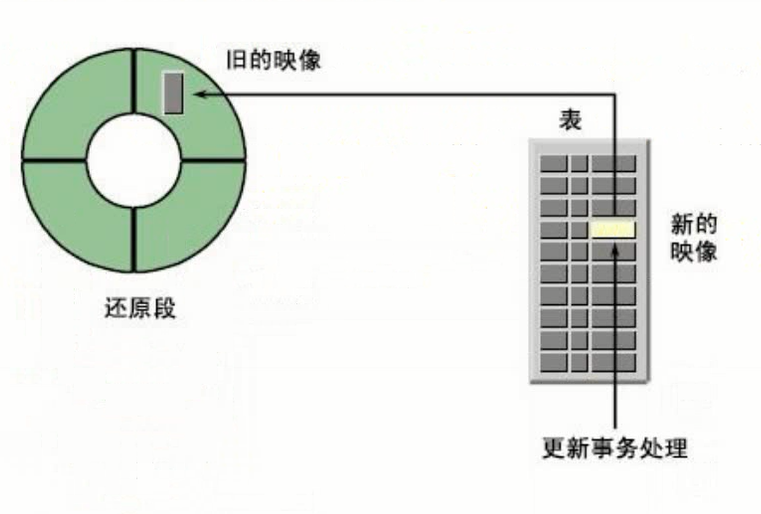

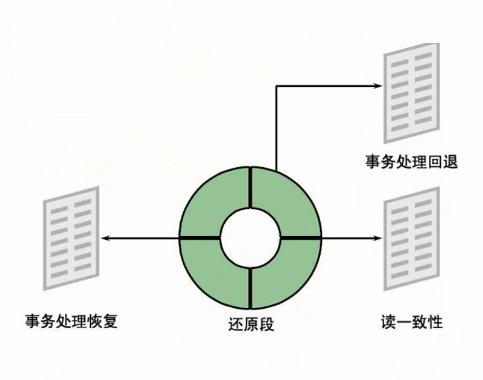

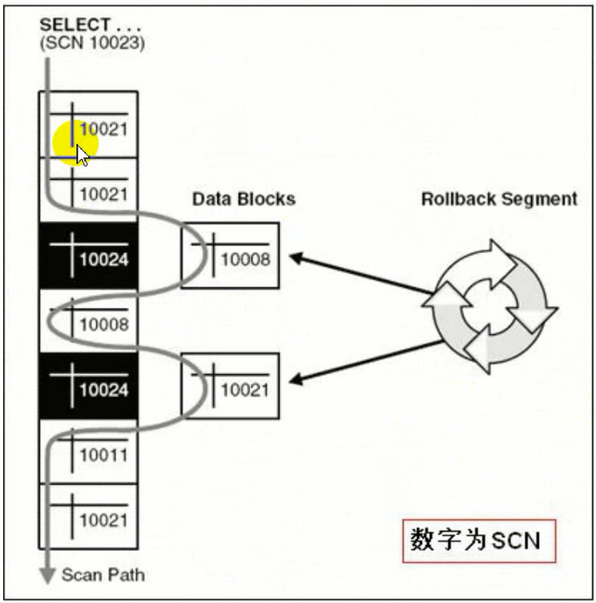

undo表空间的大小直接影响到flashback query的查询能力，因为多版本查询所依赖的undo数据都存储在undo表空间中，该表空间越大，所能够存储的undo数据就越多，如果该表空间可用空间非常小，不仅flashback，可能正常哈寻都有可能出错。

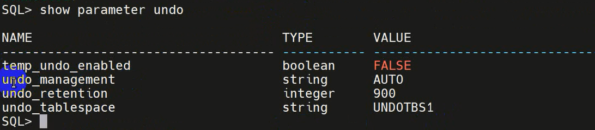

初始化参数UNDO_RETENTION用来指定undo记录保存的最长时间，以秒为单位，是个动态参数，可以在实例运行时随时修改，通常默认时900秒，15min。

undo_tetention 设置与dba_tablespaces中的retention有关。

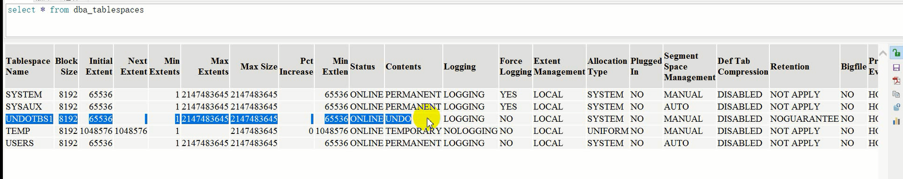

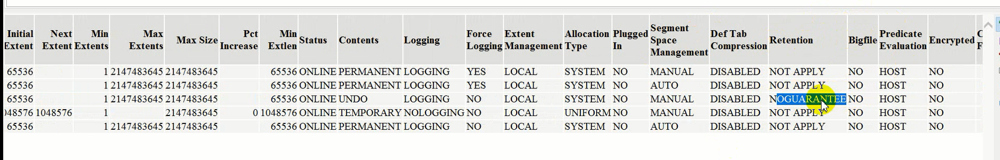

该参数为guarantee则undo数据一定会保留UNDO_RETENTION。此时如果undo空间不足，就会报错。

noguarantee时不一定会保留UNDO_RETENTION。此时若undo空间充足就会保留够，不足时不一定会保留，系统优先分配undo空间。

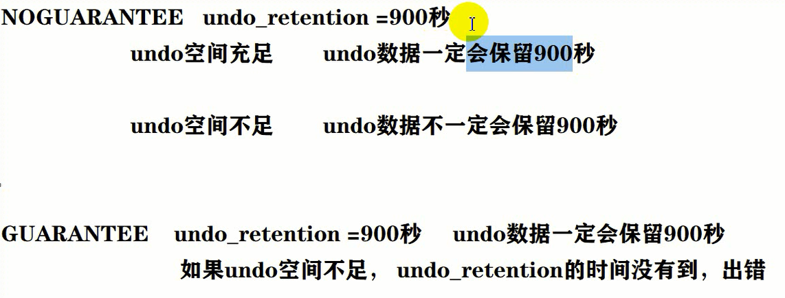

undo_retention只是指定数据的过期时间，并不是说undo中的数据一定会在鴤表空间中保存15min。比如一个事务开始时，如果undo空间已经被写满，则新事物的数据会自动覆盖以提交事务的数据，而不管是否过期。因此，当创建一个自动管理的鴤
表空间时，还要注意其空间打下，要尽可能保证undo表空间由足够的存储空间。

同时，undo_retention时间一过，已提交事务中的数据并不是立刻无法访问，只是失效，只要不被别的事务覆盖，它仍然会存在，并可以随时被flashback特性引用。如果鴤表空间足够大，数据库又不那么繁忙，undo_retention的值并不会影响。

:::tip
要注意undo表空间大小，保证其有足够的存储空间。
:::

只有在设置retention guarantee时，undo表空间中的数据在过期前一定有效。

```sh
alter tablespace undotbs1 retention guarantee;
alter tablespace undotbs1 retention noguarantee;
```

一个事务执行必须获得足够的undo空间来存储事务产生的undo信息，如果事务不提交，则undo信息被保留，如果事务提交了，则undo信息不一定会保留，因为undo循环使用。

## 使用多个表空间的好处

1. 不同类型的数据存入到不同的表空间中，可以更灵活地管理数据库。
2. 将还原段、临时段、应用程序数据段和应用恒旭索引店分开存储到不同表空间中。
3. 根据备份要求将数据分开存储。
4. 将动态护具和静态数据分别存储在不同额表空间中，以利于备份和恢复。
5. 通过分配给用户表空间上的配额，避免分某个用户占用表空间太多的存储空间。
6. 将用户护具与数据字典数据分离，以减少I/O争用。
7. 将一个应用程序地数据与另一个应用程序地数据分开，以防止在表空间必须脱机时多个应用程序受到影响。
8. 将不用表空间的数据文件存储在不同的磁盘驱动器上，以减少I/O争用。
9. 使单个表空间脱机，而其他表空间保持联机，从而提供更好的总体可用性。
10. 通过为特定类型的数据库使用（如高更新活动、只读活动或临时段存储）保留表空间来优化表空间的使用。
11. 备份单个表空间。

## 本地化管理的表空间

本地管理的表空间使用存储在每个数据文件中的位图来管理数据块。本地管理的表空间使用位图跟踪表空间本身中的所有扩展数据块信息。

本地管理的表空间提供了以下好处：
1. 快速并行的空间操作。空间分配和释放修改本地管理的资源(存储在头文件中的位图)
2. 增强的性能。
3. 允许使用可读的备用数据库，因为本地管理的临时表空间不会生成任何撤销或重做。
4. 红箭分配被简化，因为当指定autoallocate子句使，数据库会自动选择适当的区块大小。
5. 减少了用户对数据字典的依赖，因为必要的信息存储在文件头和位图块中。
6. 本地管理的表空间不需要合并可用扩展数据块。
7. 所有表空间，包括系统表空间，都可以在本地管理。

## 操作

### 查看数据块有哪些表空间

1. 包含数据库中所有表空间的描述信息
```sh
select * from dba_tablespaces;
select name from v$tablespace;
```
dba_tablespace存放的信息：
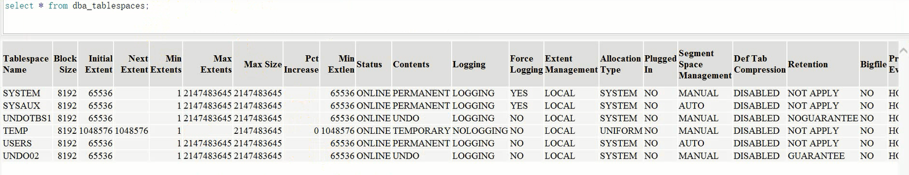

2. 包含当前用户的表空间的描述信息
```sh
select * from user_tablespaces;
```

3. 包含从控制文件中获取的表空间名称和编号信息
```sh
select * from v$tablespace;
select name from v$tablespace;
```

### 查看表空间对应的数据文件

1. 包含数据文件以及所属的表空间的描述信息
```sh
select * from dba_data_files;
select file_name,tablespace_name from dba_data_files;
```
dba_data_files记录信息：
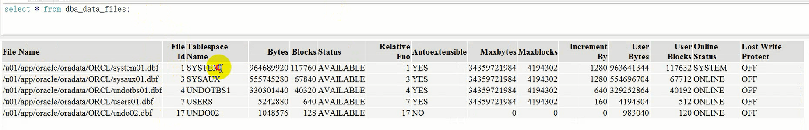


2. 包含临时数据文件以及所属的表空间额描述信息
```sh
select * from dba_temp_files;
```

3. 包含从控制文件中获取的数据文件的基本信息，包括所属的表空间名称、编号等
```sh
select * from v$datafile;
```

4. 包含所有临时数据文件的基本信息
```sh
select * from v$tempfile;
```

### 查看默认的temp表空间

1. 数据库级别
```sh
select property_name,property_value from database_properties where property_name = 'DEFAULT_TEMP_TABLESPACE';
```

2. 用户级别
```sh
select username,default_tablespace from dba_users;
```

如果用户指定了表空间，使用的就是用户表空间，如果用户没有指定表空间，使用的是系统表空间。

### 查看默认的永久表空间

如果创建用户时，不指定其永久表空间，则会使用默认的表空间。
```sh
select property_name,property_value from database_properties;
```

### 创建表空间

1. 创建mytbs8并设置数据文件为自动扩展
```sh
create tablespace mytbs8 datafile '/u01/app/oracle/oradata/orcl/mytbs08.dbf' size 5M autoextend on next 1M maxsize 50M;
```
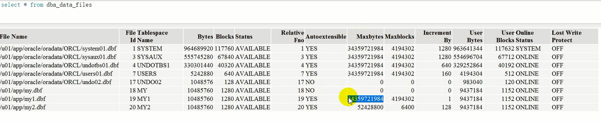

2. 查询dba_data_files视图以确定是否启用autoextend
```sh
select file_name,autoextensible from dba_data_files where tablespace_name='mytbs8';
```

3. 设置自动段空间管理

### 删除表空间

删除表空间时，ORACLE仅仅是在控制文件和数据字典中删除与表空间和数据文件相关的信息。默认情况下，ORACLE并不会在操作系统中擅删除相应的数据文件，因此在成功执行删除表空间的操作后，需要手动删除该表空间在操作系统中对应的数据文件。

如果在删除表空间的同时要删除对应的数据文件，则必须显示的指定INCLUDE CONTENTS AND DATAFILES子句。

注意，当前数据库级的默认表空间不能删除，用户级的可以删除。

```sh
drop tablespace [表空间名] [including contents [and datafiles] [cascade constraints]]
```

删除表空间时需要遵循如下原则：
1. 如果表空间中包含数据段，必须使用including contents选项。
2. 删除表空间后，其数据将不再包含在数据库内。
3. 在删除表空间时，只删除关联数据库控制文件内的文件指针。操作系统文件仍然存在，如果未使用and datafiles子句或数据文件是omf，则必须使用适当的操作系统命令明确删除这些文件。
4. 及时将表空间切换到只读状态，仍可以删除该表空间以及其中的段。
5. 删除表空间之前，建议将表空间脱机，以确保没有事务处理访问该表空间内的任何段。脱机时会将内存脏数据写入文件，保证数据一致性。
6. 不能删除下列表空间，SYSTEM表空间和具有活动段的表空间。
7. 删除非空的表空间，同时删除表空间所对应的数据文件。

### 调整表空间

可以使用命令看到表空间大小

```sh
select * from dba_data_files
```
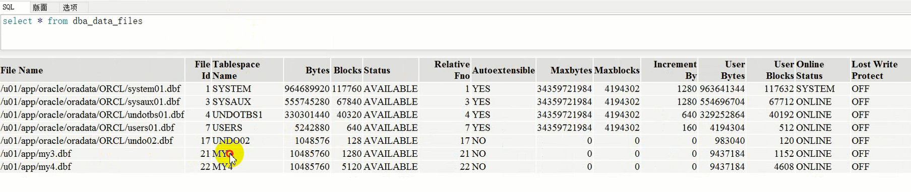

如果发现某个表空间存储空间不足时，可以未表空间添加新的数据文件，扩展表空间大小。但是一般建议预先估计表空间所需的存储空间大小，然后为它建立若干适当大小的数据文件。
1. 增加数据文件
```sh
alter tablespace [表名] add datafile '/u01/app/my33.dbf' size 10M;
```
2. 调整数据文件大小
```sh
alter database datafile '/u01/app/my33.dbf' resize 20M;
```
3. 开启自动扩展
```sh
alter database datafile /u01/app/my33.dbf autoextend on;
```
4. 关闭自动扩展
```sh
alter database datafile /u01/app/my33.dbf autoextend off;
```

### 删除数据文件

```sh
alter tablespace <表空间名> drop datafile '[文件位置]';
alter tablespace <表空间名> drop tempfile '[文件位置]';
```

删除数据文件和临时文件的限制：
1. 数据库必须处于打开(open)状态
2. 只能删除空的数据文件
3. 不能删除表空间中的第一个或唯一一个数据文件。
4. 不能删除SYSTEM表空间中的数据文件
5. 本地管理的表空间中的数据文件处于脱机状态，则不能将其删除

### 重命名重定位数据文件

#### 重命名和重定位在线数据文件

在线：数据库open，表空间联机

使用alter database move datafile重命名或重定位在线数据文件。该语句可以在数据库打开且用户正在访问数据文件时重命名或重定位数据文件。

重命名或重定位在线数据文件时，数据库控制文件中记录的指向数据文件的指针会更新

```sh
alter database move datafile  '<原有路径>' to '<新路径>'
```

任何表空间的数据文件都可以用这条命令做。

#### 重命名和重定位脱机数据文件

需要把表空间脱机，对于无法脱机的表空间文件无法实现。
```sh
# 表空间脱机，前提是表空间可以脱机
alter database <表空间名> offline;
# 用操作系统命令移动文件
host mv '<原文件路径>' '<新文件路径>'
# 重定位
alter tablespace <表空间名> rename datafile '<原文件路径>' to '<新文件路径>'
# 表空间联机
alter database <表空间名> online;
```

#### 重命名和重定位多个表空间中的脱机数据文件

可以对任何数据文件做重定位操作，但是需要关闭数据库，启动到mount状态。

```sh
# 关闭数据库
shutdown immediate
# 用操作系统命令更改文件位置
host mv '<原文件路径>' '<新文件路径>'
# 数据库mount
startup mount
# 重定位
alter database rename file '<原文件路径>' to '<新文件路径>'
# 开启数据库
alter database open
```

### 数据文件脱机

将数据文件/u01/app/oracle/mytbs08.dbf改为脱机状态
```sh
alter database datafile '/u01/qpp/oracle/oradata/orcl/mytbs08.dbf' offline;
```

数据文件脱机联机时一定要打开归档模式。非归档模式可以对表空间脱机联机。

### 维护表空间

表空间有下面几种状态：offline，read only，read write，可以通过SQL语句查询表空间状态。

```sh
select tablespace_name,contents,status from dba_tablespaces;
select file#,status,enabled from v$datafile;
```
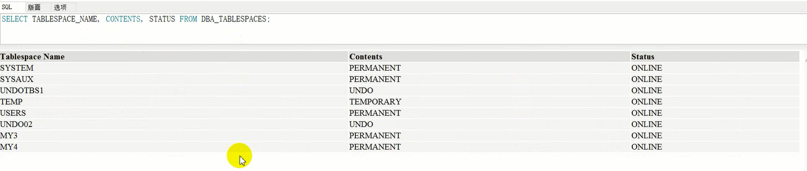

#### 表空间脱机

设置脱机状态，可以使用下面四个参数来控制脱机方式

1. NORMAL

该参数表示件表空间以正常方式切换到脱机状态，在进入脱机状态过程中，ORACLE会**执行一次检查点**，将SGA区中与该表空间相关的脏缓存块写入数据文件中，然后再关闭表空间的所有数据文件。如果在这过程中没有发生任何错误，则可以使用NORMAL参数，这也是默认方式。

该方式会执行检查点，是一致性关闭表空间，在联机时不需要对表空间做恢复。

2. TEMPORARY

该参数将表空间以临时方式切换到脱机状态。这时ORACLE在**执行检查点时并不会检查各个数据文件的状态**，及时某些数据文件处于不可用状态，ORACLe也会忽略这些错误。这样讲表空间设置为联机状态时，**可能需要进行数据恢复**。

3. IMMEDIATE

该参数讲表空间以立即方式切换到脱机状态，**这时ORACLE不会执行检查点，也不会检查数据文件是否可用**。而是直接将属于表空间的数据文件设置为脱机状态。下一次将表空间恢复为联机状态时**必须进行数据库恢复**。

4. FOR RECOVER

该参数将表空间以用于恢复的方式切换到脱机状态，如果要对表空间进行基于时间的恢复，可以使用这个参数将表空间切换到脱机状态。

如果数据库运行在非归档模式下(NOARCHIVELOG)，由于无法保留恢复表空间所需要的重做数据，所以不能将表空间以立即方式切换到脱机状态。

:::warning
脱机一般用于数据库的联机备份，数据恢复等维护操作。有些表空间不能脱机，如：SYSTEM，UNDO等。
:::

### 表空间改名

```sh
alter tablespace <旧名称> rename to <新名称>;
```

重命名表空间时，数据库会更新对数据字典，控制文件和在线数据文件头中表空间名称的所有引用。数据库不会更改表空间ID，因此如果表空间时用户的默认表空间，则重命名的表空间将在DBA_USERS视图中显示为用户的默认表空间。

以下操作会影响重命名表空间的操作：
1. SYSTEM表空间或SYSAUX表空间不会被重命名，并且会引发错误。
2. 表空间中的数据文件处于脱机状态，或者表空间处于脱机状态，那么该表空间不会重命名，并且会引发错误。
3. 表空间是只读的，则不会更新数据文件头。它将产生一条消息并写入警报日志，该消息指示尚未重命名数据文件头。数据字典和控制文件已更新。
4. 表空间是默认的临时表空间，则数据库属性表中的相应条目将更新，并且该DATABASE_PROPERTIES视图将显示新名称。
5. 如果表空间是UNDO表空间，并且满足以下条件，则表空间名称将在服务器参数文件spfile中更改为新的表空间名称。<br />
&ensp;&ensp;&ensp;&ensp;使用服务器参数文件启动数据库
&ensp;&ensp;&ensp;&ensp;如果使用传统的初始化参数文件PFILE则会向警报日志中写入一条消息，指出必须手动更改初始化参数文件。

### 表空间配额

表空间不足与用户配额不足时两种不同的概念。表空间的大小是指实际的用户表空间的到校，而配额大小指的是用户指定使用表空间的大小。

表空间不足是因为表空间没有空余空间，不能插入数据。配额不足是指分配给用户的配额不够，用户不能再使用表空间了。

#### 查看用户的表空间配额

```sh
# 查看所有用户表空间的配额情况， MAX_BYTES=-1表示没有配额限制
select * from DBA_TS_QUOTAS;
# 查看当前用户表空间的配额情况
select * from user_TS_QUOTAS;
```

#### 管理用户配额

1. 创建用户时指定限额
```sh
create user test identified by test default tablespace users temporary tablespace temp quota 3m on users password expire;
```

2. 更改用户的表空间限额

不对用户做表空间限额控制：查看是否没有表空间限额限制

取消限额
```sh
# 全局
grant unlimited tablespace to scott;
# 针对特定表空间
alter user test quota unlimited on users;
```

#### 更改本地管理的临时表空间

可以添加临时文件，使临时文件脱机或i你是文件联机。
```sh

# 向临时表空间中增加数据文件
alter tablespace <tablespace> add tempfile '<filepath>' size 18M resuse;

# 临时表空间脱机
alter tablespace <tablespace> tempfile offline;
```

:::danger
得补充点东西
:::