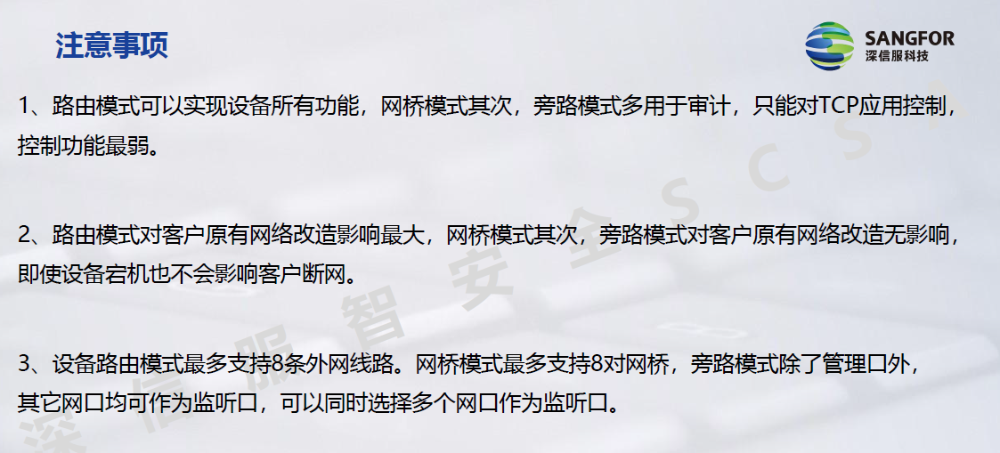
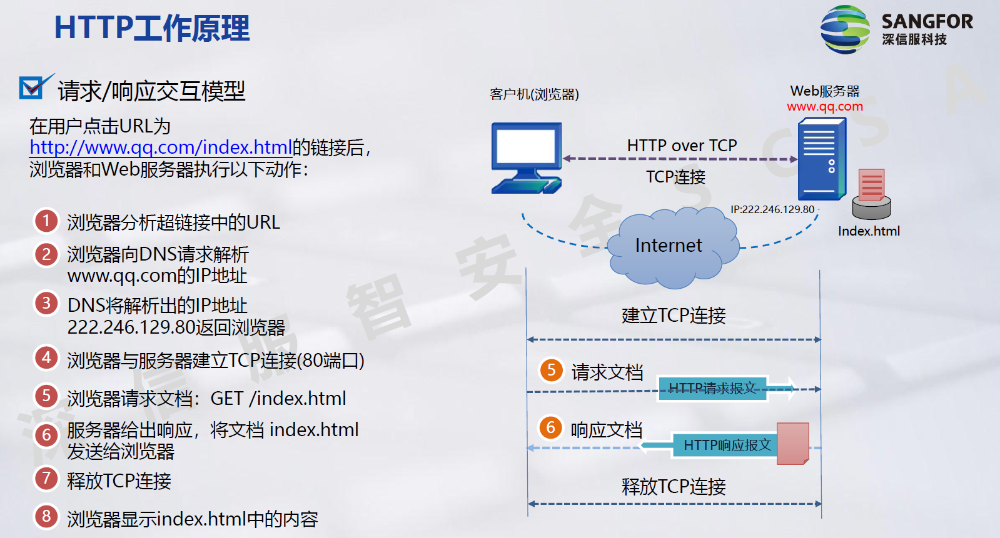
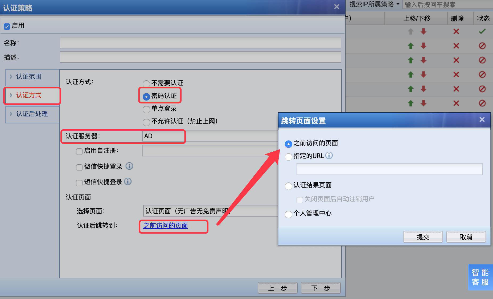
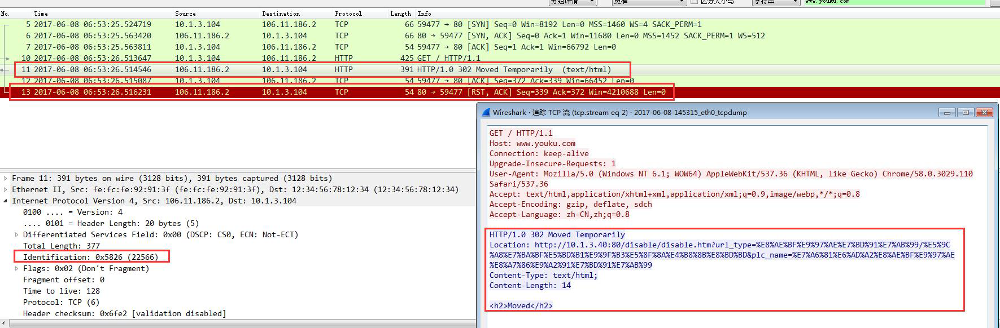

# 上网行为管理

## 全网行为组网方案

### 一、上网行为管理基本操作

#### 1、设备外观
1U设备外观

2U设备外观

软件版本

#### 2、登录设备
SANGFOR AC/SG设备各个网口默认出厂IP为：

&ensp;&ensp;&ensp;&ensp;eth0(LAN): 10.251.251.251/24&ensp;&ensp;&ensp;&ensp;eth1(DMZ): 10.252.252.252/24

使用一根交叉线连接设备和电脑。

如果和电脑连接的是设备的eth0口，需要在电脑上配置一个10.251.251.251/24网段的地址，打开浏览器输入 https://10.251.251.251 登录到设备的网关控制台。

如果和电脑连接的是设备的eth1口，需要在电脑上配置一个10.252.252.252/24网段的地址，打开浏览器输入 https://10.252.252.252 登录到设备的网关控制台。

输入控制台admin账号登录设备，默认账号和密码均为admin。

如果设备接口地址被修改，在不知道更改后接口地址的情况下，提供一下两种方法登录设备：

SANGFOR AC/SG设备的lan口(默认eth0口为lan口)有保留地址128.127.125.252/29，配置电脑IP地址为128.127.125.253/29网段，用交叉线连接电脑和设备eth0口，通过 https://128.127.125.252 登录设备网关控制台。

SANGFOR AC/SG设备的dmz口(默认eth1口为dmz口)有保留地址128.128.125.252/29，配置电脑IP地址为128.128.125.253/29网段，用交叉线连接电脑和设备eth1口，通过 https://128.128.125.252 登录设备网关控制台。

若端口被修改，还需要输入端口。保留地址随逻辑lan、dmz口变更而变更。路由模式出厂默认eth0定义为lan，eth1定义为dmz。

在不知道设备ip的情况下，可以通过SANGFOR系统升级工具查询设备地址，查询到设备地址后登录设备控制台。

安装sangfor升级系统工具的PC和设备用交叉线直连，关闭PC上安装的防火墙及Windows自带防火墙。避免数据包被拦截。再用sangfor升级系统工具查找设备地址。

#### 3、恢复出厂设置

##### (1)、通过控制台界面恢复出厂设置

恢复出厂配置会重启设备，通过此方法恢复出厂配置后，再次登录控制台，右下角会有“恢复成功”的提示。

##### (2)、通过SANGFOR升级工具恢复出厂设置

##### (3)、交叉线短接设备两个电口恢复

如果无法登录设备(如无法获得设备接口地址)，可以尝试以下方法恢复出厂配置

①、先将设备关机 
②、准备一根交叉线 
③、使用交叉线连接设备面板上任意两个非一组bypass电口(例如eth0和eth2是bypass口，就不能短接这两个口恢复密码)(12.0.12之前必须接非bypass口，12.0.12之后必须接0和2口) 
④、将设备加电开机。一直等待，直到设备重启(说明恢复出厂配置成功)，此时务必拔掉短接电口的交叉线。 
⑤、等设备运行起来后，即可通过出厂地址，默认控制台账号和密码登录设备。 

##### (4)、U盘恢复出厂设置(部分AC)

①、新建一个txt文档，将其重命名为reset-cfg.txt，将txt文档拷贝到U盘根目录，U盘格式为FAT32 
②、AC插上U盘，重启设备 
③、当设备LED灯熄灭后，alarm灯闪烁，拔出U盘。 
注意：U盘恢复出场设置需要重启设备。

#### 4、恢复控制台密码

##### (1)、交叉线恢复控制台密码

确保电脑和设备可以通信，访问设备地址，https://acip/php.rp.php, acip为AC设备的ip地址。提示“创建文件成功，请连接交叉线并重启设备”

准备交叉线短接设备任意两个非一组bypass电口(例如eth0和eth2是bypass口，就不能短接这两个口恢复密码)

手动重启设备，重启过程中，注意观察交叉线短接的两个电口ACT灯状态，两个电口ACT灯同时闪烁10此后，说明密码恢复完成，此时可以拔掉短接的交叉线，通过默认的控制台账号密码admin/admin登录设备即可。设备重启到密码恢复成功大约2到5分钟左右。

如果无法根据网口灯状态判断密码恢复是否成功，可以一直等待，等待5到10分钟左右，尝试通过默认账号admin/admin账号登录设备。

##### (2)、U盘恢复密码

新建一个txt文档，将其重命名为reset-cfg.txt，将txt文档拷贝到U盘根目录，U盘格式为FAT32

确保电脑和设备可以通信，访问设备地址https://ACIP./php/rp.php

AC插上U盘，重启设备。

当设备的LED红灯熄灭后，alarm灯闪烁即恢复密码成功，拔出U盘。

注意：U盘恢复密码需要设备重启

### 二、上网行为管理部署模式

部署模式是指设备以什么方式部署到客户网络中。不同部署方式对客户原有网路影响不同，不同模式设备支持的功能不同。

AC设备支持路由、网桥、旁路部署，SG支持路由、网桥、旁路、单臂部署，12.0版本之后支持认证部署，13.0之后认证模式功能融入到普通模式中。

#### 1、路由模式部署方案

设备以路由模式部署时，AC的工作方式与路由器相当，具备基本的路由转发及NAT功能。一般在客户还没有相应的网关设备或者用户的网络环境规模比较小，需要将AC做网关使用时，建议以路由模式部署。

路由模式支持AC所有的功能。

如果需要使用NAT、VPN、DHCP等功能，AC必须以路由模式部署，其它工作模式没有这些功能。

需求背景：客户需要用新的上网行为管理设备来替换旧的出口路由器，实现行为审计和管控。

路由模式配置思路： 
(1)、网口配置：配置各网口地址。如果是固定IP，则填写运营商给的IP地址及网关；如果是ADSL拨号上网，则填写运营商给的拨号账号和密码；确定内网口的IP。 
(2)、确定内网是否为多网段网络环境，如果是则需要添加相应的回包路由，将到内网各网段的数据回指给设备下接的三层设备。 
(3)、用户是否需要通过AC设备上网，如果是的话，需要配置NAT规则。 
(4)、检查并放通防火墙规则。 

#### 2、网桥模式部署方案

设备以网桥模式部署时对客户原有的网络基本没有改动。网桥模式部署AC时，对客户来说AC就是个透明的设备，如果因为AC自身的原因而导致网络中断时可以开启硬件bypass功能，即可恢复网络通信。

网桥模式部署时AC不支持NAT、VPN、DHCP等功能。

需求：客户需要部署一台AC，但是不想对网络改动太大。

配置思路： 
(1)、配置设备网桥地址，网关地址，DNS地址。 
(2)、确定内网是否为多网段网络环境，三层环境需要添加相应的回包路由，将到内网各网段的数据回指给设备下接的三层设备。 
(3)、检查并放通防火墙规则。 

#### 3、旁路模式部署方案

旁路模式主要用于实现审计功能，完全不需要改变用户的网络环境，通过把设备的监听口接在交换机的镜像口，实现对上网数据的监控。这种模式对用户的网络环境完全没有影响，即使宕机也不会对用户的网络造成中断。

旁路模式主要用于做上网行为审计，且只能对TCP应用做控制，对基于UDP的应用无法控制，不支持流量管理、NAT、VPN、DHCP等功能。

在核心上做一个镜像口，接到AC配置的监听口。

需求：某用户想部署上网行为管理设备来审计内网用户的上网行为，但是不能改动现有的网络环境。

对TCP的管控，通过管理口伪造另一端向内网用户发送rst包，断开连接。

配置思路： 
(1)、交换机设置镜像口，并接到AC监听口。 
(2)、配置需要审计的内网网段和服务器网段。 
(3)、配置管理口地址，用于管理AC设备。（RST包也从DMZ口发出）

#### 4、trunk模式部署方案

**Vlan**

虚拟局域网(Virtual LAN)，是物理设备上连接的不受物理位置限制的用户的一个逻辑组。形象地说，交换机Vlan技术就是将1台物理交换机划分为若干台逻辑上完全独立的交换机。

为什么引入vlan： 
(1)、二层交换机不能阻隔广播域，网络规模越大，广播危害越严重 
(2)、路由器可以阻隔广播，但价格比交换机贵，中低端路由器使用软件转发，转发性能不高 
(3)、大量未知单播流量和无用组播流量 
(4)、带来安全隐患 
(5)、难以管理和维护 

分割广播域：

**Access口**

交换机划分vlan后，数据进vlan时会打上vlan标记，出接口时去除vlan标记

**Truck环境需求背景**

部署上网行为管理设备替换出口路由器实现内网上网行为的审计和控制。

拓扑图如下图所示，交换机划分了三个VLAN，VLAN ID分别为10，20，30。路由器内网口配置为Trunk口，各Vlan间的互访通过路由器实现。

**Trunk环境路由部署：**

Trunk环境路由配置： 
(1)、AC路由模式部署直接替代原有的路由器(或FW)，并按照路由模式部署配置好设备。 
(2)、配置LAN口IP，填写内网对应VLAN的VLAN网关IP即可。 

**Trunk环境网桥部署：**

Trunk环境网桥部署配置： 
(1)、网桥模式部署在路由器与交换机之间，按网桥模式部署配置好设备。 
(2)、可以给设备网桥配置其中一个VLAN中的可用IP来进行管理和更新规则库。 
(3)、或者给设备管理口配置其中一个VLAN中的可用IP(此时不用加vid)来进行管理和更新规则库。 

### 三、防火墙技术及其应用

#### 1、防火墙过滤规则

防火墙规则是控制设备各个网口转发数据的开关。

这里设置的规则可基于IP和端口进行数据包的转发控制，和传统的四层防火墙相似。

#### 2、防火墙端口映射及其应用

端口映射需求背景：

该客户已经通过配置实现了AC代理内网用户和服务器上公网。

内网有一台OA服务器，地址是192.200.2.250，使用的服务端口是TCP 80。

客户希望将此OA服务器发布到公网，外网用户通过 http://202.96.137.75:8000 的方式访问到服务器。

端口映射原理

端口映射即DNAT，目标地址转换，用来设置对数据包目标IP地址进行转换的规则。

常用来实现客户内网有服务器需要发布到公网，或者内网用户需要通过公网地址访问内部服务器的需求。

## 接入认证技术

### 一、用户和用户组管理

**组织结构：**

组织结构即为用户和用户组的所属层级关系。

SANGFOR AC提供树形的组织结构，通过树形用户结构管理，符合企业的人员结构划分，同时又可以对相同的上网策略进行继承。一个用户有一个直属父组。

[用户管理]-[组/用户]：可以查看、新增、删除用户组信息。

[限制在以下地址范围内登录]：指的是账号只能在设置地址范围的终端上登录，其它账号也可以在这些地址上登录。

终端绑定(用户绑定)：绑定时定义[绑定目的]和[绑定对象]及[绑定有效期]

手动添加用户 
可以一次新建一个用户或组，也可以一次新建多个组，添加多个组时，名称用英文逗号隔开。

批量导入用户 
如果用户和组太多，可以将用户和组格式做成csv表格，一次性导入设备

认证策略自动添加用户 
如果只添加用户，且认证方式为不需要认证，单点登录，也可以通过认证策略自动添加新用户。

用户和用户组搜索 
[高级搜索]：可以根据指定的查询条件来搜索特定的用户

用户注销： 
1. 在 [在线用户管理] 中强制注销在线用户(临时用户、Dkey用户、不需要认证的用户无法被强制注销)
2. 在 [认证高级选项] - [认证选项] 中选择 [自动注销无流量的用户]
3. 在 [认证高级选项] - [认证选项] 中设置 [每天强制注销所有在线用户]，并设置注销事件{对所有用户生效}
4. 设置认证页面关闭时自动注销
5. 设置MAC地址变动时自动注销

### 二、不需要认证技术
**案例背景** 
要求实现: 
1. IT部电脑IP不固定
2. 办公区用户不能修改ip地址
3. 公共上网区则需要输入账号和密码才能上网

针对需求1： 
数据包特征分析：

设备根据数据包的源IP地址、计算机名、源MAC地址来标识用户。

优点：终端用户上网认证的过程是透明的，不会感知设备的存在。

一般适用于对认证要求不严格的场景

不需要认证配置思路：

(1)、首先为办公区的用户建立一个用户组，在[用户认证与管理] - [用户管理] - [组/用户]中，点新增，选择[组]，定义组名：IT部

(2)、新增[认证策略]，选择认证方式为不需要认证，不绑定任何地址

(3)、[认证后处理] - [非本地/域用户使用该组上线]：IT部

### 三、IP/Mac绑定认证技术

需求二：办公区用户不允许私自修改IP地址，否则禁止上网。IP和Mac绑定。

数据包经过二层交换机转发，数据包的源MAC地址不会变化；数据包经过三层交换机源MAC会变化。

网络管理系统通过SNMP协议可以获取防火墙、交换机等设备的一些信息，如CPU、内存、磁盘和ARP表项等。

**SNMP协议概述** 
SNMP是基于TCP/IP协议簇的网络管理标准，是一种在IP网络中管理网络节点(如服务器、工作站、路由器、交换机等)的标准协议。

**MIB库** 
管理信息库MIB：任何一个被管理的资源都表示成一个对象，称为被管理的对象。 
每个OID(Object IDentification)都对应一个唯一的对象。 

**OID值** 

假设需要从交换机中获取其ARP表项，其中MAC地址表项的OID值是一串数字，IP地址表项的OID值是另一长串数字。通过MIB库就可以知道ARP对应的OID值是多少。

在知道OID值后，向交换机发送SNMP报文就可以获取相应信息。

**SNMP协议数据单元** 
SNMP规定了5种协议数据单元PDU(也就是SNMP报文)，用来在管理进程和代理之间的交换。 
get-request操作：从代理进程处提取一个或多个参数值。 
get-next-request操作：从代理进程处提取紧跟当前参数值的下一个参数值。 
set-request操作：设置代理进程的一个或多个参数值。 
get-response操作：返回的一个或多个参数值。 
trap操作：代理进程主动发出的报文，通知管理进程有某些事情发生。

**SNMP协议数据包** 
通过Wireshark捕获SNMP交互过程

首先用户接入交换机时，交换机拥有用户的IP和MAC信息。当用户上网时数据经过AC，AC发现其数据包的MAC地址均为交换机的MAC地址。在配置了取MAC地址的功能后，AC会向核心交换机发送SNMP请求报文获取IP和MAC的对应关系。之后校验用户的IP和MAC的对应关系，选择放通或拦截上网。

若有多个三层交换机，则需要在每个核心交换机上开启SNMP功能。AC上也需要配置各个核心交换机的SNMP信息。

**配置思路：** 
1. 首先为办公区的用户创建一个用户组，在[用户认证与管理] - [用户管理] -[组/用户]中，点新增，选择[组]，定义组名：办公区
2. 新增[认证策略]，选择认证方式为：不需要认证
3. [认证后处理] - [非本地/域用户使用该组上线] 选择: 办公区
4. 勾选[自动录入绑定关系] - [自动录入IP和MAC的绑定关系]
:::warning
三层网络下需要开启以下功能：
:::
5. 配置[认证高级选项] - [跨三层取MAC]。要在三层设备上设置允许AC访问器SNMP服务器。

**思考总结** 

如果设备无法获取到交换机的ARP表，应该如何排查？ 
1. 检查设备与交换机是否通讯正常。
2. 检查交换机的配置(是否允许AC访问其SNMP服务器)、ACL和团体名
3. 检查中间设备是否有拦截UDP 161端口
4. 在电脑上通过BPSNMPUtil工具连接交换机，测试是否可以读取ARP表
5. AC只支持SNMP V1 V2 V2C版本协议

如果设备以网桥模式部署在30位掩码的网络环境中如何获取交换机的ARP表？ 
防火墙和交换机启30位掩码的地址，我们的AC网桥将不可用，需要和交换机通过snmp取mac需要用管理口

为什么此时网桥不能用？ 
30位掩码下的整个网络环境，只有两个可用IP 
AC是网桥模式部署，所以AC上下的设备都得分配IP，此时AC分配不到IP，处于无IP网桥模式，因此要用管理口来另接交换机（此时交换机上也要进行配置网口与AC的管理口对接）

IP/MAC绑定失败？ 
1、查看是否在[跨三层取MAC]中没有排除三层设备的MAC地址； 
2、在[IP/MAC绑定]中，查看PC的IP或MAC是否已经绑定了其他MAC或者IP（同时查看三层设备的MAC是否被PC绑定了）

跨三层识别方法二 
抓取arp包或dhcp包获取MAC 
通过镜像交换机arp或dhcp数据到设备空闲口(作为镜像口)获取用户mac地址。 
实现方法一：在核心交换机上增加一个trunk口，允许所有vlan，把这个trunk口连接到空闲网口上。这样可以把所有广播包复制到AC上，包括ARP包和DHCP包。 
实现方法二：镜像DHCP服务器接口进处流量。

该方法的缺陷： 
网关设备都在汇聚交换机，汇聚交换机和上网行为管理不再同计方，两机房由光纤互联的情况下无法使用这个方案实现。 
或者多个核心交换机都需要进行跨三层识别，此方案也无法实现，因为目前设备镜像口之恶能设置一个。

### 四、密码认证技术
针对需求三：公共上网区需要输入账号和密码才能上网，确保网络行为能跟踪到。

当用户首次上网时，会要求用户提交用户名和密码信息，如果用户提交的用户名密码信息和本地（或第三方服务器）一致，则给予认证同通过。

**HTTP** 
超文本传输协议 
**超文本**:包含有超链接和各种多媒体元素标记的文本。这些超文本文件彼此链接，形成网状，因此又被陈伟网页。这些链接使用URL表示。最常见的超文本格式是超文本标记语言HTML。 
**URL**:统一资源定位符，用来唯一标识万维网中的某一个文档。URL由协议、主机和端口(默认为80)以及主文件名三部分构成。 
**超文本传输协议**:HTTP，是一种按URL址式，将超文本文档从一台主机传输到另一台主机的应用层协议，以实现超链接的功能。 

**HTTP重定向** 
WEB服务器告诉浏览器，试图访问的对象已经被转移到别的位置，到Location指定的位置去取。 
首先我们以访问www.qq.com为例，回顾一下密码认证的数据流过程 
第一步：PC先进行www.qq.com DNS解析域名过程 
第二步：PC向解析出的www.qq.com服务器地址发起tcp三次握手 
第三步：PC向www.qq.com 服务器发出GET请求，请求主页 
第四步：AC拦截PC的GET请求，并把AC自己伪装成服务器（用腾讯服务器的IP给PC发包），给PC回复
HTTP 302 Moved Temporarily ，要求PC重定向请求以下URL
http://10.1.3.4:80/ac_portal/proxy.html?template=default&tabs=pwd&vlanid=0&url=http://w
ww.qq.com%2f
其中10.1.3.4就是AC设备的LAN IP、网桥IP或者虚拟IP 
第五步：PC自动重定向访问AC的认证界面，输入正确的账号密码，登录成功 

密码认证配置思路： 
(1)、首先为办公区的用户建一个用户组，在[用户认证与管理] - [用户管理] - [组/用户]中，点新增，选择[组]，定义组名：公共区 
(2)、新增用户，设置本地密码 
(3)、新增{认证策略}，选择认证方式为密码认证 
(4)、[认证高级选项] - [其他选项] 勾选[未认证或被冻结时允许访问DNS服务] 
如果不勾选，DNS请求就无法放通，就无法发送后续的GET请求，AC无法拦截并且重定向 

**密码认证思考总结** 

如果“密码认证页面”无法正常弹出，应该如何排查 
先确认网络环境，手动打开是否可以打开 
1、网桥部署虚拟地址是否根内网冲突，PC浏览器是否做了上网代理 
2、AC下接的设备是否有做限制 
3、需要启用未通过认证的用户允许访问dns服务 
4、访问的如果是https的网站需要启用HTTPS请求未通过认证时，重定向到认证页面(代理时除外) 
5、根据相关联的上网策略不能拒绝http应用和dns应用 
6、防火墙规则不能拒绝80和53端口[系统管理] - [防火墙] - [LAN-WAN]

如果以设备网桥模式部署在30位掩码的环境中是否还能弹出重定向页面？ 
**虚拟ip重定向**：内网PC认证前的HTTP上网数据经过AC时，AC拦截并记录下数据包的源、目的ip，数据包的封装类型，以及数据包进入AC时的接口。 
AC回弹portal的重定向页面时，会将记录下来的数据包的源、目的IP反转，在从数据包进入的接口直接发出，其中数据包中的数据字段会替换成AC虚拟IP的重定向URL地址。（只在网桥模式下有虚拟IP重定向） 
**DMZ口重定向**：内网PC认证前的HTTP上网数据经过AC时，AC拦截数据包，AC通过查找本身DMZ口的路由表，将portal的重定向认证页面从DMZ口发出，其中数据包中的数据字段会替换成AC的DMZ口IP的重定向URL地址。(一般在无可用网桥IP时选择从DMZ口重定向)

:::warning
密码认证注意事项：
1. 如果在认证后处理，需要用户绑定了mac地址的时候，需要注意内网是否为三层环境，如果是，则需要启用跨三层mac地址识别
2. 如果内网时DHCP的场景，不要勾选绑定IP地址
3. 如果用户打开HTTPS的网站也要能跳转到认证页面，需要在[认证选项]勾选以下选项
:::

### 五、外部认证技术

也称为第三方认证，用户的账号密码信息保存在第三方服务器上，AC/SG将用户提交的用户名密码信息转给第三方认证服务器校验，通过第三方服务器返回的认证成功与否的信息，决定是否通过AC/SG的认证，这个过程称为AC/SG的外部认证。

1. PC向AC/SG提交用户名密码信息
2. AC/SG判断为外部认证，并把用户名密码信息发送给外部认证服务器校验
3. 外部认证服务器校验后，向AC/SG发送认证失败或成功的消息
4. AC/SG根据外部认证服务器返回的消息，确定是否让该PC通过认证
5. PC通过认证后，就可以直接访问公网了

外部认证条件： 
(1)、认证策略中，认证方式选择“密码认证”，认证服务器选择“第三方服务器” 

(2)、认证高级选项，未启用DKEY。如果启用了DKEY，就只能采用DKEY认证了。 

外部认证服务器配置 
(1)、选择需要新增的外部认证服务器类型[LDAP，RADIUS，POP3服务器] 
(2)、设置外部服务器的通信方式，IP、端口等

#### LDAP认证案例
某公司内网有一台AD域服务器，域名为mengxuan.com，服务器地址为172.16.100.203。要求内网用户上网时使用域账号和密码通过AC设备的认证才可以上网。

**LDAP认证配置思路**
1. 新建外部认证服务器，设置AD域服务器信息
2. 新建认证策略，选择"密码认证"认证服务器选择上面建好的服务器

**LDAP认证配置步骤** 
第一步：新建外部认证服务器，设置AD域服务器相关信息。

测试有效性-账户有效性：可以通过此功能测试域账号的有效性，如上既测试了域的管理员账号administrator是否有权限读取域的组织结构，又测试了域的用户support1账号密码是否正确

测试有效性-修改密码：如果域上的账号是允许修改密码的，可以直接通过测试有效性修改密码，修改域上的账号密码。 
如果用户的域环境是独立域，添加外部认证服务器是，认证端口填写389； 
如果是父子域，如父域sangfor.com，子域ac.sangfor.com，ssl.sangfor.com等，则外部认证服务器配置的是父域的地址，且端口需要填3268 

第二部：新建认证策略选择“密码认证”。

终端电脑输入域账号通过AC认证，即可访问外网。

## 终端识别和管理技术

### 一、防共享需求背景
在企业的网络管理、运营商代建的高校网络中出现了防共享上网的需求，即防代理，防一拖N的需求。

目前运营商以及企业需要面对共享上网主要带来的两个问题：

1、在企业中不少用户共享自己访问互联网的权限给其他用户，绕开了企业对用户设定的上网权限控制，使得原本没有上网权限的用户可以上网，或者使得原本上网权限较低的用户拥有了较高的权限，给网络管理带来了诸多麻烦。

2、在运营商承建和运维的高校网络中，遇到很多学生使用路由器或者其他软件方式，共享互联网的访问给其他同学或朋友，直接造成运营商的收益受到影响。

私接wifi容易暴露内网，因此需要禁止共享上网行为，避免共享接入的用户绕开企业的上网权限控制和上网行为监控

运营商承建高校的校园网，学生寝室内无线共享网络，影响运营商宽带开户率及收益。
### 二、防共享识别和控制技术

#### NAT上网场景
**终端共享场景一**：多台终端通过同一个前端路由器NAT共享上网 
 
**终端共享场景二**：一台终端安装代理工具，其他终端通过代理，来实现共享上网 
 
**终端共享场景三**：一台PC外接360WiFi，其他终端通过共享上网 
 

#### 传统防共享技术

##### ID轨迹检测

Windows网络协议栈实现时，ID字段的值随着发送IP报文数的增加而增加

Identification的初始值是随机值，一般说来，不同主机的初始值有较大差距

优点：较准确地判断出是否为共享上网用户，较准确地判断出在线共享上网主机数，完全被动监听，不发送探测信息

缺点：需要一段时间观察，一般两天以上。对分时上网和代理地检测效果不明显

##### 时钟偏移检测

不同主机物理时钟偏移不同，网络协议栈时钟与物理时钟存在对应关系

不同主机发送报文频率与时钟存在统计对应关系

通过特定的频谱分析算法，发现不同地网络时钟偏移来确定不同主机

优点：非常准确地判断出是否为共享上网用户，能够较准确的判断出共享上网主机数

缺点：需要复杂的计算方法进行处理分析，需要一段时间的观察（建议两天以上）。DHCP下效果较差。

##### 其他传统防共享技术

#### 深信服DPI检测技术

通过分析常用应用软件的数据包，发现一些软件刚启用不久发送的TCP数据包中带有PI的IP信息，AC设备通过分析这些数据包可以提取出PC端的IP，根据不同的IP数量得出共享的PC数量，比如QQ登录时候的数据包中会携带电脑网卡的IP地址，适用于windows的电脑

#### 深信服字体检测技术

在共享的PC相继访问http网站，播放在线视频(浏览器需安装flash)，AC篡改PC请求，令PC上报系统字体信息到AC，假设PC1上报的字体为font1，PC2上报的为font2，那么要检测到PC1和PC2共享需要类似于这样的上报序列，font1，font2，font1交错上报，就可以识别出共享行为。

检测前提：

相同flash插件制造商获取的系统字体列表相同

不同PC之间，相同flash插件制造商获取的系统字体列表不同

这些特征与flash插件版本无关

此方法只适用于windows电脑

#### 深信服辅助检测技术

##### URL检测

通过分析常用应用软件的数据包，发现一些软件刚启用不久发送的HTTP请求中，URL会有一些特征串，在这些特征串中会有一段信息是和终端强关联的，即同一终端发送的特征串信息是相同的，不同终端建发送的是不同的，AC设备根据提取到的不同的特征串数量得出共享的终端数量。

##### 微信特征ID检测

通过分析微信客户端在发送消息时，在数据包固定的偏移位置，存在相同的一串二进制数对于同一个微信客户端。AC通过提取这串二进制数，统计提取数量的个数得出共享移动终端数量。

#### 移动终端共享识别工作原理

##### 应用规则检测

设备内置规则库，可以从这些应用中分析出不同的终端类型，其中包括IM社交、在线视频、生活、新闻咨询、地铁、下载客户端、移动浏览器、PC端手机助手等类型的应用，例如微信、移动QQ、新浪微博、优酷、91助手等常见手持终端app的应用。

##### 配置方案

[终端接入管理] - [共享接入管理] 启用共享接入检测进行配置：

1、配置选项，可以配置统计所有终端(识别PC与PC，PC与移动端，移动端与移动端之间)，或者仅统计电脑终端(可识别PC与PC之间的共享)。冻结选项可以选择多少台就识别成共享，共享后冻结多长时间等。

2、允许共享行为的用户，可以添加受信任列表，上网将不会受影响。

##### 注意事项

Android和IOS平台支持识别具体终端型号，IOS不区分具体的型号版本。

Android系统移动终端，只有在使用UC浏览器，登录微信看好友动态，登录QQ看好友动态才会带上终端手机型号。

同种手机型号的手机也可支持识别，但是由于型号一致可区分的特征不多。一般不建议用同种手机型号终端做测试。

软件特征检测不支持webqq等，只支持客户端

QQ软件特征检测方式，程序默认排除了142.16.0.0/16网段的地址，如果电脑配置这个地址段，用QQ软件特征检测，防共享会不生效，其它方式检测不受影响。

##### 不支持识别以下三种场景

1、手机插电脑上充电 
这种场景下，手机会自动通过电脑发数据包(手机一般都有默认选项，只要是别到链接电脑，自动通过电脑的网络发送流量)。从防共享检测的实现原理来讲，设备会检测到同一个IP的不同终端流量。在手机插入电脑后，去关闭这个选项，是无用的，因为此时流量已经发出。 
手机接在电脑上传本地的图片文件等动作也会被识别为共享行为。 

2、PC里装了虚拟机 
AC会检测到不同操作系统 

3、电脑上安装移动终端模拟器 
这种场景下，电脑上也会发出移动和PC两种流量的数据包 

### 三、移动终端管理需求背景

私接wifi给内网带来巨大隐患，公开暴露内网网络；新兴廉价WiFi工具降低私接WiFi难度和 成本；蹭网卡的流行使违法违纪行为难以发现和追溯。

需求场景：

### 四、移动终端识别和控制技术
移动终端管理：排除信任IP和用户，识别移动终端，管理非法接入的移动终端，移动终端发现趋势。

#### 排除信任IP和用户
不少企业内部已经部署了无线，对于合法的AP接入，管理员默认放行，而对于非法接入的AP或者用户，则需要管控。

如果AP做无线路由器，直接填AP的IP；如果AP做无线网桥，舔上AP做DHCP的网段。加入信任列表的移动终端将不再出现在移动终端列表中。

#### 移动终端识别原理

**URL检测**

通过分析常用应用软件的数据包，发现一些软件刚启用不久发送的HTTP请求中，URL会有一些特征串，在这些特征串中会有一段信息是和移动端强关联的，此方法能识别到不同型号移动终端共享行为。

**应用内规则检测**

设备内置规则库，可以从这些应用中分析出移动终端。其中包括一些常用的PC端和手持终端的app应用。

**UA检测**

User-Agent含浏览器标识(操作系统标识；加密等级标识；浏览器语言)渲染引擎标识 版本信息，可以从中提取这些信息来识别不同的终端类型。

#### 管理非法接入的移动端

把合法IP和用户加入信任列表后，经过这些IP网段上网和使用这些用户名上线的移动终端将不会出现再移动终端发现的列表中。

对于新发现的违法移动终端，可选择“拒绝此移动终端”，禁止该移动终端上网，此时经过该IP的所有访问将会被拒绝或“发送告警邮件”，提醒管理员该该IP有非法的移动端接入。

启用DHCP终端识别，可以增强设备移动终端识别能力。

#### 移动终端发现趋势

针对最近7天、30天，AC对每天发现的移动终端数量做一个趋势统计，便于管理员发现管理的有效性。

#### 配置方案

[终端接入管理] - [移动终端管理] 可以管控移动终端：

1、发现移动终端邮件告警

2、发现移动终端冻结该移动终端上网

3、对受信任的用户添加受信任列表，允许使用移动终端上网

# 应用控制技术

## 应用控制技术

### 一、应用特征识别技术

#### 数据包五元组

**需求背景一：全天不允许使用QQ等聊天工具**

传统行为检测原理：传统的网络设备根据数据包的五元组(源、目的IP，源端口、目的端口和协议号这些特征来识别应用并进行丢弃、转发接收、处理等行为)。
 
识别UDP目的端口8000为QQ数据包，丢弃以实施封堵。

配置思路：
1. 新增[上网策略] - [上网权限策略] - [策略设置] - [应用控制] 在应用里面勾选IM，生效时间全天，移动端设备里面勾选通讯聊天，动作拒绝，在[适用对象]选择办公区，即对办公区的所有用户关联上这条控制策略。
2. 新增[上网策略] - [上网审计策略] - [应用审计] 添加，勾选所有选项，在[适用对象] 选择办公区，即对办公区的所有用户关联上这条识别策略。

#### 应用特征识别技术

**需求背景二：全天只允许特定QQ号上网，不允许其他QQ账号上网** 
从数据包中可以看到，QQ用户的字段在应用层OICQ协议的Data字段 
该需求需要识别特定的QQ用户，而传统的行为检测只能对链路层、网络层、传输层、进行数据处理，不能对应用测进行操作。 
 
 
传统技术无法识别精细的数据包应用和行为，无法识别经过伪装的数据包，无法满足现在的安全需求和可是需求。 
深度行为检测技术包含：深度包检测技术（DPI），深度六检测技术（DFI） 

##### 深度包检测技术(DPI)

深度包检测不仅检测源地址、目的地址、源端口、目的端口以及协议类型，还增加了应用层分析，另外识别各种应用及其内容

1. 基于“特征字”的检测技术

客户需求：在客户局域网中只郧西电脑上网，不允许手机上网。

需求分析：该需求要能够识别哪些上网数据是手机端发出的，哪些是PC端发出的。通过数据包分析，发现手机和电脑在同时上网的时候(同时使用HTTP协议)会在HTTP协议的User-Agent字段区分出手机数据和PC数据。

不同应用依赖不用的协议，不同协议都有其特殊的特征，可能是特定的端口、特定的字符串或者特定的bit序列。

基于“特征字”的识别技术通过对比业务流中特定数据报文中的特征信息的检测以确定业务流承载的应用和内容。

通过对应用特征信息的升级(例如HTTP数据包中的User-Agent位置)，基于特征的识别技术可以很方便的进行功能扩展，实现对新协议的检测。

2. 基于应用网关的检测技术

某些应用的控制流和数据流是分离的，数据流没有任何特征。这种情况下就需要采用应用层网关识别技术。

应用层网关需要先识别出控制流，根据对应的协议，对控制流进行解析，从协议内容中识别出相应的业务流。

客户需求：禁用VoIP视频。

需求分析：VoIP视频协议先使用控制信令来协商数据的传输，之后进行数据流的传输。VoIP视频数据交换过程抓包如下。

可在控制信令中看到IP地址和端口

3. 基于行为模式的检测技术

基于对终端已经实施的行为的分析，判断出用户正在进行的动作或即将实时的动作。

行为模式识别技术通常用于无法根据协议判断的业务的识别。

例如：垃圾邮件行为模式识别。

SPAM(垃圾邮件)业务流和普通的Email业务流从Email的内容上看是完全一致的，只有通过对用户行为的分析，才能够准确的识别出SPAM业务。

##### 深度流检测技术(DFI)

DFI采用的是一种基于流量行为的应用识别技术，即不同的应用类型体现在会话连接或数据流上的状态等各有不同。基于流的行为特征，通过与已建立的应用数据流的数据模型对比，判断流的应用类型或业务。

DFI技术基于这一系列流量的行为特征，建立流量特征模型，通过分析会话连接流的包长、连接速率、传输字节量、包与包之间的间隔等信息来与流量模型对比，从而实现鉴别应用类型。

##### DPI vs DFI
DFI仅对流量行为分析，因此只能对应用类型进行笼统分类，如满足P2P流量模型的应用同一识别为P2P流量，对符合网络语音流量模型的类型同一归类为VOIP流量，但是无法判断该流量是否采用H.323或其他协议。 
如果数据包是经过加密传输的，则采用DPI方式的流控技术不能识别其具体应用，而DFI方式的流控技术则不受影响，因为应用流的状态行为特征不会因加密而根本改变。 

##### 配置思路
1. 新增[上网策略] - [上网权限策略] - [策略设置] - [应用控制] - [QQ白名单]，将允许的QQ用户加入QQ白名单，在[适用对象]选择办公区，即对办公区的所有用户关联上这条控制策略。
2. 新增[上网策略] - [上网审计策略] - [应用审计]添加，勾选所有选项，在[适用对象]选择办公区，即对办公区所有用户关联上这条识别策略。
3. 登录在白名单内的QQ号，可以正常登录；登录在白名单之外的QQ号，登录失败。

### 二、HTTP识别控制技术
**需求背景三：IT部上班事件不允许访问视频网站** 
问题一：HTTP报文中，哪个字段表示URL？ 
问题二：封堵HTTP网站，是否需要线放通三次握手的报文？ 

#### HTTP识别工作原理
HTTP网站识别，终端设备通过DNS解析域名后，跟网站服务器三次握手完成，发给get请求，在get请求数据包中的host字段，就是我们访问网站的具体URL，我们通过抓取这个字段来识别终端用户是访问的哪个网站。抓包举例： 

#### HTTP控制工作原理
如果我们对该url做封堵，终端设备在发出get请求后(即完成HTTP识别)，设备会伪装成网站服务器向终端设备发一个状态码302的数据包，源IP是网站服务器的IP地址(实际是由我们的设备发出的，我们设备发送的标识ip.id为0x5826)，数据包中的内容是告知终端设备访问网站服务器的拒绝界面。 

#### 配置思路
1. 新增[上网策略] - [上网权限策略] - [策略设置] - [应用控制]在应用控制里面访问网站-娱乐在线影音及下载勾选，生效时间上班时间，动作拒绝。
2. 在[适用对象]选择IT部，即对IT部的所有用户关联上这条控制策略。

### 三、HTTPS识别控制技术
**需求背景四：公共上网区的用户禁止访问百度**

#### HTTPS
全称Hypertext Transfer Protocol over Secure Socket Layer，是HTTP协议的安全版，HTTPS默认适用TCP 443端口，也可以指定其他的TCP端口。HTTPS中S,实际上是SSL(Secure Sockets Layer)协议。 
SSL是Netscape公司发明的一种用于WEB的安全传输协议。 随着时间的推移由于Netscape失去了市场份额，它将SSL的维护工作移交给因特网工程任务组（IETF）。第一个后Netscape版本被重新命名为安全传输层协议（TLS）， TLS (Transport Layer Security :RFC 2246)是基于SSL上研发的，但是与SSLv3.0有细微的差别。因此，SSL协议有时也称为TLS协议。目前常用的是TLSv1.0的协议。 

#### HTTPS原理
 
客户端给服务器端发送hello的问候，问候里包含有它使用的SSL版本号、加密套件列表、压缩算法列表，客户端随机数，sessionid = 0； 
**handshake1 Client hello** 
服务器端收到客户端的问候后，会从客户端提供的版本号中选出双方都支持的最高版本，从加密套件列表选择一种支持且安全性强的加密套件，从压缩算法列表选择压缩算法(一般为空)。 
**handshake2.1 Server hello** 
服务器将上述选择的加密套件，压缩算法，且计算一个session_id，和服务器端随机数发送给客户端 
客户端收到该报文后会将加密套件，压缩算法，session_id和服务器端随机数缓存起来，接着继续握手过程。 
**handshake2.2 Server Certificate** 
服务器端将自己的证书发送给客户端，证明自己的身份。证书中包含有服务器的身份信息，以及服务器的公钥。 
客户端收到Certificate报文会验证该证书是否过期，并将服务器的公钥缓存起来。 
**handshake2.3 Client Certificate Request**
如果是SSL的双向认证的话，那么服务器端会向客户端发送client certificate request消息，索要客户端的证书，证书中包含有server端的证书类型，和所信任的所有证书发行机构(CA)列表 
客户端收到该报文后会将报文消息中的证书类型列表和可信任证书发行机构列表保存下来，可在后面发送客户端证书的时候拿来筛选证书用。 
**handshake2.4 Server Hello done** 
服务器端通知客户端这一步的握手消息发送完成，等待客户端确认。 
**handshake3.1 Client Certificate** 
客户端从之前收到server端发送的cert request消息中支持的证书列表和信任的根CA列表中选择满足条件的第一个证书发送给服务器。 
服务器端会缓存客户端的公钥。 
**handshake3.2 Client Key Exchange** 
若为RSA加密，客户端则产生一个48位随机数作为pre-master(预主密钥)并用服务器公钥加密后发出去。 
服务器端缓存预主密钥 
**handshake3.3 Certificate verify** 
Certificate Verify消息中药包含一个签名，签名里头内容就是从client hello开始到目前为止所有握手消息(不包括本消息)的摘要，然后用客户端的私钥加密。 
由于之前的Client Certificate消息中包含有客户端的公钥，因此用公钥解密该消息，验证客户端的真实性。 
**handshake3.4 Change Cipher Spec** 
该消息只有一个值为1的字节，不属于握手协议，和握手协议同一级别的改变加密约定协议。发送该消息的作用是为了告诉对方接下来的消息将采用新协商的加密套件和密钥进行通信 
在发送该消息的同时，客户端会把之前的客户端随机数，服务器端随机数、以及预主密钥产生一个主密钥。并将主密钥进行密钥导出(服务器端的写MAC密钥、客户端写MAC密钥、服务器端的写密钥、客户端的写密钥)，该过程只在本地进行，不发送给对方。 
**handshake3.5 Client finished Message** 
这是客户端SSL协商成功结束的消息。也是第一个用协商好的密钥加密的消息。会把从client hello一直到现在的数据摘要，用客户端密钥加密，发送给服务器。确保握手过程的完整性和机密性。 

#### HTTPS识别工作原理
HTTPS网站识别，终端设备通过DNS解析域名后，跟网站服务器三次握手完成，终端开始发Client hello报文(SSL握手第一阶段)，在此报文中的server_name字段包含所访问的域名，上网行为管理提取Server_Name字段来识别https的网站。例如访问 https://www.baidu.com 的数据包。 
 
对HTTPS网站封堵，终端设备在发送Client hello报文后，我们识别到该网站，然后同http封堵一样，伪装网站服务器给终端设备发送RST包（ip.id也是0x5826），断开终端设备与网站服务器之间的连接，从而控制HTTPS网站的访问。 
与HTTP封堵的区别：HTTPS整个过程都是加密的，在没有做SSL中间人劫持的时候是无法劫持和伪造具体数据包的，从而无法实现重定向到拒绝页面。 

#### 配置思路
1. 新增[上网策略] - [上网权限管理] - [策略设置] - [应用控制]在应用里面勾选访问网站-web应用-搜索引擎，生效全天，动作拒绝。
2. 在[适用对象]选择公共上网区，即对公共上网区域的所有用户关联上这条控制策略。

#### 思考总结
##### HTTTPS网站不能正常封堵，应该如何排查
1. URL库是否更新到最新版本
2. 该https网站是否在应用识别库或URL规则库中
3. 策略是否配置正确
4. 策略的适用用户是否在线
5. 该用户是否在全局排除地址中
6. 是否开启了直通
7. 抓包分析Server Name是否正确，是否对应该HTTPS网站

### 四、自定义应用识别技术

#### 自定义应用方法
上网行为管理已经内置规则库已经覆盖常见的应用和网站，并已半个月为周期的持续更新，但难免有部分不常见的应用和网站没有更新。在这种环境下面，只要我们提供应用的特征或者url就可以通过自定义进行识别和控制。

#### 自定义应用思路
在[对象定义] - [自定义应用] 可以对应用的数据包方向、协议、目标端口、目标ip、匹配的目标域名识别，只要能确定应用的这些特征，我们就可以识别和控制这些应用。 
这些特征需要尽可能的精确，例如：只填写了端口80，其他条件匹配所有，就会造成所有的HTTP 80端口数据识别为该自定义应用。 

#### URL自定义思路
在[对象定义] - [URL分类库] 可以自定义URL，如下图所示，支持匹配URL和域名关键字。 

#### 对象自定义总结
1. 自定义准入规则：可以定义运行了某个进程才允许(/不允许)上网
2. 自定义应用(封堵或审计精准的应用)
3. 自定义URL(封堵或审计精准的URL)
4. 自定义关键字(用作关键字过滤或审计)
5. 。。。。。。。
对象自定义的作用：对于精准的应用等进行精准的管控，保证在99.99%的日常应用能被sangfor内置识别库识别的基础上，对0.01%的应用进行精准的管控。

#### 上网权限策略排查思路
1. 检查设备部署,如是旁路模式部署,设备本身只能对一些TCP的应用做控制
2. [实时状态]-[在线用户列表]查看策略对应的用户是否在线
3. 检查规则库“应用识别”“URL库”“审计规则库”是否为最新
4. 检查上网权限策略是否与用户关联,检查用户是否关联了多条上网权限策略,注意策略的叠加顺序（自上而下优先级递减）
5. 检查[系统诊断]-[上网故障排除]是否开启直通；[系统配置]-[全局排除地址]是否有排除内网PC的ip、目标域名、目标IP等
6. 检查是否有自定义应用,禁用或删除自定义的应用看策略是否正常
7. 给用户关联一条[上网审计策略],开启所有应用的审计,进入[内置数据中心],检查数据中心识别到的应用和实际使用的应用是否对应。如不对应那回滚下应用识别规则库再重新更新规则库
8. 如数据中心没有识别内网PC任何的应用，此时注意检查客户是否有其它的上网线路，抓包分析用户流量是否经过AC

## 流量管理技术

### 一、流量管理需求背景

带宽资源被非关键应用大量占用，传统的缓存丢包式的流控无法控制P2P下行流量，空闲时带宽利用率低，一刀切的流量控制手段影响员工使用体验。

### 二、流量管理技术

#### 传统流量管理技术缺陷

流量控制建立在流量识别的基础上，所以流量识别相当重要。

传统的流控方式是基于网络层的L4层及以下的内容(非有效负载)进行分析，通常可以基于固定的数据封装格式提取数据特征。

举例：使用QoS技术实现基于源地址、目的地址、源端口、目的端口以及协议类型等“五元组”的流量控制。

通过“五元组”定义各种流量，针对不同流量实施不同的排队机制和拥塞机制以实现控制流量的目的。

但这种传统的IP数据包流量识别和QoS技术，仅限数据包头中的“五元组”信息进行分析，却无法识别出流量中所设计的应用，因此，无法对应用进行精细的流控。

现在主流的流控已经能实现对流量的精准精细流控。

传统流控：基于缓存丢包方式，UDP协议自身没有速率调整机制，且P2P传输模式具有特殊性，外网线路依然被大量P2P数据报文所占用，导致带宽浪费。

#### 主流的流量管控技术
流量检测方法，应用检测技术，应用控制技术，识别控制组网模式。

##### 流量检测方法

##### 应用检测技术
**常用端口检测** 
端口检测法是依赖于端口来识别流量，在应用较少的互联网初期作用效果号。随着互联网发展的多样化，应用的常用端口越来越不明显，因此，该方法识别能力非常有限。

**深度流检测(DFI)** 
深度流检测方法主要采用基于流量行为的应用识别技术，即不同的应用类型体现在会话连接或数据流上的状态不同。 
主要识别指标包括：数据包的大小、速率、延时、持续时间、发送频率、上下行流量的比例关系以及ip地址的连接方式等。

**深度包检测(DPI)** 
深度包检测不仅检测源地址、目的地址、源端口、目的端口以及协议类型，还增加了应用层分析，另外识别各种应用及其内容，包括关键字检测、应用网关检测、行为模式检测等。

#### 应用控制技术

**流量整形技术** 
根据数据流识别的结果，对数据流量采用阻塞、随机丢包、或者提供QoS保证等方式，对符合策略控制条件的数据流进行流量管理和资源调度，达到流量控制的目的。 
举例：TCP整形技术---滑动窗口允许根据自己的接收速率动态调整窗口大小来调整发送方的数据传输速率

**连接干扰(TCP)/信令干扰(UDP)** 
(1)、连接干扰---根据数据流识别的结果，针对TCP流量，复制数据流的IP五元组信息，并交换源/目的IP、端口，伪造成为数据流连接的对端，发送标准的TCP Reset/FIN数据包。中断该数据流连接，或者引发TCP重传，打到流量控制的目的。 
(2)、信令干扰---针对UDP流量，由于UDP为无状态协议，因此无法从4层对数据流进行干扰，只能通过7层的协议信令进行干扰，打到流量控制的目的。

**对比** 

#### 流量控制组网方式

**直路串联流控模式** 
(1)、串联在网络中，控制方式比较直接可以灵活的对不同流量使用不同策略。 
(2)、串联使得控制设备成为被控网络的一部分，控制设备可能会影响整个被控链路。

**旁路干扰流控模式** 
(1)、TCP截断，通过伪造并发送TCP RST报文来截断TCP连接。 
(2)、TCP降速，通过伪造并发送特殊sequence报文来减小TCP的滑动窗口值。 
(3)、UDP截断，通过伪造并发送P2P应用层特殊控制命令方式来截断UDP连接。 
(4)、UDP降速，通过伪造并发送P2P应用层特殊控制命令方式来降低UDP连接的传送速率。 
优势：对链路影响较小，可扩展性较强 
劣势：目前只能对应地使用连接干扰、信令干扰技术进行数据流控制，控制能力受到较大影响。

#### 网络流量控制系统
当前广泛部署的网络流量控制系统主要由四个部分：流量分类，队列管理，分组调度，流量整形。 
(1)、**流量分类**：按照不同的优先级或控制策略，将数据包注入到不同队列。当前地流量分类技术主要分为基于端口、会话、内容的识别方式。 
(2)、**队列管理**：值对网络传输节点中队列缓冲资源的管理和分配，即缓冲管理。通过控制队列的平均深度来避免拥塞发生。 
(3)、**分组调度**：分类器根据分组的上下文和粒度确认它所在的队列，分组进入相应队列，分组进入相应队列排队等候，直至调度器将其选择发送。可以控制不同类型的分组对链路带宽的利用，使不同的数据流得到不同等级的服务。 
(4)、**流量整形**：使经过网络瓶颈的数据包平缓的注入主干网，减少数据包在边缘网关排队等待的时间，从而减少边缘网关缓存的大小和数据包丢失率。流量整形主要采用两种基本方法：漏桶算法和令牌桶算法。 

### 三、SANGFOR流控解决方案

#### SANGFOR流控原理
**缓存流控** 
以前的流控效果是通过直接丢包来实现的，导致了丢包率比较高，SANGFOR使用缓存的方式，可以有效的解决丢包问题。

**队列调度(HTB分层令牌桶)** 
可以使每个连接的数据包得到更为公平的调度。避免因为某个连接速率过高导致其他连接得不到带宽的问题。使保证带宽更准确。

**单用户流量的公平调度(UCFQ:User&Conn Fair Qdisc)** 
对当前有流量的用户进行公平调度，而不是根据在线用户进行带宽分配，因为在线的用户不一定有流量。对用户流量进行公平调度，避免某个用户的流量很大，导致其他用户只能使用很少的带宽，保证同一通道的用户流量可以平均分配。

**P2P智能流控技术** 
P2P流量上传速度和下载速度具有正相关性，通过一致上行流量来打到控制下载速度的效果。 

**动态流控技术** 
设定阈值(%)来区分空闲和繁忙状态，当整体带宽利用率低于阈值时，通道的最大带宽限制将上浮，直到整体利用率超过了阈值，才收回上浮的部分，实现带宽利用率最大化。 

**流控黑名单** 
当某个用户应用的流量、流速、时常超过了限额时： 
堵：将该用户“业务无关应用”的流量划分到流量惩罚通道中进行限速 
疏：将该用户“必要业务应用”流量划分到保障通道，确保业务不受影响 

**流控通道匹配过程** 
同级通道从上往下匹配； 
匹配到父通道后如果有下级子通道，则继续往下级匹配，直到匹配到最后一级； 
如果无法匹配到任何自定义的通道，则匹配到所在级别的默认通道。 

**流量通道优先级** 
保证通道和限制通道都可以设置优先级 
优先级别相同时，如果都需要借用带宽，则按照保证带宽的比例借用 
优先级别不同，都需要借用带宽时，带宽有限给优先级高的通道使用，剩下的带宽才给低级别的通道借用 

### 四、流量管理应用场景

#### P2P流量控制案例
客户背景： 
客户10M上网线路，内网有200人，网络管理员反映内网上网较慢，AC设备以路由模式部署在公网出口，从AC设备应用流量排名观察，p2p下载，在线流媒体等占用带宽很大。客户不想封堵任何人的任何应用，希望全天能优先保证上网及邮件收发等关键应用的流量，如果没有这些关键应用，p2p下载，在线流媒体等应用可以尽量使用线路带宽，避免带宽浪费。

需求分析： 
客户上网慢是由于高带宽软件(P2P，迅雷，在线视频)吞噬了带宽导致，客户不希望封堵这些应用。 
我们可以使用流控功能把不合理的应用带宽控制在一个合理的范围，把关键应用优先保证下带宽，当没有关键应用时，高带宽软件可以突破限制，从而实现智能动态调整带宽。 

#### HTTP下载流量控制案例

#### 流量可视化

#### 流量配额案例

## 行为审计技术
## 数据价值解决方案
## 全网行为管理