# 防火墙

## 下一代防火墙概述

### 防火墙功能
访问控制，地址转换，网络环境支持，带宽管理功能，入侵检测和攻击防御，用户认证，高可用性。

### 防火墙安全策略

安全策略是按一定规则，控制设备对流量转发以及对流量进行内容安全一体化检测的策略。 
规则的本质是包过滤。 

对跨防火墙的网络互访进行控制。 
对设备本身的访问进行控制

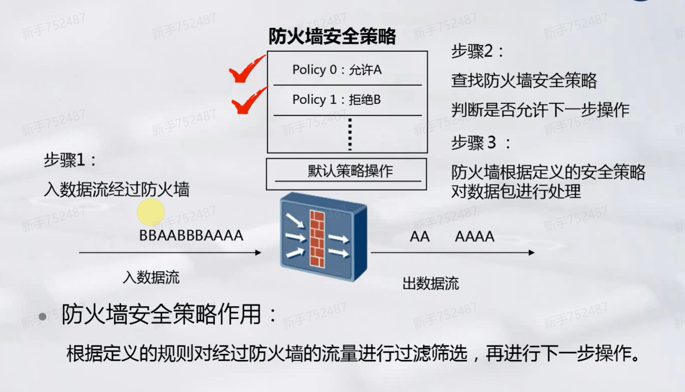

安全策略分类： 
域间安全策略 
域内安全策略 
接口包过滤 

### 发展历程
#### 传统防火墙(包过滤防火墙)
简单的针对ip和协议进行过滤。 
工作范围：网络层，传输层。 
与路由器的区别：普通路由器只检查数据包的目标地址，并选择一个到达目的地址的最佳路径。
防火墙除了决定目的路径外还要根据已经设定的规则进行判断是与否。 
技术应用：包过滤技术。 
优势：对于小型站点容易实现，处理速度快，价格便宜。 
劣势：规则表回变得庞大复杂难以运维，只能基于五元组。 

#### 传统防火墙(应用代理防火墙)
判断信息：所有应用层的信息包 
工作范围：应用层 
与包过滤防火墙的区别：包过滤防火墙工作于3-4层，通过检验报头进行规则表匹配。
应用代理防火墙工作于7层，检查所有的应用层信息包，每个应用需要添加对应的代理服务。
识别应用，根据应用规则放行或拦截。 
技术应用：应用代理技术 
优势：检查了应用层的数据 
劣势：检测效率低，配置运维难度极高，可伸缩性差 

#### 传统防火墙(状态检测防火墙)
检查建立会话表。 
判断信息：IP地址，端口号，TCP标记。 
工作范围：数据链路层，网络层，传输层。 
和包过滤防火墙的区别：包过滤防火墙工作于3-4层，通过检验报头进行规则表匹配。是包过滤防火墙的升级版，一次检查建立会话表，后期直接按会话表放行。 
技术应用：状态检测技术 
优势：主要检查3-4层能够保证效率，对TCP防御较好 
劣势：应用层控制较弱，不检查数据区 

#### 入侵检测系统(IDS) --网络摄像头
部署方式：旁路部署，可多点部署。 
工作范围：2-7层 
工作特点：根据部署位置监控到的流量进行攻击事件监控，属于一个事后呈现的系统，相当于网络上的监控摄像头。 
目的：传统防火墙只能基于规则执行“是”或“否”的策略，IDS主要是为了帮助管理员清晰的了解到网络环境中发生了什么事情 
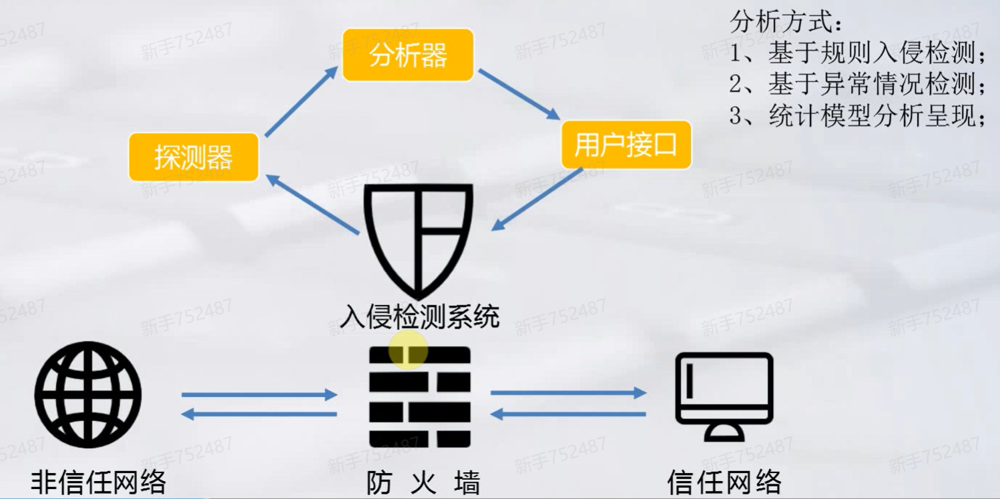

#### 入侵防御系统(IPS) --抵御2-7层已知威胁
部署方式：串联部署 
工作范围：2-7层 
工作特点：根据已知的安全威胁生成对应的过滤器(规则)，对于识别为流量的阻断，对于未识别的放通 
目的：IDS只能对网络环境进行检测，但却无法进行防御，IPS主要是针对一致威胁进行防御 
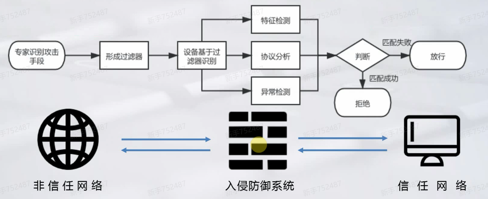

#### 防病毒网关(AV) --基于网络侧识别病毒文件
判断信息：数据包 
工作范围：2-7层 
目的：防止病毒文件通过外网进入到内网环境 
和防火墙的区别：
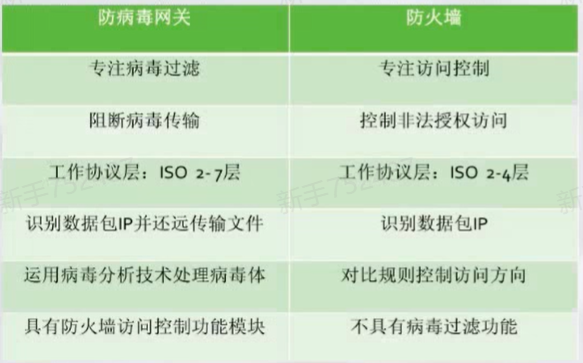
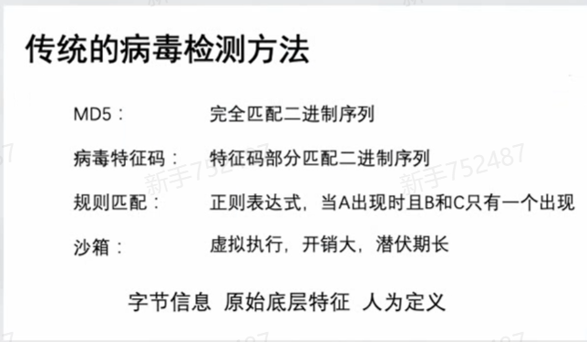

#### Web应用防火墙(WAF) --专门用来保护web应用
判断信息：http协议数据的request和response 
工作范围：应用层(7层) 
目的：防止基于应用层的攻击影响Web应用系统 
主要技术原理： 
①代理服务：会话双向代理，用户与服务器不产生直接连接，对于DDOS攻击可以抑制 
②特征识别；通过正则表达式的特征库进行特征识别 
③算法识别：针对攻击方式进行模式化识别，如SQL注入、DDOS、XSS等 

#### 统一威胁管理(UTM) --多合一安全网关
包含功能：FW、IDS、IPS、AV 
工作范围：2-7层 
目的：将多种安全问题通过一台设备解决 
优点：功能多合一有效降低了硬件成本、人力成本、时间成本 
缺点：模块串联检测效率低，性能消耗大 
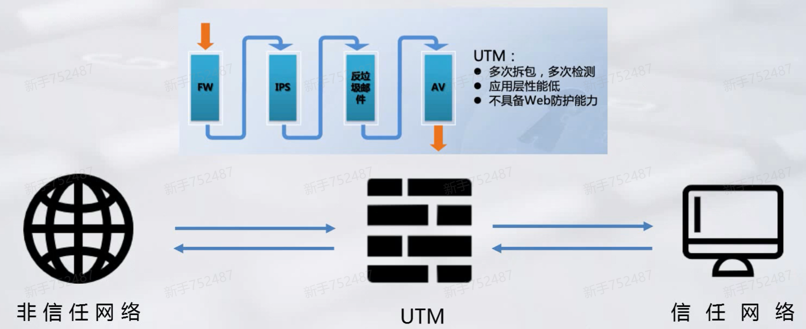
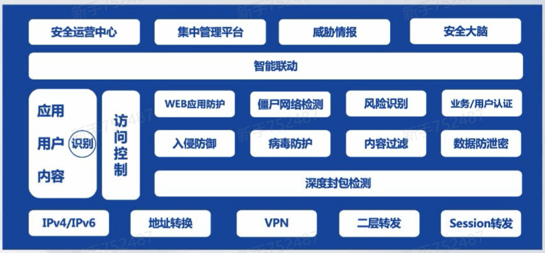

#### 下一代防火墙
包含功能：FW、IDS、IPS、AV、WAF 
工作范围：2-7层 
和UTM区别：与UTM相比增加了web应用防护，UTM是串行处理机制，NGFW是并行处理机制，NGFW性能更强，管理更高效。
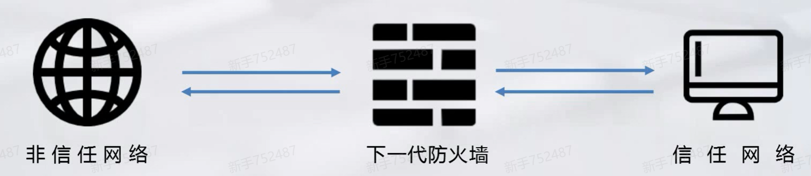
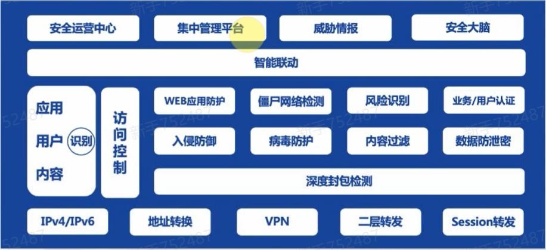

### 性能指标
#### 吞吐量
防火墙能同时处理的最大数据量 
**有效吞吐量：**除掉TCP因丢包和超时重发的数据，实际的每秒传输有效速率 
**衡量标准：**吞吐量越大，性能越高

#### 时延
数据包的第一个比特进入防火墙到最后一个比特输出防火墙的时间间隔指标 
用于测量防火墙处理数据的速度理想的情况，测试的是其存储转发性能。 
衡量标准：延时越小，性能越高。

#### 丢包率
在连续负载的情况下，防火墙由于资源不足，应转发但是未转发的百分比。 
衡量标准：丢包率越小，性能越高
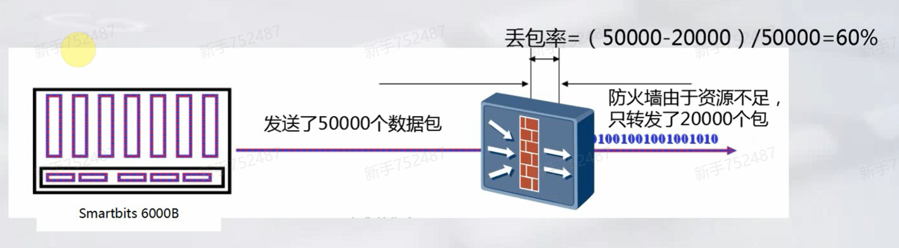

#### 背靠背
衡量标准：背靠背主要是指防火墙缓冲容量的大小。网络上常会出现一些突发的大流量(例如：NFS，备份，路由更新等)，而且这样的数据包的丢失可能会产生更多的数据包丢失。强大的缓冲能力可以减小对这种突发网络情况造成的影响。
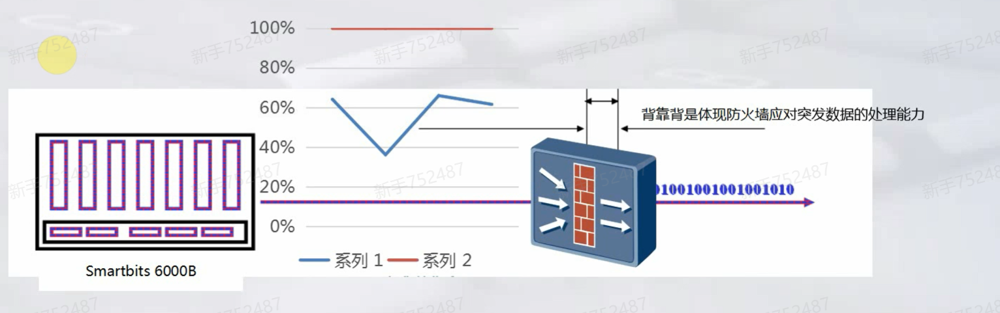

#### 并发连接数
由于防火墙是针对连接进行处理的，并发连接数是指防火墙可以同时容纳的最大连接数，一个连接就是一个TCP/UDP的访问。 
衡量指标：并发连接数指标越大，抗攻击能力也越强。
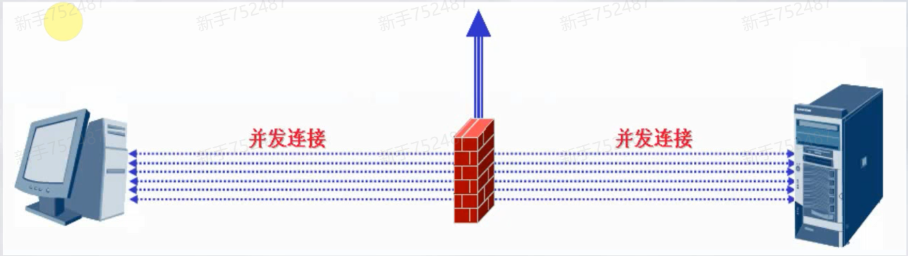

### 深信服下一代防火墙解决方案
传统防火墙通过防御设备划分边界，基于IP/端口和特征进行判断 
以隔离为基础，基于信任原则构建安全框架 
以防护为核心，基于静态特征的攻击检测 

深信服：安全可视化，事前预知，事中防御，时候检测与响应。
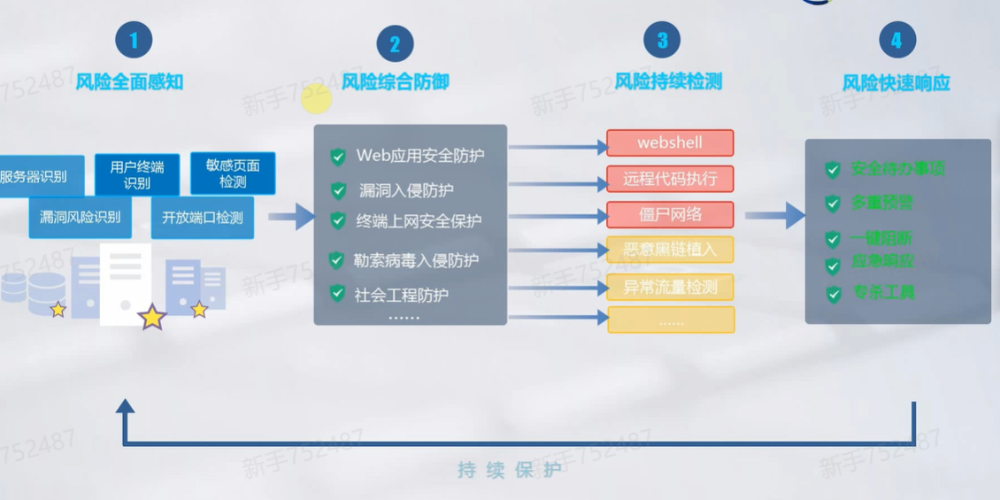

基于AI的杀毒引擎SAVE
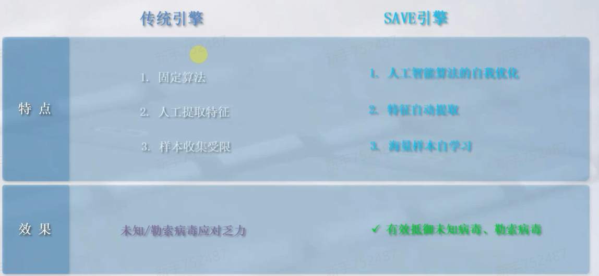

智能联动
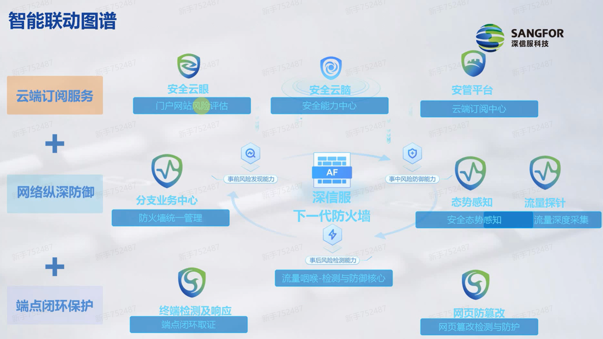

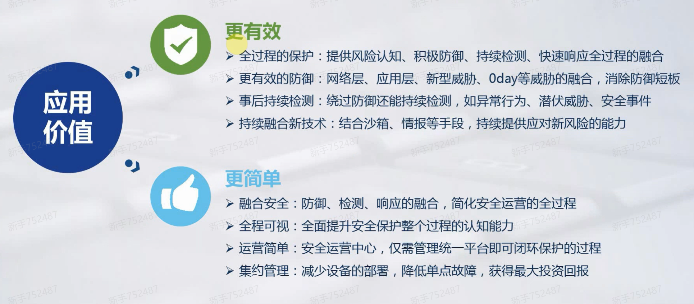

## 下一代防火墙组网方案

### 下一代防火墙组网简介
AF基本应用场景
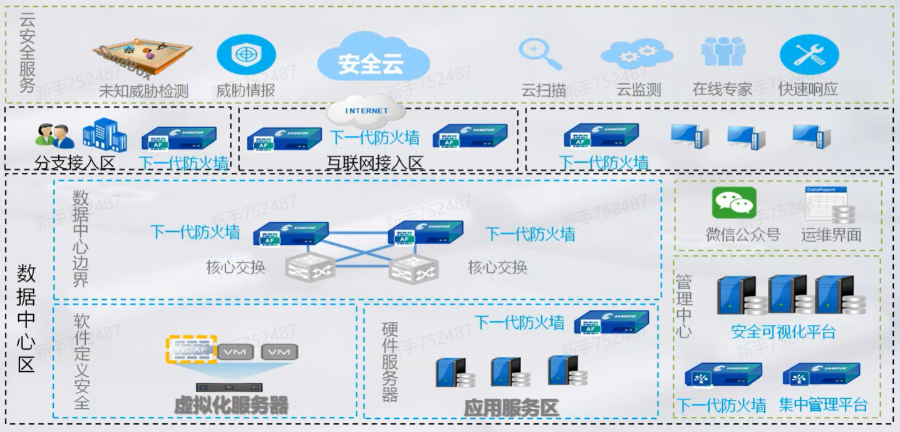

#### 部署模式简介
下一代防火墙具备灵活的网络适应能力，支持：路由模式、透明模式、虚拟网线模式、混合模式、旁路模式。
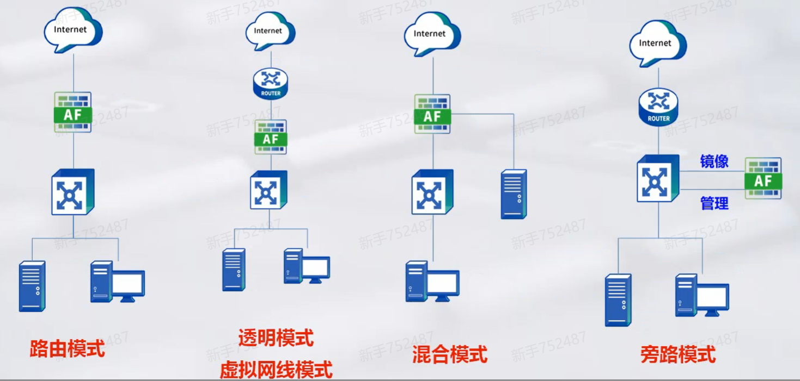

#### 接口
根据接口属性分为：物理接口、子接口、VLAN接口、聚合接口。 
其中物理接口可选择为：路由口、透明口、虚拟网线口、旁路镜像口。 

根据接口不同工作层面，可以划分为：二层区域、三层区域、虚拟网线区域。 

#### 物理接口
物理接口与AF设备面板上的接口一一对应(默认eth0为manage口，该管理口只能为路由接口，不能为透明或者虚拟网线接口)，根据网口数据转发特性的不同，可选择路由、透明、虚拟网线和旁路镜像4种类型，前三种接口又可设置WAN或非WAN属性。 
物理接口无法删除或新增，物理接口的数目由硬件决定(个别平台支持可扩展)。 

#### 路由接口
如果设置为路由接口，需要给该接口配置IP地址，且该接口具有路由转发功能。
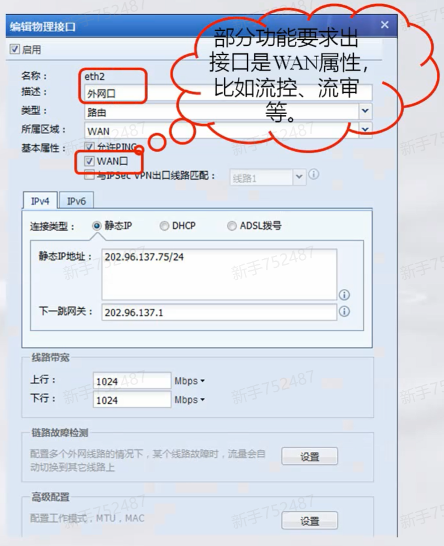

接口ip地址设置完后，需要配置接口的下一跳网关，用于链路故障检测，并不会自动生成0.0.0.0的缺省路由，需要手动添加缺省路由。

接口的线路带宽设置与流量管理无关，用于策略路由根据接口带宽占用比例选路。告诉设备所接网线带宽多少兆，设备无法自动感知。

ADSL拨号：如果设置为路由接口，并且是ADSL拨号，需要选上添加默认路由选项，默认勾选。拨号的下一条网关是会变的，建议不要手动使用静态路由，建议使用策略路由。
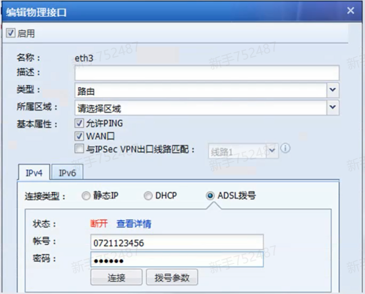

选择拨号参数。
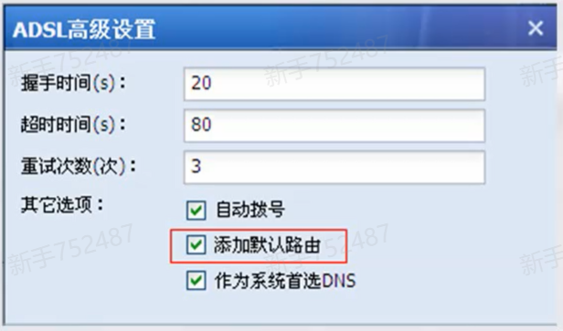

管理口：Eth0为固定的管理口，接口类型为路由口，无法修改。Eth0可增加管理IP地址。 
默认的管理IP地址10.251.251.251/24如需修改，AF8.0.13版本后，可在[系统]-[通用配置]-[网络参数]中进行修改。 
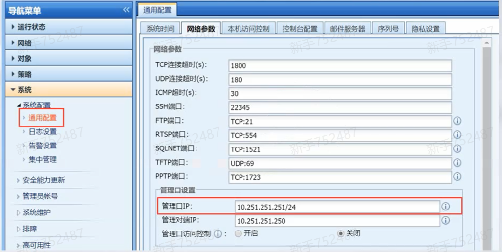

#### 透明接口
透明接口相当于普通的交换网口，没有涉及网络层，不需要配置IP地址，不支持路由转发，根据MAC地址表转发数据。
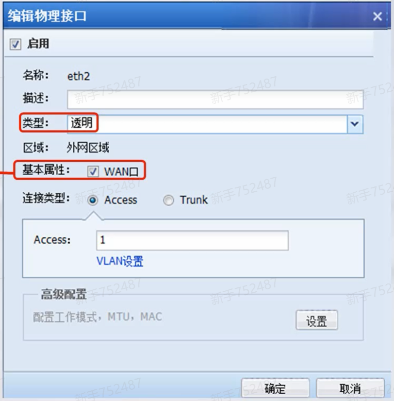

#### 虚拟网线接口
虚拟网线接口也是普通的交换接口，不能配置IP地址，不支持路由转发，转发数据时，也无需查看MAC表，直接从虚拟网线配对的接口转发。 
虚拟网线接口的转发性能高于透明接口，单进单出、双进双出等成对出现的网桥的环境下，推荐使用虚拟网线接口部署。 
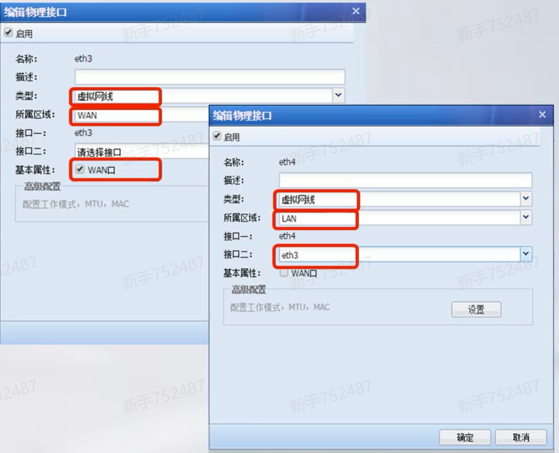

#### 旁路镜像接口
旁路镜像接口不能配置IP地址，也不支持数据转发，只是用来接收从外部镜像过来的镜像数据。 
镜像接口可以配置多个，根据现场实际业务场景需要接收的数据情况进行选择。 
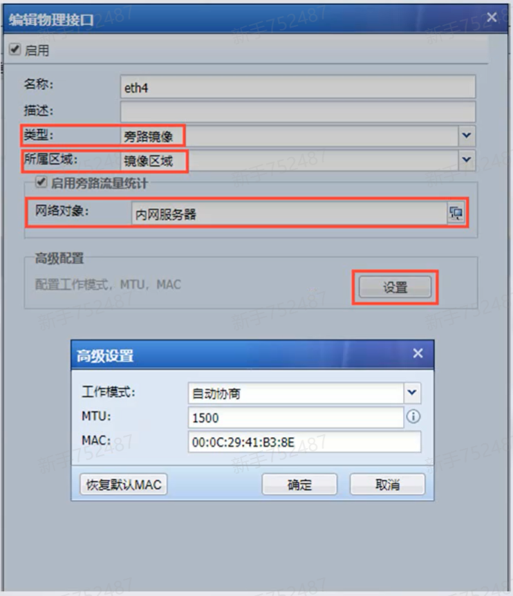

#### 聚合接口
将多个以太网接口捆绑在一起所形成的逻辑接口，创建聚合接口成为一个逻辑接口，而不是底层的物理接口。 
最多支持4个聚合口，不支持旁路镜像 
负载均衡：hash：按数据包源目IP/MAC的hash值均分 
负载均衡：：RR：直接按数据包轮转均分到每个接口 
主备模式：取eth最大号为主接口收发包，其余为备接口。 
LACP：标准LACP协议对接，选择LACP选项后，可以支持基于：IP+MAC、IP+端口、MAC三种哈希策略，同时支持主动和被动两种模式。 
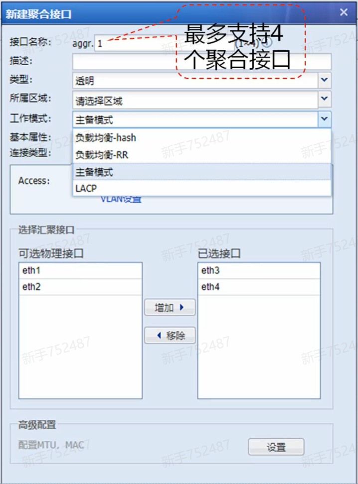
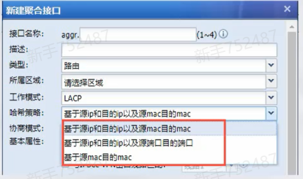
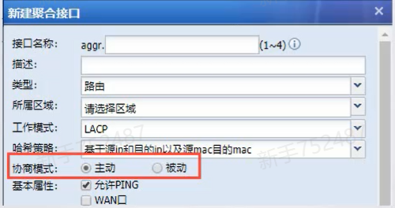

#### 子接口
子接口应用于路由接口需要启用VLAN或TRUNK的场景。 
子接口与聚合接口一样，均为虚拟接口，不同点在于：聚合口是将一个以上的物理接口聚合在一起，子接口是物理口下虚拟出来的接口。子接口是逻辑接口，只能在路由口下添加子接口。 
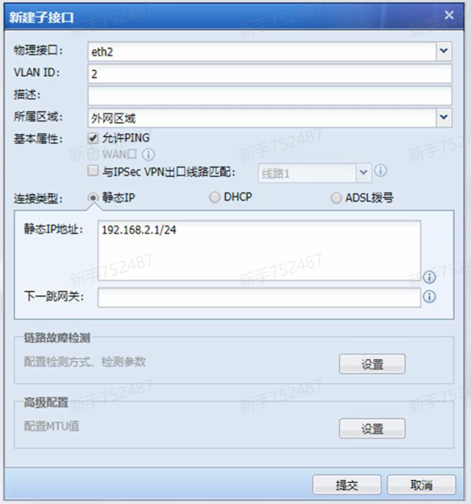
物理接口：选择在哪个路由接口下添加子接口。 
VLANID：设置子接口的VLANID。 
新版本的子接口默认继承路由口的WAN属性，所以其WAN属性无法设置。 
子接口的下一跳网关和链路故障检测根据实际环境进行配置。 

#### VLAN口
为VLAN定义IP地址，则会产生VLAN接口。VLAN接口也是逻辑接口。
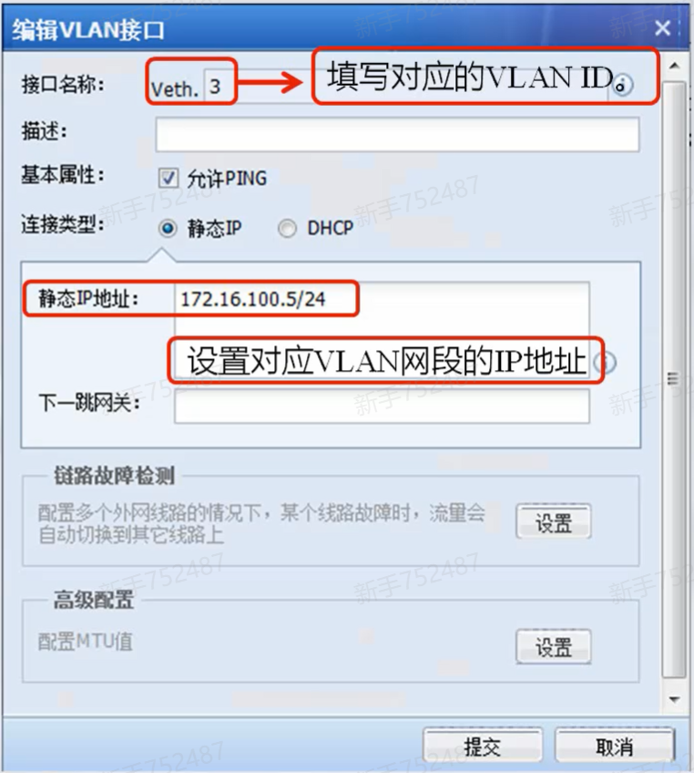

#### 接口配置注意事项
1. 设备支持多个WAN属性的路由接口连接多条外网线路，但是需要开通多条线路的授权。
2. 管理口不支持设置成透明接口或虚拟网线接口，如果要设置2对或2对以上的虚拟网线接口，则必须要求设备不少于5个物理接口，预留一个专门的管理口Eth0。
3. 一个路由接口下可添加多个子接口，路由接口的IP地址不能与子接口的IP地址在同网段。

### 区域
是在防火墙上根据不同业务划分出的。 
区域用于定义和归类接口，以供各类安全策略等模块调用。 
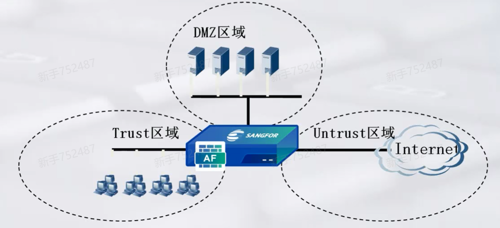
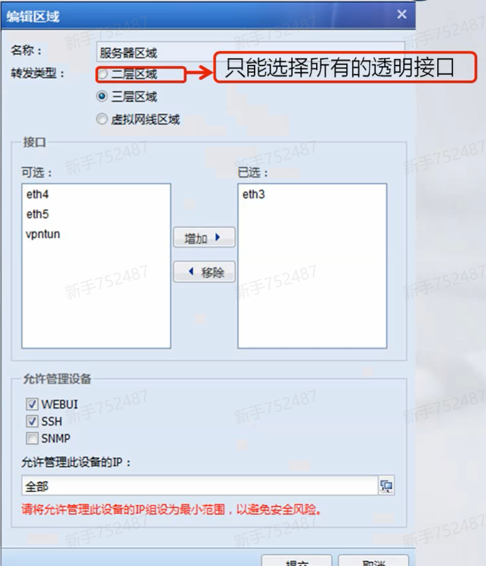

### 路由模式部署方式
在部署前需要考虑：
1. 现有设备的接口配置
2. 内网网段规划，好写回包路由
3. 是否有服务器需要映射
4. 是否需要代理内网用户上外网
5. 进行内外网哪些访问权限的控制
6. 进行哪写安全策略配置实现用户需求
7. 现在拓扑是否完整

#### 配置思路
1. 配置接口地址并定义接口对应的区域： 
在[网络]-[接口/区域]-[物理接口]中，选择接口，并配置接口类型、所属区域、基本属性、IP地址。
2. 配置路由： 
在[网络]-[路由]中，新增静态路由，配置默认路由或回程路由。
3. 配置代理上网： 
在[策略]-[地址转换]中，新增源地址转换。
4. 配置端口映射： 
在[策略]-[地址转换]中，新增映射服务器。
5. 配置应用控制策略，放通内网用户上网权限： 
在[策略]-[应用控制策略]中，新增应用控制策略，放通内到外的数据访问权限。
6. 配置安全防护策略： 
如：业务防护策略、用户防护策略等。

#### 单臂路由部署模式
单臂路由是指在路由器的一个接口上通过配置子接口(逻辑接口，并不存在真正物理接口)的方式，实现原来相互隔离的不同VLAN(虚拟局域网)之间的互联互通。
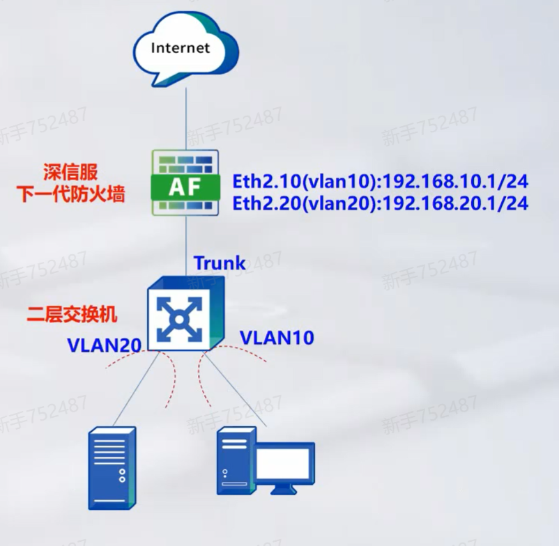

#### 路由模式部署总结

在此组网方式时，防火墙位于内部网络和外部网络之间，负责在内部网络、外部网络中进行路由寻址，相当于路由器。其与内部网络、外部网络相连的上下行业务口均工作在三层，需要分别配置不同网段的IP地址。

此组网方式支持更多的安全特性，如NAT、策略路由选择，动态路由协议(OSPF、BGP、RIP)等。

需要修改原网络拓扑，对现有环境改动较大。

一般部署在需要进行路由转发的位置

### 透明模式组网方式

部署方式比较简单，不会改变现有的网络环境。只要串入即可
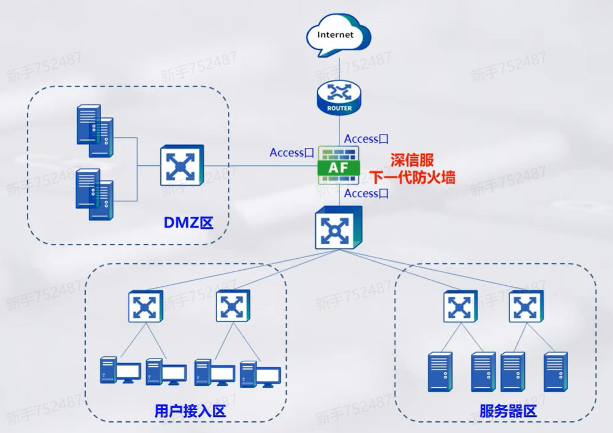

部署前准备：
1. 接口自定义
2. 管理地址配置
3. 配置路由，一般缺省路由用作防火墙上网，回程路由用作防火墙管理
4. 不用配置地址转换
5. 应用控制进行访问权限控制
6. 安全防护策略

#### 配置思路
1. 配置接口地址并定义接口对应的区域： 
在[网络]-[接口/区域]-[物理接口]中，选择接口，并配置接口类型、所属区域、基本属性、IP地址，需要设置基本属性为Access或者Trunk。
2. 配置管理接口： 
在[网络]中，新增管理接口，或者配置vlan接口的逻辑接口作为管理接口，并分配管理地址。
3. 配置路由： 
在[网络]-[路由]中，新增缺省路由和回程路由。
4. 配置应用控制策略，对不同区域间的访问权限进行控制： 
在[策略]-[访问控制]-[应用控制策略]中，新增应用控制策略，进行访问权限控制。
5. 配置安全防护策略： 
如：业务防护策略、用户防护策略等。

### 虚拟网线部署
用户需求：路由器和交换机聚合口对接，要求透明部署防火墙设备，即从1号口进来的数据，只从2号口出，不再转发到其他接口，其他接口的效果也一样。同样防火墙设备可以被日常管理。
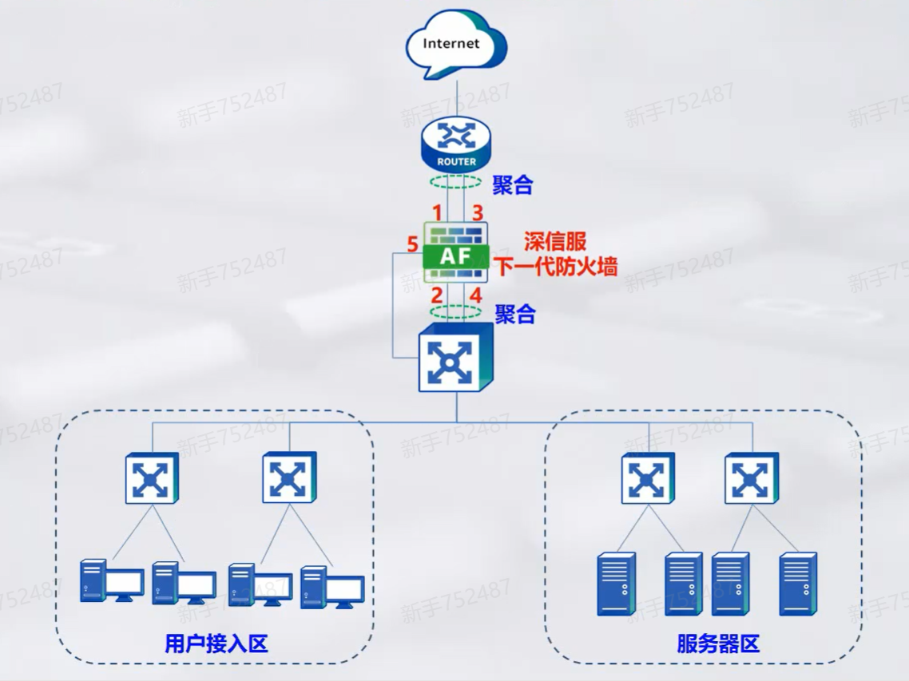

#### 配置思路
1. 配置接口地址并定义接口对应的区域： 
在[网络]-[接口/区域]-[物理接口]中，选择接口，并配置接口类型、所属区域、以及配对的虚拟接口。
2. 配置管理接口： 
在[网络]中，新增管理接口，管理接口必须新启一个单独的接口，无法通过配置桥地址实现，并分配管理地址。
3. 配置路由： 
在[网络]-[路由]中，新增缺省路由和回程路由。
4. 配置应用控制策略，对不同区域间的访问权限进行控制： 
在[策略]-[访问控制]-[应用控制策略]中，新增应用控制策略，进行访问权限控制。
5. 配置安全防护策略： 
如：业务防护策略、用户防护策略等。

### 混合模式组网
用户需求：内网用户有服务器群，服务器均配置公网IP地址，提供所有用户直接通过公网IP地址接入访问。内网用户使用私有地址，通过NAT转换代理上网。希望将AF设备部署在公网出口的位置，实现内外部署数据通信的同时，保护服务器群和内网上网数据的安全。

服务器有公网ip，不需要地址转换，内网用户使用私有地址，需要NAT。 
将防火墙串在服务器与公网之间，透明;内网用户需要NAT地址转换，路由部署模式。

部署方式推荐：推荐使用混合模式部署，AF设备连接公网和服务器群的2个接口使用透明bypass口，连接内网网段使用路由接口。

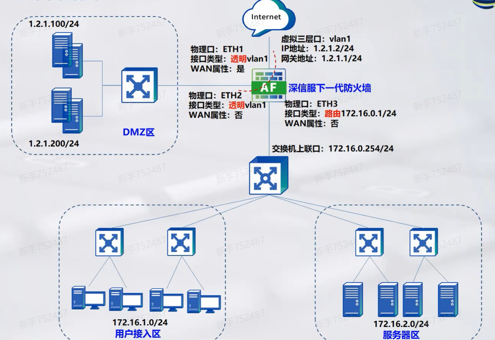

首先选择三个接口，对这三个接口进行划分。两个接口划分为透明口接公网和服务器，一个配成路由口。
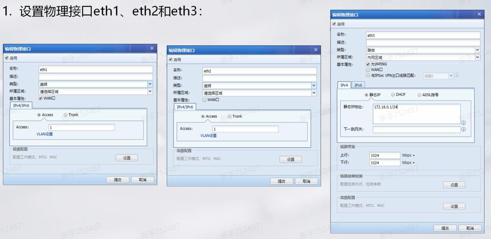

第二步设置vlan接口
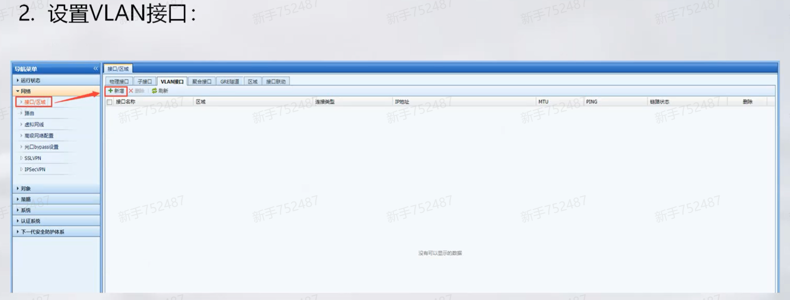
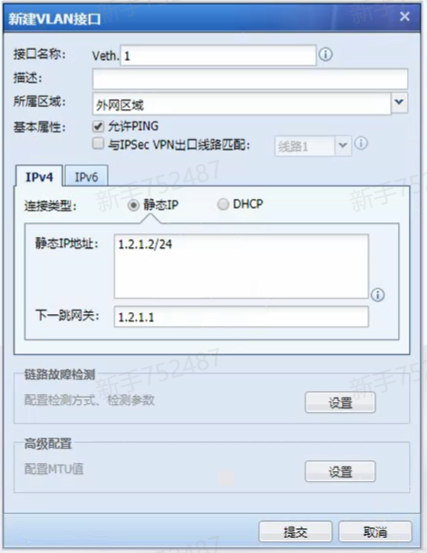

### 旁路模式部署
需求：使用AF来实现对各区域之间数据交互进行安全分析，同时不改动已有的环境。
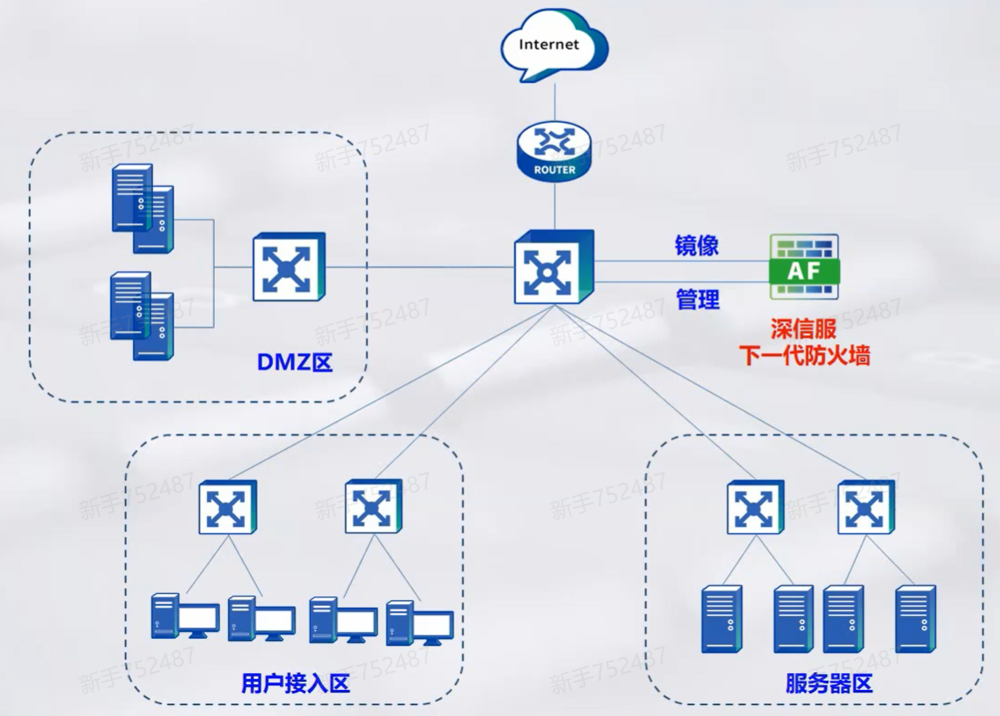

#### 配置思路
1. 配置镜像接口，定义接口对应的区域，并配置流量监听网络对象： 
在[网络]-[接口/区域]-[物理接口]中，选择接口，并配置接口类型、所属区域、旁路流量统计网络对象。
2. 配置管理接口： 
在[网络]-[接口/区域]-[物理接口]中，选择空闲的物理接口作为管理口。
3. 配置路由： 
在[网络]-[路由]中，一般新增缺省路由。较少场景使用明细的回程路由。
4. 启用旁路reset功能： 
在[系统]-[系统配置]-[通用配置]-[网络参数]中，勾选[旁路reset]。 
若用户不需要防火墙阻止内网数据转发，则不需要开启，需要阻止已经发现的危害内网的行为，则需要开启。
5. 配置安全防护策略： 
如：业务防护策略、用户防护策略等。

#### 思考总结
设备旁挂在现有的网络设备上，不影响现有的网络结构，通过端口镜像技术把流量镜像到下一代防火墙，实现对数据的分析和处理。

需要另外单独设置管理接口才能对设备进行管理。

启用管理口reset功能。

旁路部署支持的功能有： 
APT(僵尸网络) 
PVS(实时漏洞分析) 
WAF(web应用防护) 
入侵防护系统 
DLP(数据泄密防护) 
网站防篡改部分功能(客户端保护)

## 策略路由解决方案
策略路由时路由中的一种。

静态路由的匹配条件相对较少：匹配目的IP、子网掩码与下一跳网关。

策略路由可以弥补静态路由的不足，更灵活多样的匹配条件，根据相应策略来进行匹配，包括：匹配源、目的、协议、应用等，出口在外网多条线路情况下，建议配置策略路由。

策略路由分为： 
源地址策略路由--可指定内网哪些IP走指定线路出公网 
多线路负载路由--可指定多条线路进行负载选路 
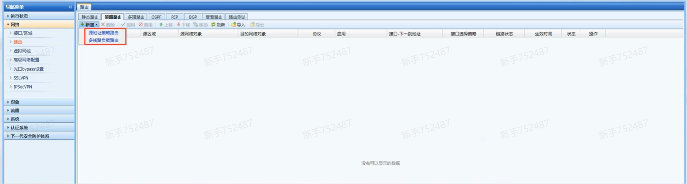

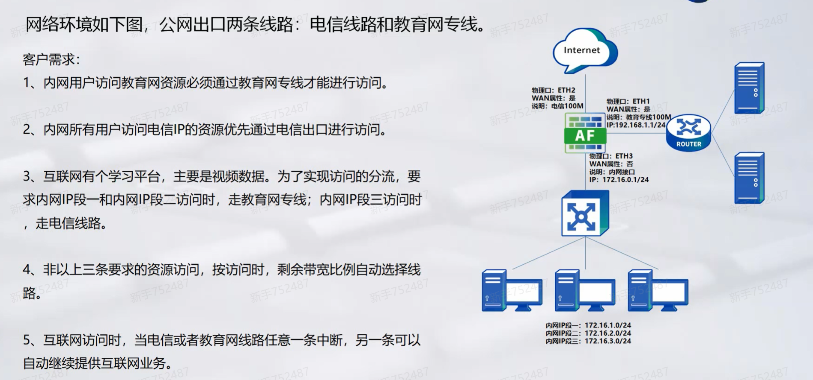

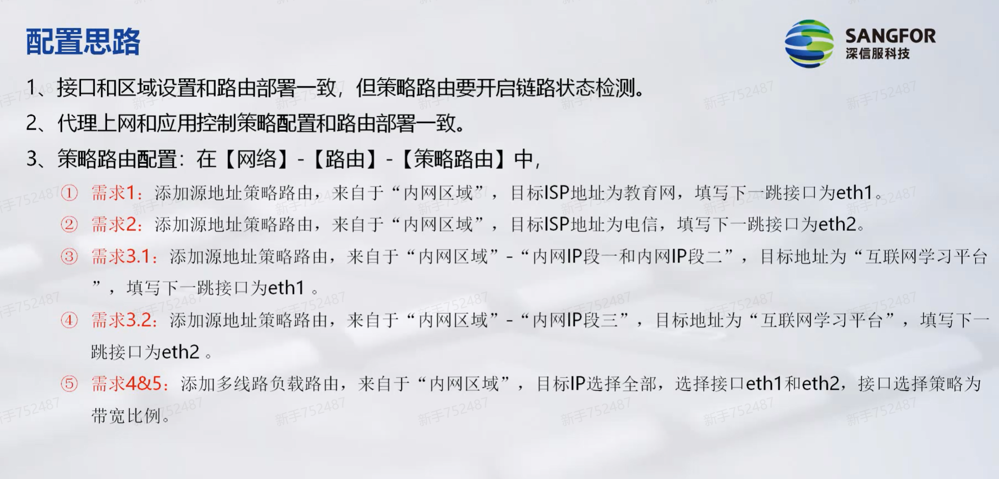
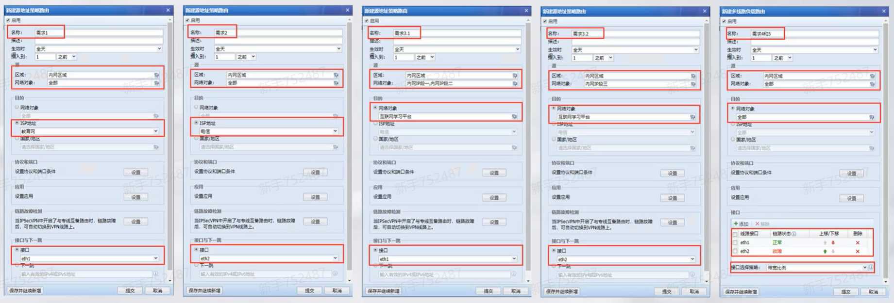
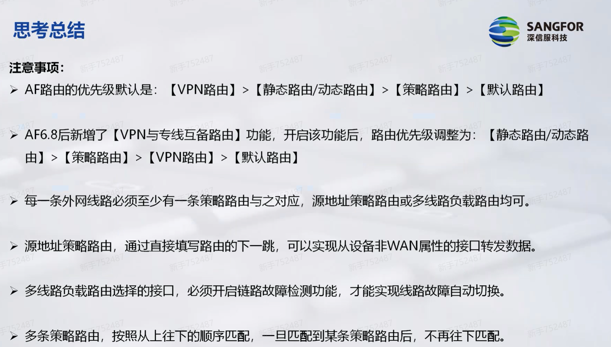

## 高可用性

### 高可用性概述
客户需求：现有的拓扑如图，一台AF做网关部署，在单点故障下会出现网络中断，为了提高网络可靠性，保证业务连续性，在网络设备或线路故障时能够有效避免出现网络中断的问题。
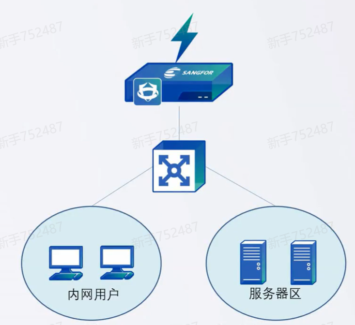
两台满足条件的AF组合在一起，实现相互的冗余备份，提高网络的可靠性。
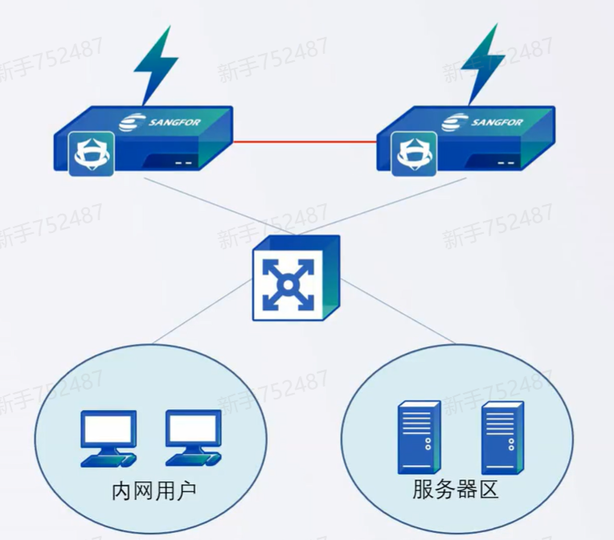

#### 建立条件：
1. 网口数量一致
2. cpu核心个数、内存大小、磁盘大小一致
3. 设备序列号功能开启且保持一致
4. appversion版本信息一致
5. 配置同步要一致，双机配置与设备无关
6. vrrp组的配置要一致，这是双机配置与设备无关

#### 名词解释
**主线路和辅线路** 
1. 主线路：负责主备机心跳保持、配置同步、会话同步。目前支持使用聚合口做为心跳接口，单聚合接口模式只支持“主备模式”；
2. 辅线路：当主心跳故障后，辅心跳可以承接主心跳进行心跳保证的工作，同样支持聚合主备接口。但需要注意，辅心跳不支持配置同步，所以如果主心跳故障的，也需要立即处置，否则还是有业务风险。
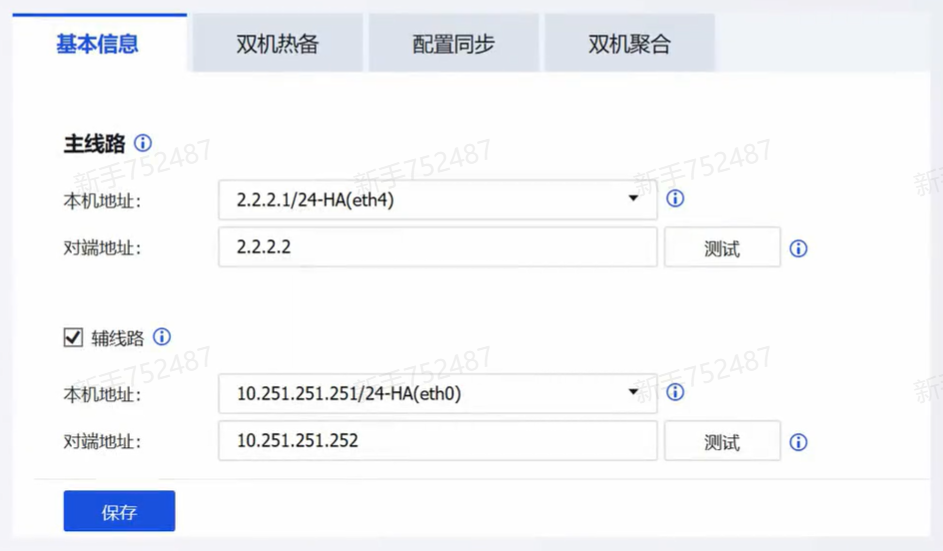

**抢占** 
1. 不开启抢占：如果原主机因故障切换成备机，故障恢复后，就算优先级高，也不会自动恢复成主机，而是以备机身份继续运行；
2. 开启抢占：如果原主机因故障切换成备机，故障恢复后，如果优先级高，会自动恢复成主机。
3. 抢占功能非特殊场景不建议开，原因是当主机网线出现故障，主机状态变成备机或者故障状态之后，网口默认不发包，设备链路检测状态为故障，当线路恢复正常，主机抢占回主状态，这个时候链路状态还未恢复，主机又会恢复成备机或者故障状态，会一直反复来回切换会增加切换频次，而且因为AF必须同构(即两台AF需要硬件一致)运行，所以也不存在性能差异，抢占的意义一般不大。
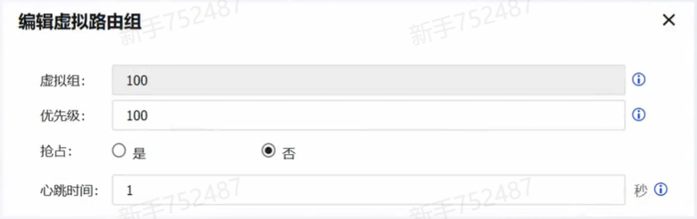

**网口监视** 
1. 网口监视：双机切换条件之一，通过接口物理状态进行检测结果判定，如接口出现ifconfig down，网线脱落，协商失败等物理故障。物理状态的故障双机状态可以快速检测到，并在多播包中发送prio=0，通知对端变成主机，理论上可以实现无延时切换；
2. 网口监视还有一个功能时，备机状态下，添加到网口监视中的接口，处于发包抑制状态，无法发送任何数据包，所以配置了业务的接口，都必须添加到网口监视中，否则双机同步配置后，主备机接口IP一致，就会导致网络中的IP冲突。
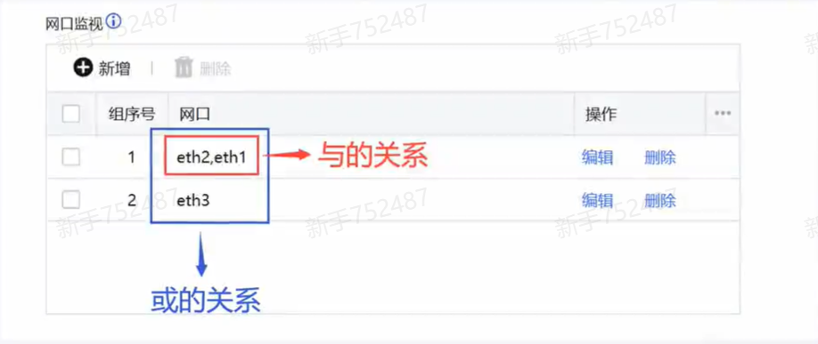

**链路监视** 
双机切换条件之一，通过链路联通性状态进行检测结果判定，目前支持ARP、DNS、PING三种检测方法，三种检测方法可以在接口上选择性开启，同时双机判断链路失败的条件也可以自由组合。
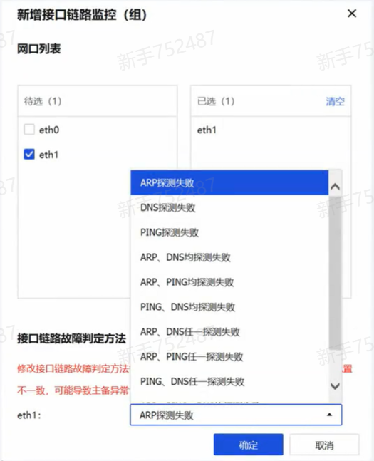

**主备机和主备控** 
1. 主备机：简单理解为设备数据层面控制，主机状态加入网口监视的业务接口允许进行正常的数据转发，备机状态加入网口监视的业务接口不允许进行数据转发；
2. 主备控：简单理解为设备配置层面控制，主控允许修改设备配置，备控不允许修改设备配置，主机强制绑定为主控，备机强制绑定为备控。主备控配置同步的流程为：
&ensp;&ensp;&ensp;&ensp;a) 备控向主控主动发起配置更新请求(10秒一次发送需要同步配置文件的MD5到主控)  
&ensp;&ensp;&ensp;&ensp;b) 主控收到备控请求后，向备控同步当前的配置(比对有MD5差异的文件，把有差异的文件同步给备控)。 

**高可用部署类型** 
主备部署： 
两台设备只有一台处于工作状态，还有一台处于热备状态，当检测机制检测到主机故障后，由热备设备自动承接所有工作，从而来保障客户业务的连续性； 
主主部署： 
两台设备均处于工作状态，根据流量转发到不同AF的情况，来进行数据处理，主主又分两种情况： 
a) 有VRRP双主：配置多组VRRP，每组有不同的主备机，该场景不推荐，路由有VRRP双主基本上很难支持起来。透明有VRRP双主一般就直接引导为无VRRP双主。 
b) 无VRRP双主：不配置VRRP组，只配置双机基本信息和配置同步，根据上下联设备把数据引流到不同设备来进行承接。 

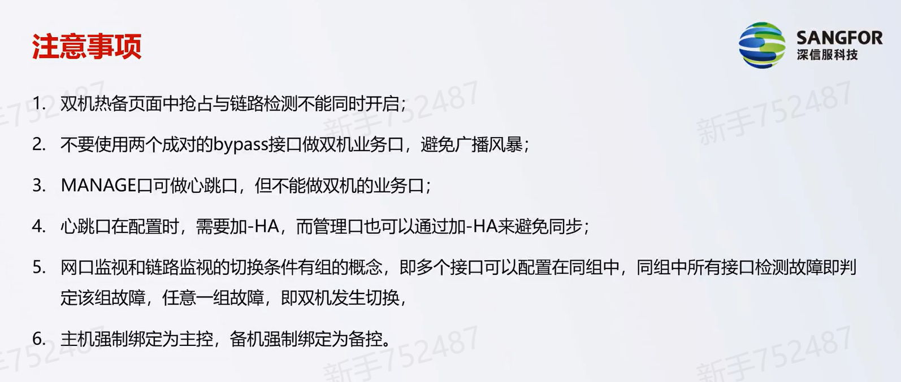

### 高可用性功能相关
