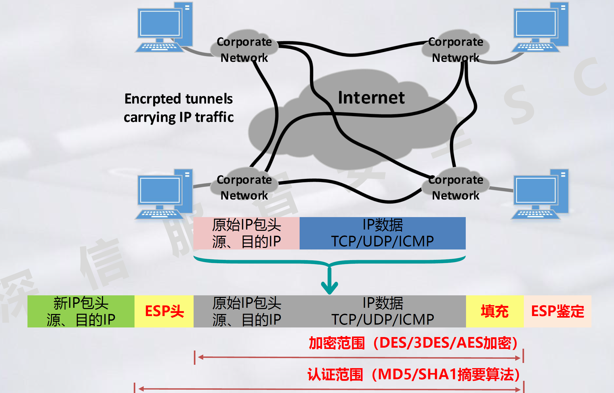

# VPN

## VPN概述

### 一、概述

Vitual Private NetWork 虚拟私有网，是依靠ISP或其他NSP在公用网络基础设施之上构建的专用的安全数据通信网络，只不过这个专线网络是逻辑上的而不是物理的，所以称为虚拟专用网。

虚拟：用户不再需要拥有实际的长途数据线路，而是使用公共网络资源建立自己的私有网络。虚拟的专线。

专用：用户可以定制最符合自身需求的网络。

**核心技术：隧道技术。**私网与私网通信数据，封装后发出，运营商只看外层。两边协议不兼容，需要转译。VPN使用的封装思想。

一般是临时的通信连接，会话结束就断开。

### 二、分类

#### 1、Client-LAN VPN (Access VPN)
接入式VPN，远程访问VPN，使用基于Internet远程访问的VPN。出差访问公司内网。

#### 2、LAN-LAN VPN
在不同的局域网之间建立安全的数据传输隧道，例如在企业内部各分支机构之间或者企业与其合作者之间的网络进行互联。

结构复杂，费用昂贵。通常使用IPsec协议簇。

intranet，内部公司内部子网互联。extranet安全性要求更高，企业和合作机构互联。

#### 3、按照网络层次分类

IPSec单播，GER组播。

### 三、VPN常用技术

保障数据和身份安全

#### 1、隧道技术
隧道：在公共通信网络上建立一条数据路径，可以提供与专用通信线路等同的连接特性。

隧道技术：是指在隧道的两端通过封装以及解封装技术在公网上建立一条数据通道，使用这条通道对数据报文进行传输。隧道是由隧道协议构建形成的。隧道技术是VPN技术中最关键的技术。

不能保证数据安全性和保密性，隧道只能封装和解封装。安全性需要加解密技术，完整性需要认证技术。

两侧IPX，中间IP协议。隧道协议头：使用的哪种封装协议，IPsec或GRE等。或者两侧为IP私网协议，一样的。

两个私网通讯，需要封装。

#### 2、加密解密技术

保护数据的保密性。在信息被监听/截取的情况下，攻击者也无法获取。建立在密码学基础上。加密算法理论上都是公开的，保密的是密钥。

加密算法主要分为对称加密算法，和非对称加密算法。

对称加密：双方拥有同样的钥匙。双方必须用相同的钥匙进行加解密，需要使用安全信道建立密钥。一个用户跟多个用户通信，密钥很多，不好管理。

非对称加密：加密和解密使用不同的密钥，使用公钥加密，使用密钥解密。任意密钥加密的信息只能用另一个密钥解密。

常见的对称加密算法：DES，3DES，AES(这几个是最常用的)

**密钥传输和数据传输不能使用同一通道。**

Bob Alice有同样的钥匙。Bob用钥匙将明文加密，在公网传输，Alice拿相同的钥匙解密。

对称加密算法的缺陷： 
(1)、密钥传输风险 
Alice Bob必须使用一个安全的信道建立密钥。
但是消息传递的通信链路是不安全的。 
(2)、密钥多难管理 
在人多的情况下，n个人，每个人有n-1个密钥。 

弥补方式：非对称加密，公钥用于加密，私钥用于解密。公钥可公开。

用一把密钥加密，用另外一把密钥解密。

加密和解密使用的是不同的密钥（公钥、私钥），两个密钥之间存在相互依存关系，用其中任一个密钥加密的信息只能用另一个密钥进行解密，用公钥加密，用私钥解密得到明文。这样使得双方无需事先交换密钥。

非对称加密过程：

给谁发送就用谁的公钥加密。Bob用Alice的公钥对数据加密，Alice用自己的私钥解密。

常见的非对称加密算法：RSA，DS。

对比：

数据使用对称加密算法加密，密钥使用(接收方的公钥)非对称加密算法加密，得到两个密文发给对方。接收方使用自己的私钥解开对称加密算法密钥，再解开数据（**数字信封**）。

#### 3、身份认证

防止中间人攻击。伪造身份假冒合法用户获得访问合法信息。

Alice有自己的公钥私钥，Bob有Alice的公钥，黑客张三有自己的公钥和私钥。

##### 3.1、数字签名

签名：私钥加密的哈希值。

Alice使用HASH对原文生成摘要，Alice使用私钥加密摘要生成数字签名。hash可以把无论多长的原始信息生成固定128bit或者256bit的摘要。

原始信息和数字签名一起发送。（举例，实际不是一起发的）

Bob使用Alice的公钥解密数字签名得到摘要2，使用原文得到摘要1，对比二者确认发送者身份。

黑客使用自己的公钥换走了Bob电脑上Alice的公钥，Bob无法确定这个公钥是否属于Alice。找可信的证书中心对该公钥做认证。

##### 3.2、数字证书

**数字证书**的原始文件中包含Alice的身份信息，身份验证机构信息，公钥信息。通过CA对其进行签名生成数字证书。

数字证书中包含，颁发者，有效期，主题(使用者)，算法(哈希，加密算法，MD5，RSA等)，CA公钥，签名(CA)。

验证过程： 
&ensp;&ensp;&ensp;&ensp;验证是否在有效期内； 
&ensp;&ensp;&ensp;&ensp;验证证书是否由CA颁发：用CA公钥解开CA签名，CA签名是CA私钥写的。 
&ensp;&ensp;&ensp;&ensp;验证证书中的信息有无篡改。签名：CA使用MD5将除了签名外的所有东西计算哈希值，再使用CA私钥加密得到签名。将其他信息计算哈希值，对比，相同则没有篡改，不同则有篡改。 

问题：黑客自己搭建一个CA。接收者需要确认CA是否可信。**终极问题：认可CA**

Alice发送信息只需要附上CA颁发的证书。

Bob使用CA的公钥解开数字证书就能拿到Alice的公钥。

**建立在CA可信的基础上。**私钥一般用于签名，公钥用于认证

由PKI体系来规定可信的CA和CA的工作流程。

##### 3.3、PKI体系

Public Key Infrastructure，公开密钥体系，是一种遵循标准的利用非对称加密技术为电子商务的开展提供一套安全基础平台的技术和规范。

利用公钥理论和技术建立的提供安全服务的基础设施。

体系组成：PKI是创建、颁发、管理、注销公钥证书所设计到的所有软件、硬件的集合体。其核心元素是数字证书，核心执行者是CA认证机构。

PKI策略中一般包含两种策略：

一种是证书策略，用于管理证书使用。

另一种是CPS，如何在实践中增强和支持安全策略的详细过程的操作文档。

注册机构RA为用户和CA之间提供了一个接口，用户将用户信息和公钥发给RA，RA对其校验，再同意CA给其颁发证书。RA不签发证书，而是进行资格审查。

证书发布系统负责证书发放。

CA中心，证书授权中心，或者证书授权机构，是电子商务交易中受信任的第三方。树状的组织结构。根CA下有多级CA。二级CA、三级CA颁发的证书会得到所有CA的认同。

CA中心的作用：签发证书、规定证书的有效期和通过发布证书废除列表（CRL）确保必要时可以废除证书，以对证书和密钥进行管理。

CA中心为每个使用公开密钥的用户发放一个数字证书，数字证书的作用时证明证书中列出的用户合法拥有证书中列出的公钥。

CA中心的数字签名使得攻击者不能伪造和篡改证书。

###### 数字证书认证技术原理

数字证书：一个经证书授权中心数字签名的包含公开密钥拥有者信息和公开密钥的文件。一般包含：用户身份信息，用户公钥信息，身份验证机构数字签名的数据。

从证书用途看，数字证书可分为签名证书和加密证书。签名证书主要用于对用户信息进行签名，以保证信息的真实性和不可否认性。加密证书主要用于对用户传送的信息进行加密，以保证信息的机密性和完整性。

从使用方看，分为数字证书，根证书，用户证书，设备证书。

数字证书，在互联网通信中标志通信各方身份的一系列数据。

根证书，CA给自己颁发的证书，信任链的顶端。签发者是本身。

用户证书，CA给个人颁发的。

设备证书，一般为服务器证书。

###### 数据传输安全案例：

对称加密算法加密数据，非对称加密算法加密密钥。

发送方Alice使用hash算法从原始信息中得到信息摘要，使用自己的私钥生成数字签名，并将数字签名、原始信息和证书使用Alice和Bob的对称密钥加密后传输。使用Bob的公钥加密对称密钥生成密钥信封进行传输。

Bob用自己的私钥从密钥信封中解出对称密钥，解密加密数据。从Alice的证书中获取Alice的公钥，并用其从Alice的签名中解出信息摘要，Bob自己再从原始信息中得到摘要，通过对比两个摘要验证信息。

访问百度，先向百度服务器请求证书，得到百度公钥，传输双方的对称密钥，之后就可以传输数据了。(HTTPS)

HTTP为常用的web协议，用于交互网页数据。http是不加密的，在网上明文传输数据。https是ssl协议基础上的http协议。ssl协议的握手过程需要传输服务器的证书，并验证证书的可靠性。

客户端向服务端发送加密请求；服务器用自己的私钥加密网页后连同自己的证书一起发送给客户端，证书中有服务器公钥，用于解密网页；服务器证书会存在浏览器的证书管理中，浏览器证书管理中有受信任的根证书颁发机构列表。

## IPSEC VPN 解决方案

### 一、IPSEC协议簇安全框架

**IPsec(Internet Protocol Security)：**是一组基于网络层，应用密码学的安全通信协议族。IPSec不是具体的协议，而是一个开放的协议族。

**设计目标：**在IPv4和IPv6环境中为网络层流量提供灵活的安全服务。

**IPSec VPN：**基于IPSec协议族构建的在IP层实现的安全虚拟专用网。通过在数据包中插入一个预定义头部的方式，来保障OSI上层协议数据的安全，主要用于保护TCP、UDP、ICMP和隧道的IP数据包。

IPSEC提供的安全服务：

IPSEC协议簇安全体系框架

ESP和AH的通信协议，ESP设计加密和鉴别算法，AH设计鉴别算法。

ESP是封装安全载荷协议，除了提供AH协议所有的功能外还可以提供对IP报文的加密功能。ESP安全等级比AH稍高。

加密算法、鉴别算法、解释域、密钥管理是IKE协商建立隧道的过程。定义安全参数如何协商，共享密钥如何建立。DOI定义协商内容。

通过ESP保障数据传输过程中的机密性和完整性，使用AH保障完整性。

### 二、IPSEC工作模式

#### 1、传输模式

主要应用场景：经常用于主机和主机之间端到端通信的数据保护。不产生新头，不封装。用得不多。

封装方式：不改变原有的IP包头，在原数据包头后面插入IPSec包头，将原来的数据封装成被保护的数据。

原始IP包头中的源地址和目的地址不会改变，但是会修改协议字段为对应IPSec包头的协议号，并且重新计算校验和。

#### 2、隧道模式

主要应用场景：经常用于私网与私网之间通过公网进行通信，建立安全VPN通道。产生新头。

在隧道模式下，原始的ip分组会被封装成新的ip报文。在内部报头和外部包头之间插入一个IPSec报头。

整个数据包被作为数据部分封装到新的数据包中，源目ip都被改变。

### 三、IPSEC通信协议

#### 1、AH协议

通信保护协议 Authentication Header，协议号51。是一个三层的协议。不支持加密。

SPI、认证数据比较重要

##### 传输模式：

**AH会校验整个数据，不能篡改，篡改之后无法通过校验丢弃。与NAT冲突。**

##### 隧道模式：

AH在隧道模式下，AH头对整个新的数据包进行校验。

#### 2、ESP协议

封装安全载荷协议。也是三层协议，Encapsulating Security Payload，封装安全有效载荷。

从ESP头部校验到esp尾部，IP报头不校验

##### 传输模式：

##### 隧道模式：

一般用隧道+ESP

### 四、IPSEC建立阶段

#### 1、安全联盟

协商->隧道建立->数据传输

安全联盟SA Security Association 通过通信对等体建对某些要素的约定，通信的双方符合SA约定的内容，就可以建立SA。例如使用什么安全协议，传输模式，密钥等等。

**对建立IPsec VPN双方某些参数的约定。**可以有多个，由三元组唯一标识

SA构成要素很多，但由三元组唯一标识：**(1)安全参数索引SPI 目(2)的IP地址 (3)安全协议号(50 ESP/51 AH)**

SA是单向的，两个通信对等体之间通信至少需要两个SA，入站和出战数据流由出战入站SA管理。

可以通过**手工指定方式**或者**IKE自动协商**。**Internet Key Exchange**.

**IKE基于UDP，要求源端口500。**

#### 2、IKE协商阶段

用IPSec保护一个IP包之前必须先建立安全联盟。

IKE为IPSec协商生成密钥，供AH/ESP加解密和验证使用。在IPSec通信双方之间，动态地建立安全关联Security Association，对SA进行管理和维护。

IKE通过两个阶段为IPSec进行密钥协商并建立安全联盟：

**第一阶段交换：**通信各方彼此间建立了一个已通过身份验证和安全保护的通道，此阶段的交换建立了一个ISAKMP安全联盟，即ISAKMP SA。第一阶段交换有两种协商模式：主模式协商，野蛮模式协商。

**第二阶段交换：**用已经建立的安全联盟（IKE SA）为IPSec协商安全服务，即为IPSec协商具体的安全联盟，建立IPSec SA，产生真正可以用来加密数据流的密钥，IPSec SA用于最终的IP数据安全传送。

##### 2.1、IKE阶段1(铺垫)

建立IKE SA。有能力保证自身以及第二阶段的安全性。

###### 2.1.1、主模式

默认使用IP地址作为身份标识，默认是传递自己的出口地址做身份标识，校验对端的公网IP做对端身份标识。自动生成双方身份ID。**自己的设备只能使用出接口地址作为身份标识，有点问题。**

三大步：

六个报文：

**消息1**

第一个消息由隧道的发起者发起，携带了如这样一些参数，如加密机制-DES，散列机制-MD5-HMAC，Diffie-Hellman组-2，认证机制-预共享。

**消息2**

消息2是由应答方对发送方信息的应答，当应答方查找SPD查找到发送方相关的策略后，将自己的信息同样发送给对端，当然，应答方在发送传输集时将会生成自己的Cookie并添加到数据包中。

双方交流的都是自己含有的配置信息，如果双方信息一致，则开始进行下一步传输。

**消息3**

当完成了第一步骤双方的策略协商后，则开始进行第二部，DH公共值交换，随数据发送的还包含辅助随机数，用户生成双方加密密钥。

数据包中当前载荷类型属于密钥交换，载荷为DH公共值和Nonce随机数。都属于明文，未加密。

**消息4**

应答方同样将本端的DH公共值和Nonce随机数发送给对端，通过消息4传输：

**消息5**

第五条消息由发起者向响应者发送，主要是为了验证对端就是自己想要与之通信的对端。**可以通过预共享、数字签名、加密临时值来实现。**

双方交换DH公共体后，结合随机数生成一系列的加密密钥，用于双方加密、校验，同时生成密钥后，将公共密钥和本端身份信息等进行hash，hash值传输给对端进行验证设备身份。发送方通过消息5发送给接收方，可以看到载荷类型为身份验证载荷，所携带的信息经过加密，无法查看相关信息。

**消息6**

第六条消息由响应者向发起者发送，主要目的和第五条一样。

在者第六条消息过后，也就是验证一旦通过，就进入了IKE第二阶段：快速模式。

DH算法：a随机数，gp质数。可以保证双方K是一样的，且只有双方知道。不知道a，b则计算不出K。**有安全隐患。**

SKID_a加密5、6报文。SKID_d用于哈希。

5、6报文用于身份认证。hashi、hashr是之前报文的哈希值(1234报文)，验证是否篡改。

###### 2.1.2、野蛮模式

可以使用用户名或IP等作为双方身份标识，即可以手动配置身份ID。包含三个步骤，但只需要三个包就能完成。效率较高，但是安全性较低。

野蛮模式下有三个交互包： 
1、第一个交互包发起方建议SA，发起DH交换。 
2、第二个交互包接收方接受SA 
3、第三个交互包发起方认证接受方 

野蛮模式交互过程少，所以在传输过程中，其传输的数据比较多，并且前两个数据为明文传输，仅消息3为加密传输。

数据包内容和算法与主模式是一样的，但是野蛮模式不提供身份保护。

VPN设备都是网关部署，中间没有NAT设备，两端IP地址固定，可以使用主模式。

有一端IP地址不固定，有设备在内网部署，必须使用野蛮模式。

**消息1**

消息1数据包中包含了SA载荷，即策略协商信息；密钥交换载荷，即策略协商信息；密钥交换载荷和随机数载荷；身份验证载荷。

野蛮模式将主模式中需要进行交换的数据全部进行了发送。

**消息2**

当应答方接收到发起方发送来的消息1后，通过自身查看SPD是否存在与发起方身份匹配的相关策略，若存在，则利用消息1中信息与自身配置进行计算，生成身份验证的hash值后，将自身配置策略信息和hash值传送给发起方。

**消息3**

发送方接收到应答方的策略信息和hash值后，同样进行验证，若匹配，则将自身的hash值用计算出的密钥加密后，传输给应答方。从flag中可以看出数据经过了加密。

#### 3、数据传输阶段

使用AH或者ESP通信，建立在网络层上。在同一条VPN连接中源地址和发送地址相同，则SPI是一样的。发送方和接收方维护各自的SPI值。

若建立隧道后其中一端的设备重启，导致SA不一致，会出现隧道黑洞。另一端VPN隧道没有释放，而异常重启的一段又发起连接，则不会接受新的连接协商。

DPD，死亡对等体检测检查对方ISAKMP SA是否存在，只对第一阶段生效。每收到一个IPSec数据包就重置计时器，超时则断开。

DPD一种是周期模式，一种是按需模式。

DPD包采用空闲计时器机制，每收到一个IPSec加密数据包后重置IKE SA的空闲定时器。若空闲定时器从开始到结束都没有收到SA对应的数据包，则在SA要加密并发送下一个数据包前需要发送DPD请求来检测对方是否存活。默认5次DPD请求没有收到任何DPD应答则删除SA。请求->超时->请求->超时->请求->超时->请求->超时->请求->超时。

如果IPSec流量通道上跑的是单向UDP流量，任何数据都不会有回应，所以不建议使用按需模式。

周期模式可以较快找到问题，但是占用带宽。

### 五、IPSEC VPN应用场景

#### 1、IPSec VPN网关部署场景

网关部署。IPSec和NAT哪个先处理？在部署时定义出站入站，某一段的数据NAT失效，感兴趣流。

使用ESP协议才能实现数据加密性，工作模式为隧道模式。

举例：总部设备172.172.10.10访问分支机构172.172.4.10，数据包走到出口VPN设备封装，源目ip地址改变。对端VPN设备解密，发送给接受方。

#### 2、NAT下的VPN部署场景

正常情况下，设备要访问某台服务器，经过NAT设备做NAT表，有源地址和源端口。回包时查看NAT表。

##### NAT端口复用技术：

**发包：**

**回包：**

NAT下VPN能否成功建立和进行数据传输？

两台设备都在内网单臂部署，并以私网地址标识。

**主模式协商过程：**
WOC与SSL建立隧道，WOC发起连接，源IP：172.172.10.3，目的IP：SSL映射到公网的202.96.137.88，端口均为500。

到达对端后，经过NAT转换，源IP由172.172.10.3变为202.96.139.99。目的ip由对端变为172.172.2.200。

此时在SSL VPN上记录的对端为202.96.139.99，本端为172.172.2.200，与WOC记录的身份id不匹配。所以主模式协商失败。**（其他厂商可以手动配置主模式身份id标识，可能可以成功。）**

**野蛮模式协商过程：**

野蛮模式可以用用户身份标识做身份认证。

WOC发起VPN连接：

总部VPN上配置为Sangfor.com1和Sangfor.com2，所以可以成功。**（只是隧道成功建立）**

两种通信模式和两种工作模式，AH/ESP，传输/隧道。

##### AH传输模式：

AH封装对整个数据包做完整性校验，**进隧道口后经过NAT**，接收方计算得到的AH头部，和发送方发送的AH头部不一致，导致AH校验失败。AH根据自身完整性校验决定是否丢弃数据。

但是有部分协议存在校验机制，确定数据包的正确性，从而决定是否丢弃数据包。

TCP/UDP伪首部校验机制：增加校验和的检错能力。

目的端根据伪报头和数据单元计算校验和以验证数据没有改变并到达的正确的目的地址。该包头在ip分组头的分组中，不向下传送，也不向上提交，仅用于计算校验和。通过伪首部校验可以校验数据的正确性。

##### AH隧道模式：

##### ESP传输模式：

ESP不对ip头部做认证。因此NAT对ESP本身认证机制不影响。

考虑传输层伪首部：

经过NAT后ip头部变化，数据传输失败。

##### ESP隧道模式：

原始数据包都不变，数据传输成功。

**只有ESP+隧道能穿越NAT**

#### 3、多VPN情况

两台设备发起IKE协商。

在NAT表中需要改变其中一个的源端口才能标识不同的数据。源端口不为500导致协商失败。

数据传输问题。两台电脑给两台VPN发包。

经过NAT后源目ip都变了，能够顺利发送，VPN设备也能解包。回包进行封装，发给防火墙，202.96.139.99不知道要回给哪个内网设备。

因此，标准IPSec VPN只能同时进行一个VPN连接问题。

NAT-T NAT穿越技术允许多个IPSec VPN连接。

NAT-T允许源端口为非UDP 500。并且为ESP增加了UDP头部。

NAT-T解决了多VPN连接问题，但是没有解决其余三种模式的问题。

## SANGFOR VPN

### 一、SANGFOR VPN 功能优势

与标准IPSec VPN相比，SANGFOR VPN的专利技术的优势：

1、**支持两端都为非固定IP的公网环境**---通过webagent实现。

2、更细致的权限粒度。

与标准IPSec VPN相比，SANGFOR VPN的特殊场景：

1、更细致的权限粒度。

2、隧道间路由技术，分支用户通过总部上网，实现总部的统一管控

3、隧道内NAT技术，解决多个分支网段IP冲突的·问题

#### WebAgent工作原理：

总部和分支通过ADSL拨号上网。用户要求分支和总部建立sangfor vpn实现两端互访。ADSL拨号上网，ip地址随实会变。总部实时在变的ip地址通过数据包同步给webagent服务器。分支连接总部时，在webagnet找总部IP地址，再发起VPN连接请求。所有信息都使用DES加密。

#### 更细致的权限粒度

VPN网络可能存在黑客连接，病毒传播等风险。SANGFOR VPN可以细粒度到端口级别的权限，只有授权的用户才能访问。

线路探测技术，保障多线路能正常使用。可以在两点间实现多条Internet线路互联。一方面通过线路复用实现带宽的叠加，另一方面当一条线路中断时，系统可以将负载切到另一条线路上。

### 二、SANGFOR VPN 术语解释

#### 总部

提供VPN接入服务，为其他VPN用户提供接入账户校验的设备。SANGFOR VPN总部设备需要配置WEBAGENT、VPN接入账号等。一般将服务器端所在的网络作为总部。

#### 分支

即接入总部端的设备。一般将客户端所在的网络做为分支。

#### 移动

即SANGFOR VPN的软件客户端，又称为PDLAN。一般通过软件接入总部的单个客户端称为移动用户。

一个VPN设备既可以当总部，也可以当分支，也可以同时充当总部和分支的角色。

#### WebAgent书写格式

1.IP:端口					123.123.123.123:4009

适用于总部VPN设备有固定公网IP地址的环境

2.IP1#IP:端口			123.123.123.123#221.221.221.221:4009

适用于总部VPN设备有多条固定IP的线路，且需要做VPN的线路备份的环境

3.网址的形式			webagent.sangfor.com.cn/webagent/123.php

适用于总部VPN设备没有固定公网IP的环境，如ADSL线路

4.域名:端口形式		www.sangfor.com:4009

适用于总部已存在动态域名指向他们出口的公网IP的环境

#### 本地子网

IPSec VPN一般通过ACL抓取感兴趣流，只有感兴趣流才能流到隧道中进行加密传输。

而SANGFOR VPN是通过本地子网宣告自身内网网段给对端的形式，来让对端具备访问本端网段的路由，从而实现数据的互访。（设备默认只宣告设备直连网段）

#### VPNTUN口

VPN数据的虚拟路由口，用来引导数据发往VPN隧道，从而封装报文。用来做隧道封装的网口。

### 三、SANGFOR VPN 建立过程

#### 1、建立条件

(1)、至少有一端是总部，且有足够的授权(PDLAN授权)。SANGFOR硬件与SANGFOR硬件之间互连不需要授权，与第三方对接需要分支授权，移动客户端需要移动用户授权。

IPSec VPN时，深信服设备互联需要授权，深信服设备与第三方设备互联需要占用第三方分支授权。

(2)、至少有一端在公网上可访问，即“可寻址”或固定公网IP。

(3)、建立VPN两端的内网地址不能冲突。冲突的情况下，同网段走二层不会进入隧道口进行封装。

(4)、建立VPN两端的软件版本要匹配，硬件版本无要求。（如VPN4.x版本既能跟VPN4.x互联也能跟VPN5.x互联，但VPN2.x只能与VPN2.x互联）

#### 2、建立过程

(1)、寻址：与谁建立连接，找到目标(web agent)

(2)、认证：身份验证，提交正确、充分的信息，账号密码，Dkey，硬件鉴权，第三方认证

(3)、策略：下发选路策略、权限策略、VPN路由策略、安全策略、VPN专线、分配虚拟IP

### 四、SANGFOR VPN 数据传输过程分析

sangfor vpn使用udp 4009端口。

在深圳总部出口做DNAT，将202.96.137.88:4009映射到172.172.2.200:4009。隧道就能成功建立。

172.172.10.10访问172.172.3.100。172.172.10.10没有写静态路由，所以将数据包发送给默认网关AC设备，AC查静态路由和默认路由没有去往172.172.3.0网段的路由，此时私网地址无法在公网传输，会被丢弃。

在长沙AC上配置静态路由，去172.172.3.100的下一跳为WOC 172.172.10.3。或者直接在PC上写静态路由。WOC查路由，没有静态路由，又发给AC，AC又发给WOC，此时AC和WOC循环往复发包。因为WOC上没有去往172.172.3.0网段的路由。此时要在总部将172.172.3.0网段配置在SSL VPN的本地子网上，此时建立VPN隧道后，对端才会生成静态路由，对端才会将数据包封装后丢进隧道。

数据包变化过程：

由PC发出：由PC发送给AC，AC将其引流给WOC。

WOC进行封装：数据发生变化。WOC将封装后的数据包发送给AC。

AC对数据包进行SNAT转换发送到对端：

深圳总部出口进行DNAT匹配，将目的地址改为172.172.2.200，然后一步步发送给SSL VPN解封装。

SSL VPN解封装后将数据发送给目标服务器。

回包过程：

服务器将数据包发送给默认网关AF，AF查找路由，无静态路由发送给公网被丢弃，需要在AF上增加路由，去往172.172.10.10的要走到SSL VPN设备。SSL VPN封装后发回。

服务器发包到AF，AF将数据包发送给SSL VPN。

SSL VPN进行封装，发送给总部出口。

总部出口匹配代理上网并且匹配DNAT规则，将172.172.2.200变为202.96.139.99

长沙分公司AC匹配DNAT，将数据包发送给WOC

WOC解封装后将数据包发给PC

**要考虑数据引流，将数据引流到VPN上进行封装和解封装。**

### 五、SANGFOR VPN 特殊场景

#### 权限控制场景

可以通过ACL访问控制或者通过防火墙做访问控制。

还可以通过VPN的内网权限实现。

#### 分支通过总部互联互通

分别在分支1和分支2的设备中配置隧道间路由

分支1：去往172.16.1.0/24的扔给总部VPN

分支2：去往192.168.1.0/24的扔给总部VPN

**要在分支本地配置，因为本地是最早走的**

#### 分支通过总部上网

在分支配置所有上网流量丢给总部，默认路由指向总部。

#### 分支地址冲突

在总部配置隧道内NAT。
