# DNS服务

## 安装

```sh
yum install bind
```

## 配置

设置为开机自动启动
```sh
systemctl enable named
```

防火墙添加策略
```sh
firewall-cmd --permanent --add-service=dns
firewall-cmd -reload
```

重启并查看服务状态
```sh
service named status
```
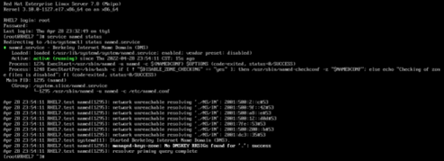

修改配置文件/etc/named.conf
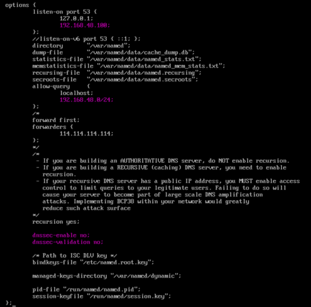

### options

dns服务器全局配置。<br />
&ensp;&ensp;&ensp;&ensp;listen on字段表明监听地址和端口号，
&ensp;&ensp;&ensp;&ensp;allow-query声明了可以查询本服务器的网段。
&ensp;&ensp;&ensp;&ensp;dnssec-enable以及dns-validation设置为no，因为本地dns为非法dns，设置为yes后会报broken trust错误。

此时虽然能解析出域名，但是在查看named服务时出现以下问题，需要在配置文件中禁用ipv6，在/etc/stsconfig/named中添加 OPTIONS = “-4”。
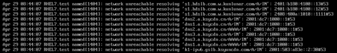

在辅助区域文件/etc/named.rfc1921.zones中定义域名与ip地址解析规则保存的文件位置以及服务类型等，但是不保存具体的域名、IP地址对应关系。<br />
三种服务类型：hint根区域，master主区域，slave辅助区域。通过以下参数设置本网段的正向解析和反向解析。
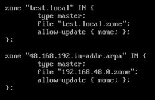

在/var/named文件夹下创建两个区域的配置文件，名称与named.rfc1921.zones中配置的文件名相同，内容如下：<br />
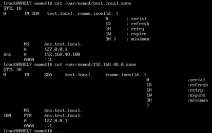

配置完成后重启服务<br />
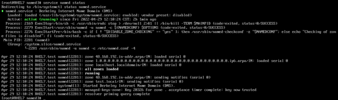

在客户机中设置DNS服务器为刚才设置的dns服务器，分别ping www.baidu.com和dns.test.local
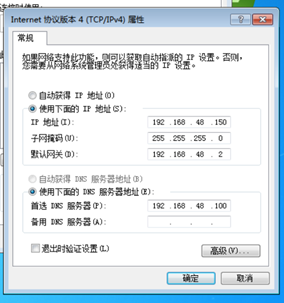
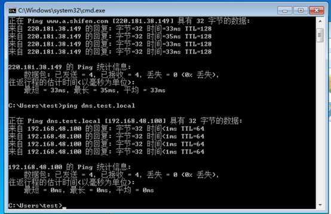

## 集群配置
辅助DNS与主DNS的配置步骤相同，但是区别在于zone配置时需要设置为slave模式，并向其中添加主机，且允许更新。named.rfc1921.zones文件中区域配置如下：
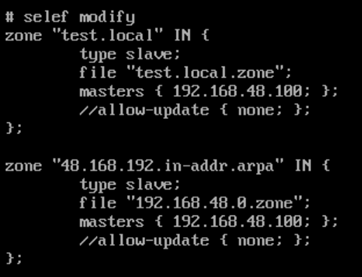

需要配置工作模式为slave，并向master中添加主机，file中的文件名与主机中的区域文件名称一致，但不需要在本地创建相应文件。

DNS主机需要对区域配置做一定更改，具体更改如下：
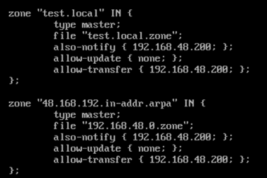

需要配置通知辅DNS更新配置，这样主DNS主机上的区域文件会自动同步到辅DNS上。同时，需要注意的是每次在主DNS中修改完地址后需要将文件中的序列号加一，因为只有主机区域文件序列号大于辅助DNS主机中的序列号时，辅助DNS中的区域文件才会更新。<br />
配置完成后将辅助DNS主机的首选DNS设置为自身的IP。

主DNS配置：<br />
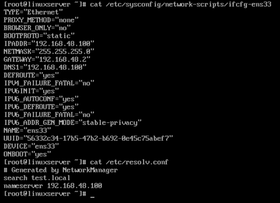

辅DNS配置：<br />
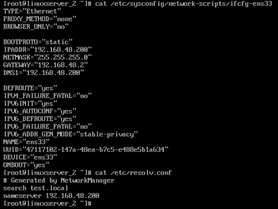

主DNS区域配置文件：<br />
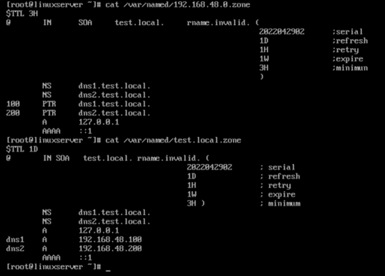

在主DNS上查询两台dns服务器地址：
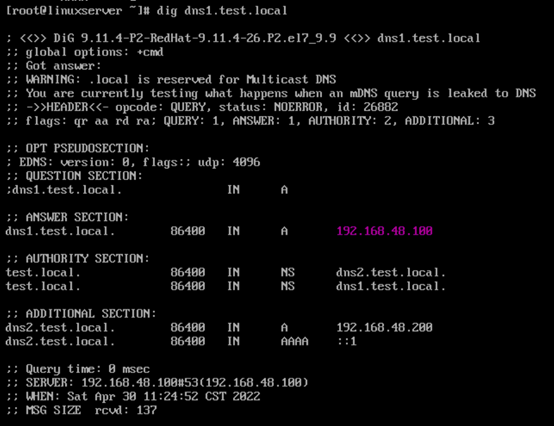
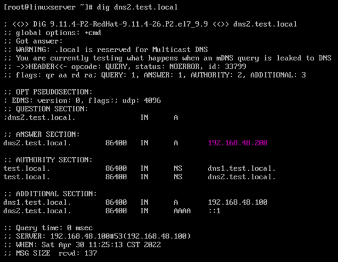

辅DNS上查询两台dns服务器地址
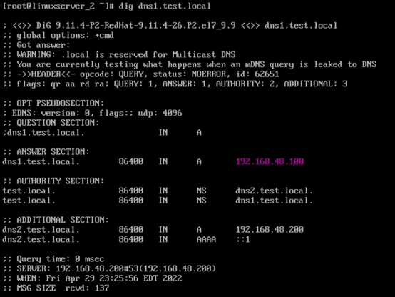


新建Windows Server中配置网络并测试
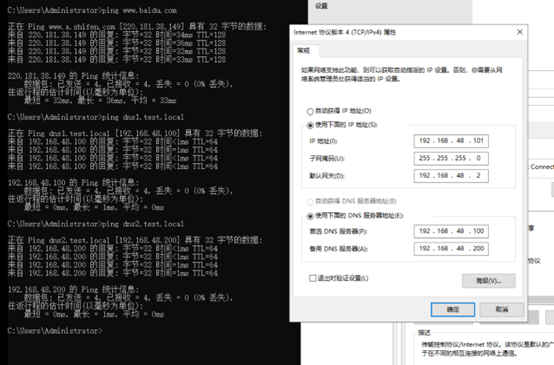