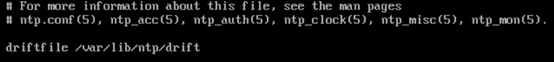
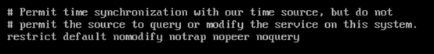
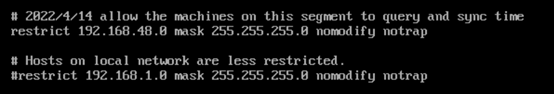
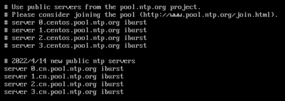
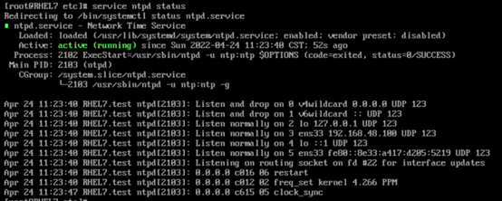
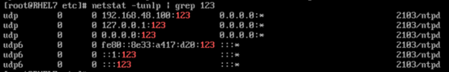
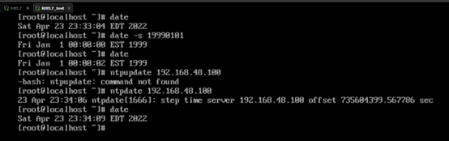

# ntp服务

## 安装

使用yum安装
```sh
yum install ntpdate ntp -y
```

## 配置

ntp服务的配置文件位于/etc/ntp.conf

其中的driftfile是对主板晶体振荡器的配置，ntp时间同步的原理是通过加快或减慢晶体振荡器的频率实现的。<br />


权限设置部分，允许与时间源同步，但是不允许时间源查询或修改本机系统的服务。

```sh
restrict 限制
default 默认
nomodify 不允许修改
notrap 不允许陷阱操作
nopeer 不允许同等级连接
noquery 不允许查询
```

允许回环接口的所有访问，可以使服务更加稳固，但是会影响管理功能。


允许192.168.48.0/24网段的主机查询，但是不允许修改以及陷阱操作


本机时间参考如下的公共时间服务器


配置文件修改完成后重启ntp服务器并设置为开机自动启动
```sh
systemctl restart ntpd
systemctl enable ntpd
```

将ntp服务添加到防火墙策略
```sh
firewall-cmd --permanent --add-service=ntp
firewall-cmd -reload
```

查看ntp服务状态
```sh
service ntpd status
```


查看端口状态，ntp服务会监听123端口
```sh
netstat -na | grep 123
```


在客户机上修改时间，使用ntpupdate同步时间
