# yum换源

一般在部署Linux系统时选择最小化安装，这种方式部署的服务器比较简洁，但是如ifconfig、wget等工具没有安装，为了安装这些工具，以及后续其他服务的部署，需要为yum换源。

操作步骤：挂载安装系统时使用的镜像文件，配置本地源安装ifconfig、wget等，之后配yum源为国内其他源。

## 配置本地源

将系统镜像挂载在虚拟光驱中，然后在系统dev目录下查看设备
```sh
ls -l /dev/sr0
```
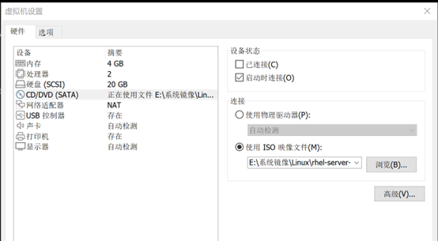
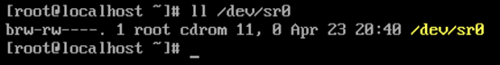

之后将sr0挂载到/mnt/CD_rom文件夹下
```sh
mkdir /mnt/CD_rom
mount /dev/sr0 /mnt/CD_rom
```
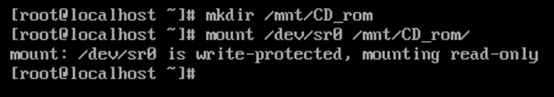

yum源配置文件位于/etc/yum.repos.d，在该文件夹下新建一个本地源配置文件local.repo
```sh
[local]
name = local
baseurl = file:///mnt//CD_rom
enabled = 1
gpgcheck = 0
```

保存并退出后执行yun clean all和yum makecache重新生成yum缓存
```sh
yum clean all
yum makecache
```
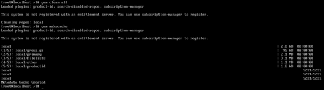

查找ifconfig和wget的包位置。
```sh
yum search ifconfig
yum search wget
```
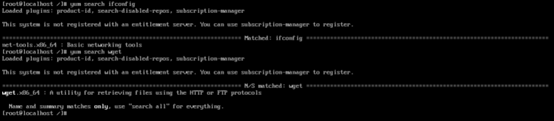

，可以看到分别在net-tools.x86_64和wget.x86_64中，可以运行yum install安装这两个包或者yum install ifconfig wget
```sh
yun install net-tools.x86_64 wget.x86_64
# or
yum install ifconfig wget
```
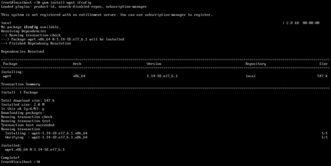

## 配置yum镜像

使用wget下载centos7 yum镜像文件，需要的文件如下：
```sh
python-chardet-2.2.1-3.el7.noarch.rpm
python-iniparse-0.4-9.el7.noarch.rpm
python-kitchen-1.1.1-5.el7.noarch.rpm
python-urlgrabber-3.10-10.el7.noarch.rpm
yum-3.4.3-168.el7.centos.noarch.rpm
yum-metadata-parser-1.1.4-10.el7.x86_64.rpm
yum-plugin-fastestmirror-1.1.31-54.el7_8.noarch.rpm
yum-utils-1.1.31-54.el7_8.noarch.rpm
```

在安装上述包之前卸载原有的yum
```sh
rpm -qa | grep yum | xargs rpm -e -nodeps
```
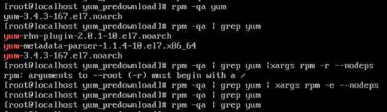

用同样的方式卸载rhn和订阅管理
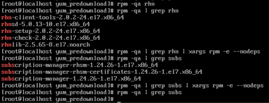

之后使用rpm -ivh [文件名] 安装刚才下载的包。

安装完成后下载centos7的repo文件，并将其中的字符串$releasever全部替换为7.9.2009。
```sh
# vim中运行
%s/$releasever/7.9.2009/g
```
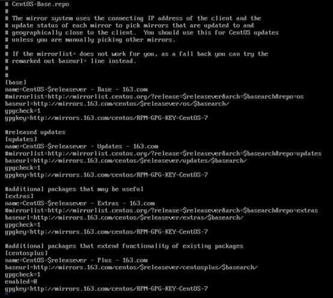
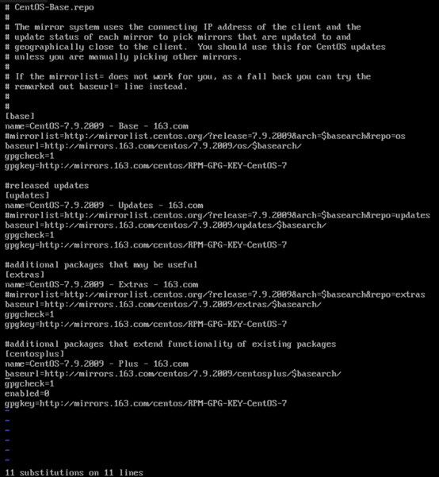

操作完成后运行yum makecache，再运行yum repolist all查看所有yum镜像
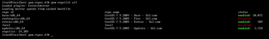

安装ntp服务：<br />
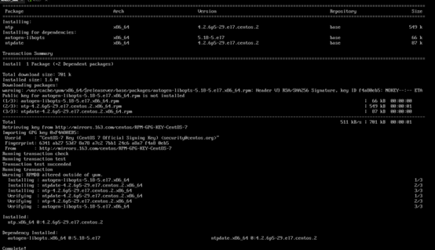

配置完成
