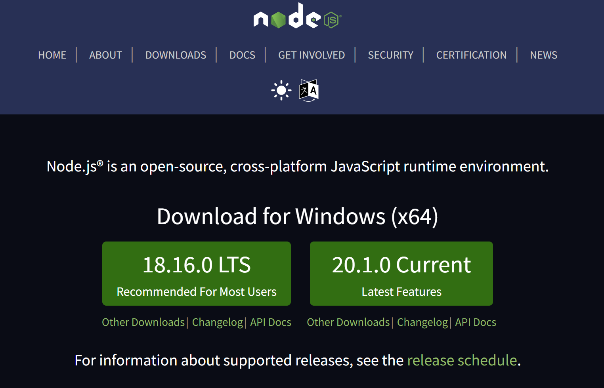
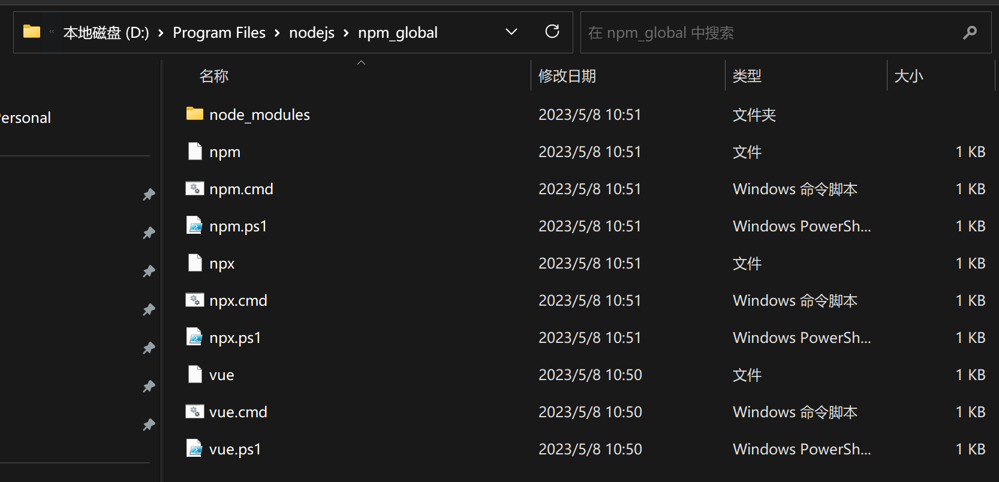
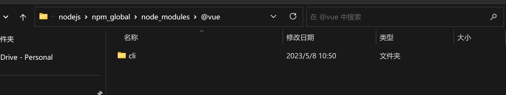

# 环境配置

## nodejs

### 安装包下载

在官网下载node.js安装包。LTS长期支持版，Current是最新的，但是可能不稳定，装LTS就可以。

https://nodejs.org/en



下载后安装除了设置安装路径以外，一路next就可以。我设置的安装路径是 D:\Program Files\nodejs。

在命令行查看node和npm版本验证安装结果：

```sh
C:\Windows\System32>npm -v
9.6.6

C:\Windows\System32>node -v
v18.16.0

```

### 环境变量

查看npm的全局包安装路径和缓存路径

```sh
# 包安装路径
npm get prefix
# 缓存路径
npm get cache
```

在nodejs目录下新建npm_prefix和npm_cache文件夹，并修改npm配置。将npm的全局包安装在新建的文件夹中。执行安装相关命令时可能需要以管理员身份打开命令行，否则可能无法在npm_global中创建文件夹。

```sh
npm config set prefix "D:\Program Files\nodejs\npm_prefix"
npm config set cache "D:\Program Files\nodejs\npm_cache"
```

添加环境变量如下：

```sh
# NODE_JS
D:\\Program Files\\nodejs
# NPM_GLOBAL
D:\\Program Files\\npm_global
# NPM_CACHE
D:\\Program Files\\npm_cache
```

以管理员方式打开命令行，安装vue-cli

```sh
npm install -g @vue/cli
```

查看npm_global文件夹中内容。可以看到vue-cli已经安装完成。




