# VUE项目创建

在命令行中进入存放项目文件的目录，执行命令 vue create [项目名称]创建项目。执行完成后会再当前文件夹创建一个名称为项目名的文件夹，文件夹中存放的就是项目文件。

```sh
vue create [项目名称]
```

::: warning
需要以管理员身份进入命令行
:::

## 默认模板

提示连接到当前npm源速度慢，是否要修改。暂时不了。一般国内会把源换成淘宝的npm镜像。

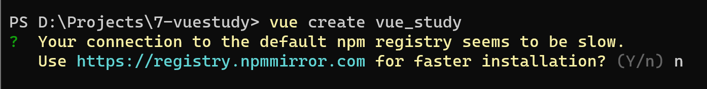

选择vue项目版本，这是一个默认的vue2项目模板，也可以手动创建。

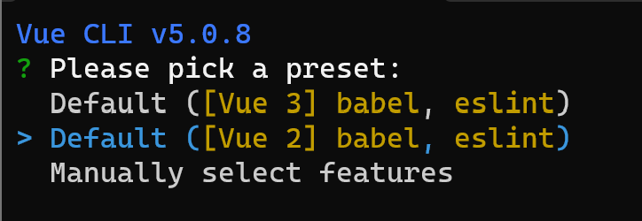

项目创建输出如下：

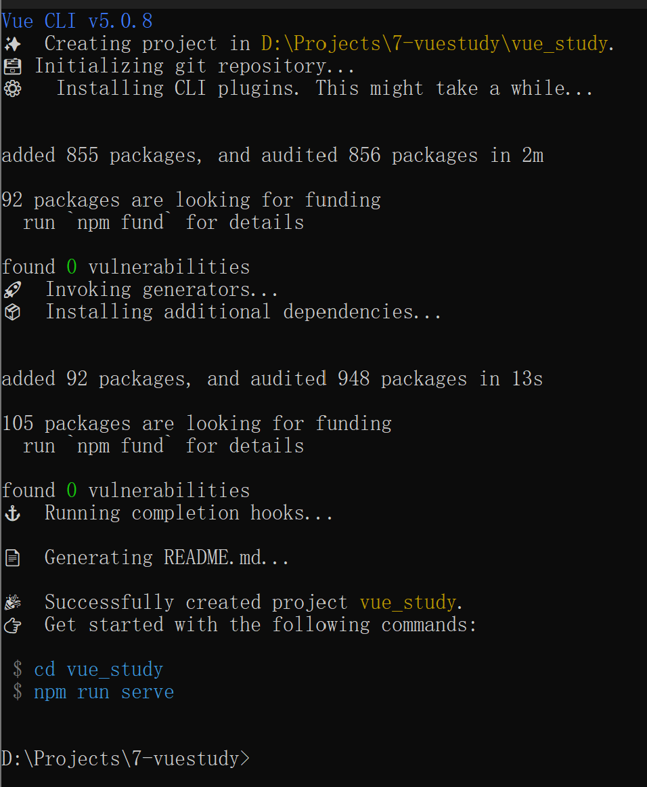

在命令行执行

```sh
cd vue_study
npm run serve
```

进入项目目录并运行。

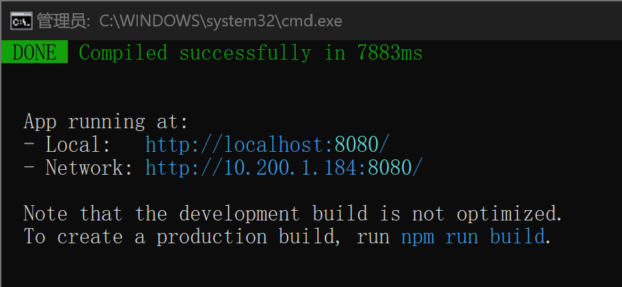

浏览器打开 http://localhost:8080/，可以看到默认页面

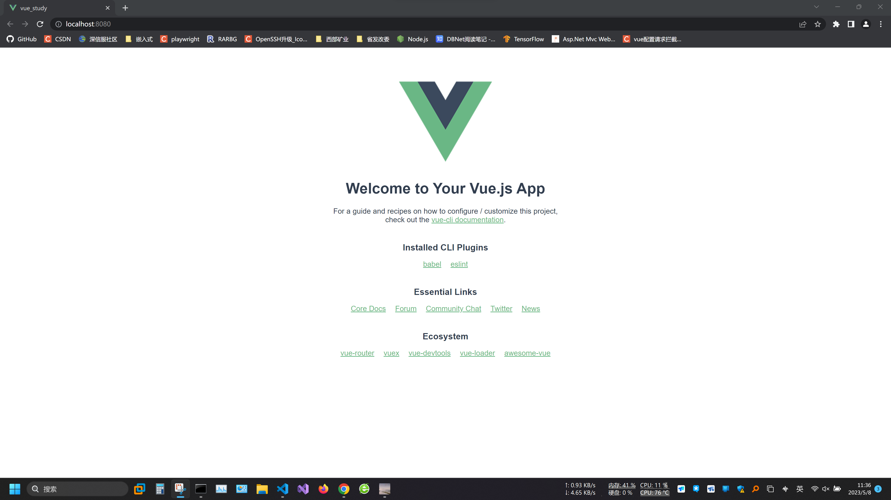

开发完成后执行npm run build可以将资源编译成静态页面。

```sh
npm run build
```

## 手动创建模板

手动创建的项目主要是在创建过程中选择项目的默认包和组件。vue create之后选择 Manually select features

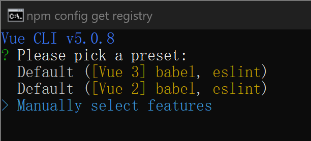

空格勾选Bable，Router，Vuex，Linter/Formatter

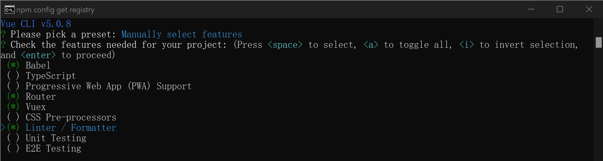

选择vue版本，vue2或者vue3，其中有一个没有办法加入vuetify，应该是vue3。选择2.x

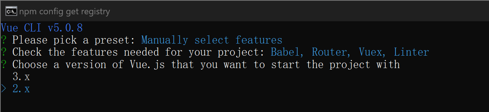

不使用router的history模式，使用默认的hash模式

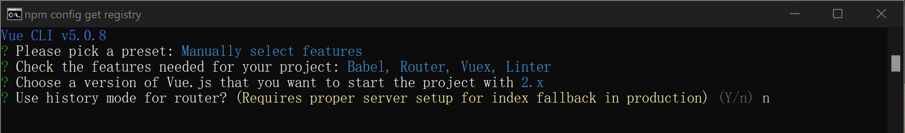

选择ESLint + Prittier，和Lint on save

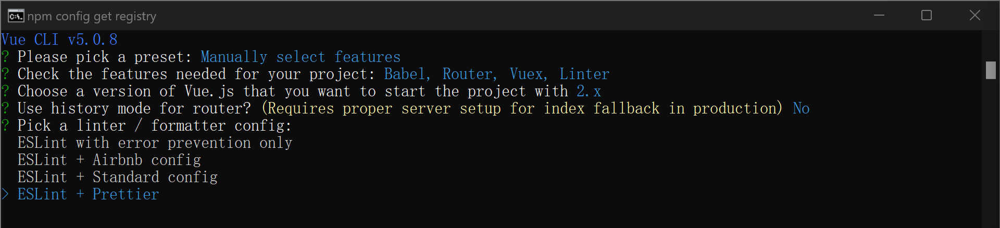

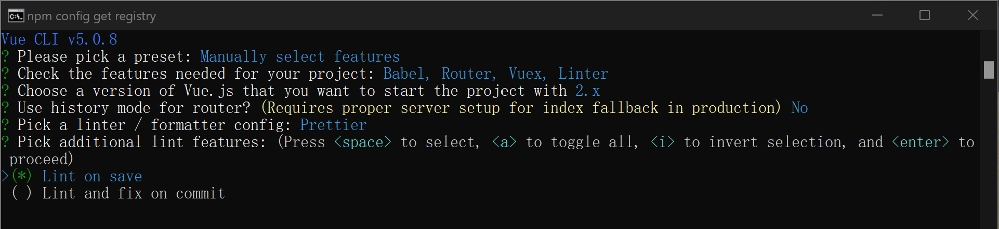

将以上各种包的配置保存在项目的package.json中

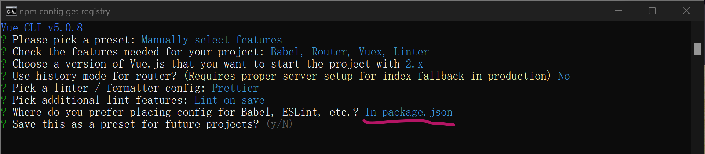

将刚才创建的项目预设保存为模板

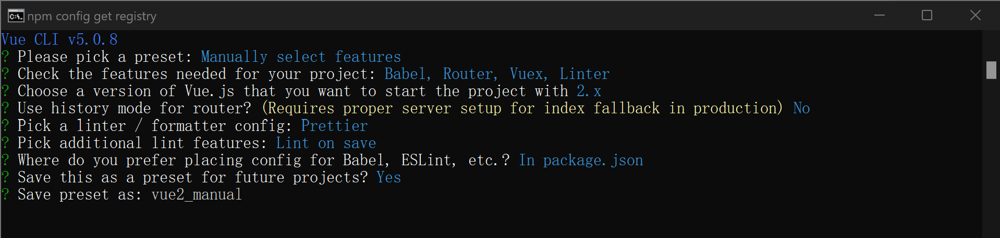

项目创建完毕

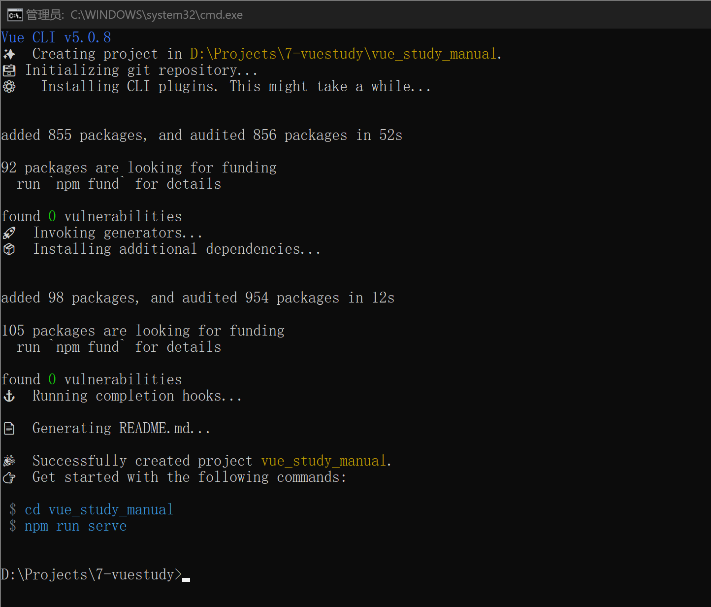
